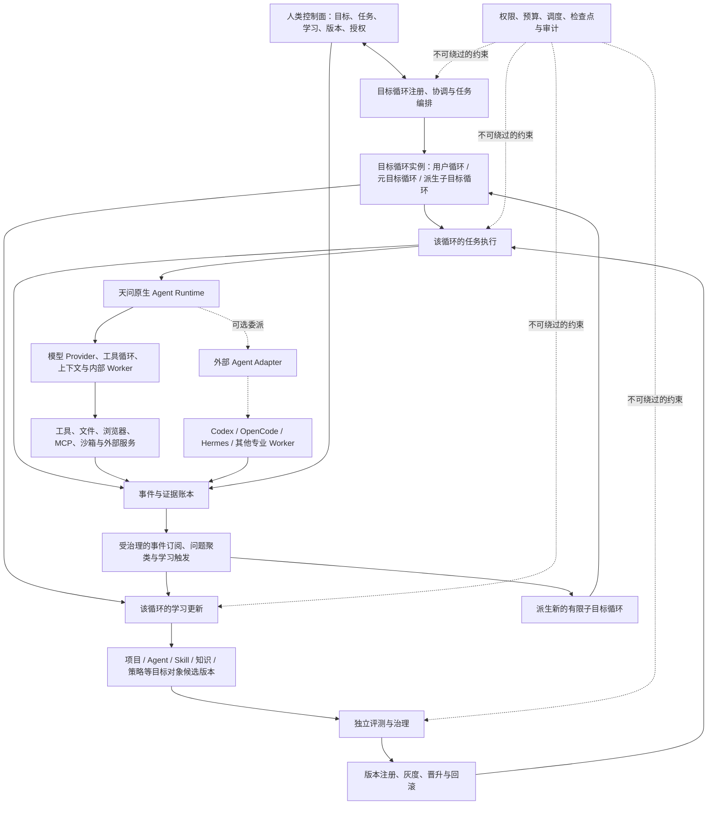
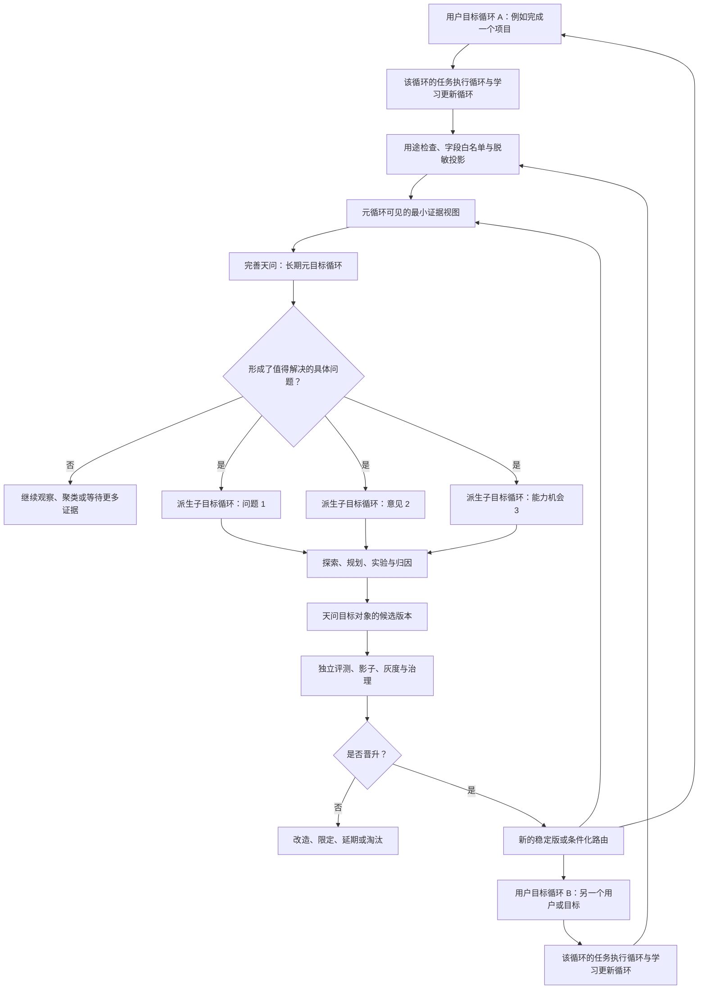
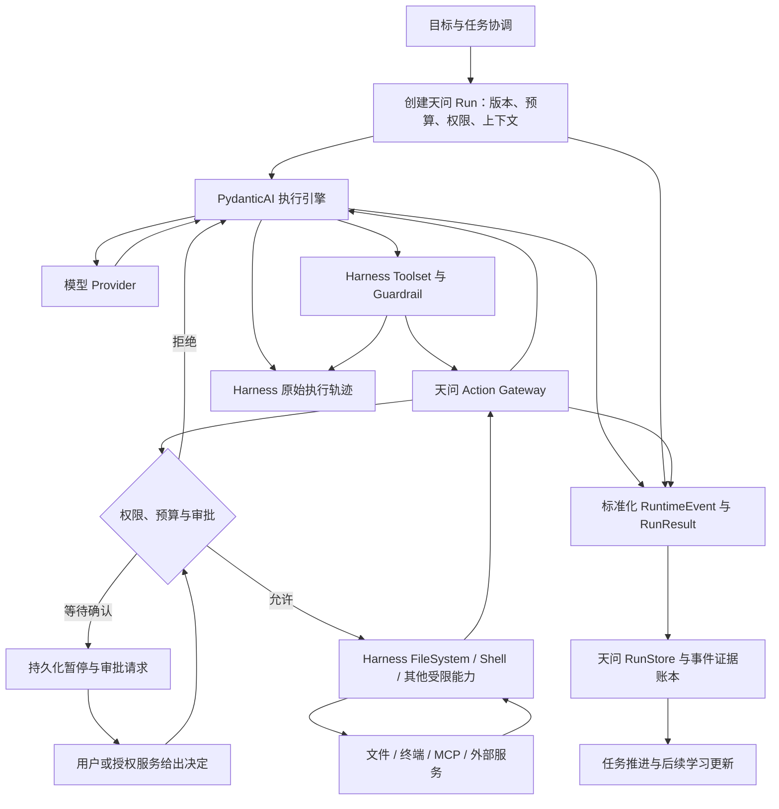

# 持续学习 Agent 研究笔记

> 状态：研究记录已完成首轮架构收口；实施以独立设计规格与垂直切片计划为准
> 创建日期：2026-08-11
> 最后更新：2026-08-12
> 项目目录：`D:\Guo\zuochong\AGi`
>
> 决策读取规则：后续明确标记为“当前采用”“最终决定”或“当前技术方向”的内容覆盖更早的候选方案；早期 A/B/C 对照继续保留，只用于说明取舍。第 22 节是当前决策索引，第 23.10 节是当前 Runtime 底座决定，第 29 节记录理论复审后的最终收口。独立设计规格和首个垂直切片实施计划是实施时的直接依据。

## 1. 文档目的

本文件用于保存关于“持续学习 Agent”的长期讨论成果，避免长会话发生上下文压缩后丢失重要推理。

维护原则：

- 保存结论，也保存得出结论的关键理由。
- 区分已形成的共识、暂定建议和仍待研究的问题。
- 每完成一个讨论章节，就同步更新本文件。
- 本文件是研究记录；未来确认产品范围后，再单独形成正式设计文档。

## 2. 讨论协作约定

后续讨论采用以下方式：

- 主要依赖逻辑分析和工程判断的问题，由主控 Agent 直接分析并给出建议。
- 不把阶段性结论机械地变成“请用户确认”的审批节点。
- 只有答案依赖用户的私人信息、价值选择、风险偏好或授权时，才向用户提问。
- 提问前先解释问题背景、不同答案的影响、利弊和主控 Agent 的推荐。
- 主控 Agent 应主动指出反例、风险和不确定性，不要求用户只做“同意/不同意”的 yes 机器。
- 每个讨论章节都应在会话中给出完整、可读的分析和推荐，文档只负责持久保存，不能代替向用户交付内容。
- 应先让用户在会话中看到结论及其理由，再将同一结论整理进研究文档并同步仓库。

## 3. 总体命题

当前 Agent 领域已经出现持续学习的若干部件：

- 长期目标与持续执行，例如 Goal 模式；
- 任务内迭代优化，例如 Loop；
- 将重复经验抽象为 Skill；
- 长期记忆、工具调用、MCP、上下文管理和评测体系。

但这些部件尚不等于完整的持续学习。完整系统还需要将它们连接为可验证、可治理、可回滚的学习协议。

### 3.1 项目定位补充

用户期待最终形成自己的通用持续学习 Agent，而不是复刻 Hermes，也不是把 Codex 简单改装或将两者机械拼接。它们更适合作为不同设计原则的参考：

> 2026-08-11 架构纠偏：此前“先把 Codex 作为第一个 Runtime”的建议已废止。当前有效方向是天问拥有独立原生 Runtime；Codex 等完整 Agent 仅为未来可选 Worker。后续设计和实现不得再以前一建议为基础。

> 2026-08-11 边界细化：“天问拥有 Runtime”指产品入口、权威状态、权限预算、执行控制和内部 Worker 归天问所有，不表示模型—工具底层循环必须全部手写。成熟 Agent Framework 可以作为天问进程内的可替换执行引擎，但不能成为天问正式目标、学习和版本状态的唯一持有者。

| 参考对象 | 值得吸收的部分 |
| --- | --- |
| Hermes Agent | 通用工具执行、跨会话记忆、从实践中形成和改进 Skill、后台任务与多入口交互 |
| Codex | 持久目标、任务与进度的可见性、检查点、用户可暂停和恢复、较清楚的权限与工作区边界 |
| 本项目的原创重点 | 将“学、习、持续”连接成目标驱动、证据约束、版本化、可灰度、可回滚、可治理的持续学习协议 |

暂定产品公式：

> 通用行动能力 × 持续学习能力 × 用户可理解、可观察、可干预的控制面

这里的“自己的 Agent”具有明确的产品和架构含义：

- 天问拥有自己的启动入口、身份、会话、目标、任务和控制面；
- 天问拥有能够直接调用模型与工具、并由天问控制状态和权限边界的 Agent Runtime；
- 不安装 Codex、OpenCode、Hermes 或 Claude Code，天问仍能运行完整的基础目标循环；
- 天问内部子 Agent 默认是原生 Runtime 的隔离实例，而不是其他 Agent 产品；
- 外部 Agent 可以作为以后可选的专业 Worker，但不能成为天问赖以存在的宿主；
- 更换或删除外部 Agent 不会让天问丢失目标、记忆、证据、学习历史和正式版本。

独立不等于每一行基础代码都自行开发。天问可以依赖成熟 Agent Framework 和普通库、移植许可证允许且边界清楚的源码模块、维护小范围分叉并吸收其他 Agent 的设计。独立性的判断标准是天问是否掌握顶层控制权、正式状态、动作与权限边界、内部 Worker 和用户入口，而不是底层 `while` 循环由谁编写。

为避免再次混淆，独立性分为三层：

1. **产品独立，必须满足**：天问可以独立启动、交互和完成基础目标循环；
2. **控制与状态独立，必须满足**：目标、任务、权限、预算、事件、检查点、学习和版本以天问状态为准；
3. **底层实现独立，不强求**：Provider 适配、模型—工具往返、MCP、流式解析和参数校验可以由嵌入式框架实现。

这里的“用户控制面”不是最后附加的一层界面，而是自主 Agent 的核心架构：

- 目标层：当前在追求什么，为什么做，怎样算完成，什么不可改变；
- 任务层：正在做、等待做和已经完成什么，当前检查点、阻塞和产物在哪里；
- 学习层：发现了什么、证据是什么、准备修改什么、哪个版本正在生效；
- 控制层：用户可以暂停、恢复、调整预算、限制权限、否决变更和回滚版本；
- 解释层：重要决策、风险判断和失败归因可以追溯。

自主性与用户友好不是互相对立的：

- 只有自主性而没有可见性，用户感受到的是失控；
- 只有可见性而没有自主性，系统只是一个需要不断催促的任务管理器；
- 理想状态是 Agent 能独立推进，但用户不必猜测它正在做什么，也不必通过频繁对话才能控制它。

因此，Codex 的 Goal 模式和任务组织方式对本项目的价值，不只是提供若干可借鉴的功能，而是证明了“长期自主工作也可以保持清楚、可控和符合用户习惯”。本项目还要在此基础上增加学习过程与版本变化的可见性。

“通用”是长期产品定位，不代表第一个实现阶段必须同时覆盖所有任务。早期可以选择可评测的有限环境验证学习闭环，但核心概念和数据边界不应被设计成只能服务于编程。

暂定总体表达：

> 持续学习 = 目标驱动的认知建模（学） × 证据约束的能力更新（习） × 可长期运行的反馈控制（持续）

这里使用乘法，是因为任何一项缺失都会让系统退化：

- 只有“学”：会研究和写报告，但行为不改变。
- 只有“习”：会无方向地试错。
- 没有“持续”：只能进行一次性优化。

### 3.2 开源优先与灵活复用

本项目采用“开源优先、差异化自研”的工程原则：

> 已有成熟实现能够满足需求时，优先复用；接口不完全匹配时优先适配；只有核心差异化能力或现有实现确实不合适时，才自行开发。

截至 2026-08-11，相关项目的公开边界并不相同：

- Codex 的 CLI、SDK、App Server、Skills、Plugins 和部分环境组件属于公开源码部分；IDE 扩展和 Codex Cloud 不开源；
- Claude Code 有公开 GitHub 仓库，但核心许可证注明版权所有并受 Anthropic 商业条款约束，不能把整个项目视为传统开源代码自由改造；
- Anthropic 的部分 Agent SDK、API SDK 和示例项目另有独立许可证，需要逐个仓库、逐个组件确认；
- OpenCode 和 Hermes Agent 的官方仓库采用 MIT 许可证，可以作为重点源码研究与复用候选；
- “仓库公开可读”不等于“代码可以复制、修改和分发”，任何复用决定都必须检查具体许可证。

#### 四种利用上游实现的方式

方式 A：直接依赖稳定组件。

当上游提供边界清楚、版本化、许可证合适的 SDK 或库时，将它作为普通依赖。例如模型 Provider、MCP、数据库、解析器和沙箱客户端。

这是优先级最高、升级成本最低的复用方式。

方式 B：选择性移植源码模块。

对于没有独立发布包、但职责单一且耦合较低的模块，可以固定上游提交后移入天问的 `vendor` 或 `third_party` 区域。例如 Skill 生命周期统计、待审批写入、快照回滚和部分安全校验。

移植代码必须保留许可证和版权声明，并记录来源文件、上游提交、天问修改、契约测试和更新方法。不能把来源不明的复制代码混入核心。

方式 C：维护范围受控的小分叉或按天问接口重新实现。

当模块与上游耦合较深但设计值得复用时，优先保留其状态机和接口思想，按天问边界重新实现。只有差异很小且上游结构稳定时，才维护小分叉。

方式 D：建立可选的外部 Agent Adapter。

Codex、OpenCode、Hermes 或 Claude Code 可以在未来作为专业 Worker 接入。它们接受边界清楚的工作单并返回事件、产物和结果，但不能承载天问的正式目标、学习和版本状态。

当前推荐顺序是：

> 优先以方式 A 组装天问 Runtime，包括把合适的 Agent Framework 当作进程内执行引擎；方式 B 和 C 只处理公开接口确实不能满足的部分。方式 D 属于后续增强能力，不作为天问首版成立的前提。完整 Fork 一个现有 Agent 不作为默认路线。

#### 优先复用的通用能力

- 模型提供商适配；
- 工具调用循环；
- 终端、文件和浏览器工具；
- 沙箱与权限隔离；
- MCP 客户端和服务发现；
- 会话持久化与上下文压缩；
- 任务调度、后台运行和通知；
- 插件与 Skill 加载机制；
- Git、工作区与产物管理；
- 流式输出、任务面板和交互基础设施；
- 测试执行器和通用评测框架。

#### 需要保持为本项目核心的差异化能力

- “学、习、持续”的统一状态和数据模型；
- 目标主权与保留意图的目标重协商；
- 经历、证据、假设、知识、Skill、策略和版本之间的生命周期；
- 失败归因与学习触发；
- 条件化知识、冲突、遗忘和重新验证；
- 自我模型与动态自主边界；
- Champion/Challenger、灰度、晋升和回滚；
- 任务进度与学习进度的双轨控制面；
- 学习预算、停止条件和可恢复检查点；
- 学习者、评测者、治理者和执行者之间的职责与权限分离。

#### 每个上游组件的审计要求

在正式引入前，应记录：

- 官方仓库和具体版本或提交；
- 许可证、版权声明和再分发义务；
- 核心代码是否真正公开；
- 维护活跃度和社区情况；
- 与本项目架构的匹配程度；
- 安全边界和凭证处理方式；
- 测试覆盖和可验证性；
- 升级上游时的冲突成本；
- 是否绑定特定模型、服务或平台；
- 选择“直接依赖、适配、维护小分叉、只参考设计或不采用”的理由。

项目应维护一份上游来源与改动记录，确保以后知道每段复用代码来自哪里、采用什么许可证、修改过什么。

#### 避免两种极端

- 不重复造轮子：不要重新实现已经成熟、非差异化的基础能力；
- 不盲目堆依赖：一个依赖只有在减少的复杂度明显大于引入的维护成本时才值得采用。

阅读上游源码的目标也不只是复制代码，还包括发现成熟项目已经踩过的坑、理解状态边界、比较实现取舍，并用真实实现校正我们的概念设计。

## 4. “学、习、持续”三层理解

### 4.1 学：目标、探索、规划

“学”不是漫无目的地吸收信息，而是围绕明确目标建立认知。

基本过程：

`目标 → 识别知识缺口 → 探索 → 形成假设和概念地图 → 规划下一步`

主要组成：

- 目标：学习为哪个现实问题服务。
- 探索：寻找概念、证据、方法和反例。
- 知识建模：区分事实、主张、推测、冲突和未知。
- 规划：安排依赖顺序，并选择最可能降低关键不确定性的下一步。

例如“改善记忆系统”不能直接变成“研究所有记忆技术”。应先判断问题属于：

- 没有保存；
- 无法检索；
- 检索错误；
- 检索到了但不会使用；
- 知识互相冲突；
- 经验没有转化为未来行为。

不同问题对应完全不同的学习路线。

### 4.2 习：验证、记录、进化

知识不是无条件真理。它通常只在特定前提下成立，并伴随收益、代价和失效范围。

验证要确定：

- 结论是真是假；
- 在什么条件下成立；
- 在什么条件下失效；
- 收益和副作用；
- 证据强度和可信度；
- 是否存在反例或竞争解释。

“记录”不只是保存文本，而是知识固化与整合。成熟知识至少应携带：

- 结论；
- 来源和证据；
- 适用条件；
- 反例；
- 收益与代价；
- 可信度；
- 时间有效性；
- 与其他知识的关系和冲突。

“进化”是把知识转换成目标对象的候选变化：

`知识 + 目标对象当前状态 + 目标 + 约束 → 项目、Agent、Skill、知识、策略或用户适配的候选版本`

因此，“完善天问”只是目标对象为天问时的一种表现；生成项目、改良其他 Agent 或适应用户使用同一过程。

### 4.3 持续：包围“学”和“习”的控制层

“持续”不是排在学和习之后的第三个一次性阶段，而是控制二者反复运行的外层机制：

`持续 { 学 ↔ 习 }`

完整循环：

`目标 → 知识缺口 → 探索 → 假设 → 验证 → 条件化知识 → 目标对象候选更新 → 效果监测 → 新知识缺口`

持续不等于全天候不停运行。健康系统还必须知道：

- 什么时候启动学习；
- 什么时候停止研究并开始行动；
- 一轮学习可以消耗多少资源；
- 什么情况必须交给人类；
- 什么时候遗忘、废弃或重新验证旧知识。

## 5. 目标主权与目标重协商

### 5.1 顶层目标由人类掌握

原则：

> Agent 对顶层目标拥有异议权、解释权和提案权，但没有擅自修宪权。

Agent 可以自主修改方法、计划和局部策略，但不能悄悄改变人类最终想实现的事情。

### 5.2 目标层级

- 价值与核心意图：为什么做，由人决定。
- 项目目标：最终得到什么，原则上由人修改。
- 成功标准与约束：人和 Agent 可以协商，但修改必须透明。
- 策略路线：采用什么方法，Agent 可以自主调整。
- 战术步骤：下一步搜什么、试什么和运行什么，Agent 可以自由迭代。

### 5.3 致命阻塞的分类

Agent 不能把“我暂时不会”误判成“不可能”。阻塞至少分为：

- 原理上不可能；
- 当前技术或资源条件下不可行；
- 代价不可接受；
- 目标内部矛盾；
- 暂时缺少输入、权限或服务；
- 证据不足，既不能证明可行也不能证明不可行。

宣布目标不可行本身也需要证据和反向验证。

### 5.4 保留意图的目标修复

例如“研发永动机”在字面物理定义下不可实现，但其底层意图可能是“长时间、低维护、自主运行的能源系统”。

Agent 应：

1. 说明对原目标的理解；
2. 区分字面目标和底层意图；
3. 提供阻塞证据和可信度；
4. 提出最小幅度的替代目标；
5. 等待人类决定。

目标修改应保留版本谱系：

`原目标 G0 → 阻塞报告 → 人类批准 → 修订目标 G1`

## 6. 自主性、暂停与动态信任

### 6.1 暂停不是二元开关

不能让 Agent 一有疑虑就暂停整个任务。风险处理应分级：

1. 记录并继续；
2. 自主缓解风险；
3. 隔离实验或准备回滚；
4. 非阻塞通知；
5. 局部暂停高风险动作；
6. 仅在目标级重大风险时整体暂停。

原则：

> 能自行降低风险就继续；能隔离或回滚就先实验；只有必须由人做价值取舍时才暂停。

### 6.2 动态自主边界

暂定原则：

> 底线固定，权限动态；自主性可以增长，但不能无限外溢。

信任不是单一等级，而应按以下维度分别增长：

- 任务领域；
- 动作类型；
- 影响范围；
- 资源预算；
- 可逆性；
- 数据敏感度。

Agent 可以获得“自主修改本地代码”的权限，但不因此自动获得付款、生产部署或公开发布权限。

### 6.3 自主性可以降低

权限不是永久勋章，而是与当前已证明能力匹配的许可证。

以下情况应触发重新验证或降级：

- 模型、工具或环境变化；
- 新 Skill 改变行为；
- 连续发生误判；
- 知识过期；
- 风险识别明显退化。

## 7. 底线约束不能只依赖提示词

提示词可以作为“宪法文本”，但不能作为真正的门锁。

推荐采用多层约束：

### 7.1 提示词层

负责表达难以完全编码的语义原则，并使用正例和反例提高理解概率。

### 7.2 工作流协议层

把正向义务变成完成任务的必要条件，例如：

- 必须提交验证证据；
- 必须列出未验证部分；
- 必须记录已知风险和回滚方法；
- 缺少必要字段时，系统不接受“已完成”状态。

原则：

> 不只要求 Agent 拥有某种美德，而要把美德转换成可观察、可检查的行为。

### 7.3 Guardrail 与策略检查层

- 输入检查；
- 输出检查；
- 工具参数和结果检查；
- 高风险动作审批。

### 7.4 权限与执行器层

Agent 不直接掌握所有凭证和执行能力：

`Agent 提议动作 → 策略系统检查 → 执行器执行 → 自动记录`

即使 Agent 判断错误，权限系统也能阻止越界动作。

### 7.5 两阶段执行

高风险动作拆成：

1. 自主准备、模拟和影响分析；
2. 满足策略或取得批准后正式提交。

### 7.6 审计、评测和回滚

- 日志由外部运行框架产生，Agent 不能自行删除；
- 证据引用真实工具结果，而不是任意文本；
- 新 Skill 先进入隔离区；
- 通过安全评测和回归评测后才能启用；
- 出现退化时自动回滚。

## 8. 自主不等于自我批准

授权不一定意味着人类逐次点击同意。授权可以分为：

- 逐次授权；
- 人类预先划定的长期授权范围；
- 满足规则后由系统自动放行。

持续学习 Agent 应主要依赖后两种。

推荐职责分离：

`学习者提出变化 → 评测系统验证 → 治理规则决定晋升 → 执行器应用变化`

整个过程可以自动运行，但 Agent 不能同时修改提案、评测标准、权限边界和放行结果。

自我修改的自动晋升链：

`草稿 → 隔离 → 已验证 → 小范围试用 → 正式启用 → 观察 → 保留或回滚`

只能由人类修改或最终批准的内容包括：

- 顶层目标；
- 底线；
- 权限上限；
- 核心评测规则；
- 审计系统；
- 外部凭证。

## 9. 评测、真实实践与版本进化

### 9.1 证据原则

> 评测是对真实效果的小样本预测，实践效果才是最终证据。

但实践与评测互相改进：

- 评测决定新版本是否值得进入实践；
- 实践暴露的新问题进入知识库和评测库；
- 新版本必须避免旧问题复发。

### 9.2 稳定版与挑战版

- Champion：当前证据最充分、正式执行任务的稳定版。
- Challenger：用于挑战稳定版的候选版本。

不需要让所有历史版本长期并行运行。历史版本保留配置和数据，但通常归档。

### 9.3 验证阶段

`离线评测 → 真实影子运行 → 隔离并行运行 → 小范围灰度 → 晋升稳定版 → 长期监测`

- 影子运行：两个版本收到相同输入，但只有稳定版产生外部副作用。
- 隔离并行：两个版本在不同沙箱中完成相同任务。
- 灰度运行：挑战版处理少量低风险真实任务。

### 9.4 版本 C 的意义

A/B 比较不一定选出永久赢家。新问题可能产生 C。

但持续进化不等于持续改动：

> 应持续积累证据，离散地发布版本。

如果不同版本擅长不同任务，最终结果可能是学习“何时路由到 A、何时路由到 B”，而不是统一成一个万能 C。

### 9.5 多维评测

不能只看单一总分。至少考虑：

- 任务成功；
- 输出质量；
- 安全；
- 成本；
- 延迟；
- 人类介入次数；
- 泛化和迁移能力；
- 可回滚性。

## 10. 记忆的分层与版本关系

### 10.1 共享与独立记忆的矛盾

完全共享可写记忆会导致 A、B 相互污染，难以归因。

完全独立会造成重复存储、经历分叉和用户信息不一致。

### 10.2 推荐：共享基础 + 独立分支

- 共享知识库：用户明确偏好、项目事实、正式确认的领域知识。
- 版本内程序记忆：习惯、Skill、策略、自我认知和实验经验。
- 正式实践证据：经过最小化和标准化的动作、结果、评测、反馈与版本关系，长期用于学习和审计。
- 原始执行轨迹：模型消息、工具细节和大段输出，短期用于调试、恢复和证据回填，不默认永久保存全部内容。
- 单次工作记忆：当前任务临时上下文。

版本定义应包含：

`模型 + 提示词 + Skill + 工具 + 策略 + 记忆快照`

A/B 测试时从同一正式记忆快照分支；实验结束后只合并经过验证的记忆。

## 11. 第一章：Agent 究竟学习什么

一次实践可能产生不同学习对象：

| 学习对象 | 回答的问题 |
|---|---|
| 原始经历 | 实际发生了什么 |
| 观察与证据 | 从经历中直接看到了什么 |
| 假设 | 可能是什么原因 |
| 条件化知识 | 在什么条件下什么结论成立 |
| Skill | 应该怎样操作 |
| 策略 | 什么时候使用或不使用 Skill |
| 自我模型 | Agent 对自身能力有什么认识 |
| 评测案例 | 如何防止同类问题复发 |

学习链最终收口为：

`Event / Trajectory → Case → Lesson → Artifact Candidate → 独立评测 → 已发布 Capability`

原始经历、案例、经验主张、候选资产和正式能力是不同对象，不能只用同一对象的“状态变化”表达。每类对象内部仍可以使用少量生命周期状态；冲突、敏感、需要复验、被替代和过期等使用独立原因字段，避免状态数量随着异常情况无限增长。

这项修正的工程意义是：内部可以保存丰富事实，但模型在每一步只接收与当前位置有关的少量选择；合法状态转换、权限和版本门槛由程序判断。

关键原则：

- 原始经历不等于知识；
- 知识不等于 Skill；
- 失败通常应先形成评测，再形成改造；
- 未经验证的用户偏好推断不能自动升级为底线；
- 不修改系统也可以是有效学习结果。

逻辑上应区分：

- 实践记录库；
- 知识库；
- Skill 库；
- 策略库；
- 评测库；
- 自我模型；
- 治理规则。

## 12. 第二章：什么时候触发学习，以及下一步学什么

持续学习 Agent 不应一直进行无边界探索。每个目标循环都包含任务执行循环和学习更新循环；不同目标循环可以按资源调度交错运行，但同一任务检查点默认冻结稳定行为版本。

主要触发信号：

- 明确失败；
- 结果明显低于预期；
- 重复问题；
- 高不确定性；
- 预测与结果不一致；
- 意外成功；
- 用户纠正；
- 环境变化；
- 新目标产生能力缺口；
- 定期审计。

触发信号首先进入学习队列，不是直接形成 Skill。低价值信号只形成记录；具有复用、阻塞、风险或明确反馈价值的信号才创建有限 Learning Job；重大事故可以立即触发止损调查，但永久知识仍需验证。

学习任务应包含：

- 关联目标；
- 已观察事实；
- 当前假设；
- 潜在影响；
- 复用概率；
- 学习成本；
- 前置知识；
- 完成条件；
- 允许修改的最小对象；
- 为什么暂不修改其他层；
- 预算、停止和返回父循环的条件。

优先级的直观原则：

> 学习价值 = 潜在收益 × 复用概率 × 目标重要性，减去学习成本与风险。

Agent 应维护知识前沿：

- 已确认；
- 仍不确定；
- 暂时不重要；
- 阻塞决策的关键未知；
- 需要外部实验；
- 当前无法回答。

一次学习必须有时间、成本、证据和停止条件。

## 13. 第三章：归因——为什么成功或失败

归因目标不是追求绝对科学证明，而是获得与改造风险相匹配的“决策级证据”。

原因层次：

1. 现象；
2. 直接原因；
3. 根本原因；
4. 系统性原因。

只有可复用的系统性原因通常值得修改 Agent；单次目标仍可以通过局部上下文、任务计划或工具参数修复。

归因核心问题：

> 如果没有这项改造，结果会怎样？

主要方法：

- 相同输入和环境快照下的 A/B；
- 消融实验；
- 每次尽量验证一个核心变化；
- 多次重复；
- 搜索竞争解释和反例；
- 比较成功与失败轨迹的最早分歧；
- 记录行动前预测和行动后结果；
- 将用于改造的数据与最终验证数据分开。

归因完成后还要选择正确的修改层。默认从最小影响范围开始：

`任务上下文 → 检索与适用条件 → Skill → 路由/策略 → 非关键 Prompt/Harness → 评测协议建议 → 治理或顶层目标建议`

首切片实际允许发布的变化只有 `repo_task` Skill。检索、路由、其他策略、评测协议、治理核心和顶层目标只能形成独立建议。

证据与行动匹配：

- 很弱：保存候选假设；
- 较弱：建立待验证知识；
- 中等：小范围试用；
- 较强：形成正式 Skill；
- 很强：扩大使用范围。

条件化结论优于绝对结论：

> 在条件 C 下，变化 X 对任务 T 稳定地产生结果 Y，并伴随代价 Z。

## 14. 第四章：自我模型——Agent 如何认识自己

自我模型不是一段“我是谁”的人格描述，而是一份由系统事实和实践证据共同维护的能力账本。

它需要回答：

- 当前运行的是哪个 Agent 版本；
- 拥有哪些模型、工具、Skill、知识和权限；
- 在哪些任务上已经被证明可靠；
- 在哪些条件下容易失败；
- 当前哪些知识过期、冲突或不确定；
- 完成某类任务通常需要多少成本和时间；
- 什么情况可以自主执行，什么情况需要降级、委托或暂停。

### 14.1 为什么需要自我模型

Agent 即使学到大量外部知识，如果不了解自身当前状态，仍然无法正确改造自己。

例如它知道“向量检索可以改善长期记忆”，但必须先知道自己的真实问题属于：

- 没有保存；
- 检索不到；
- 排序错误；
- 检索结果没有进入上下文；
- 检索到了但策略没有使用；
- 记忆内容本身不可信。

只有准确识别自身缺口，外部知识才能转化为正确改造。

### 14.2 自我模型的组成

1. **版本清单**
   - 模型；
   - 提示词；
   - Skill；
   - 工具；
   - 策略；
   - 记忆快照；
   - 评测规则；
   - 运行环境。

2. **能力清单**
   - 能处理哪些任务；
   - 需要哪些前置条件；
   - 有哪些工具和权限；
   - 能否隔离、验证和回滚。

3. **实践能力画像**
   - 按任务类型统计成功率、质量、成本和延迟；
   - 人类介入次数；
   - 常见失败模式；
   - 最近验证时间；
   - 适用范围和环境。

4. **知识边界**
   - 已确认知识；
   - 候选假设；
   - 已知未知；
   - 过期知识；
   - 冲突知识；
   - 当前无法访问的信息。

5. **失败画像**
   - 经常在哪个阶段失败；
   - 哪些输入或环境容易触发；
   - 直接原因与系统性原因；
   - 已知缓解方法；
   - 是否已经存在回归评测。

6. **自主与权限画像**
   - 可以自主完成的动作；
   - 只能在沙箱中执行的动作；
   - 需要策略放行的动作；
   - 必须由人类决定的动作；
   - 当前权限为什么被授予或降级。

7. **当前运行状态**
   - 活跃目标；
   - 当前上下文和依赖；
   - 剩余预算；
   - 正在进行的实验；
   - 等待中的外部事件。

### 14.3 自我模型不能主要依赖模型自述

模型说“我很擅长研究”不是可靠证据。自我模型应优先来自：

- 外部工具和权限清单；
- 真实执行轨迹；
- 客观测试结果；
- Champion/Challenger 比较；
- 用户纠正；
- 版本和环境元数据；
- 长期表现统计。

模型的自我反思可以提出假设，但不能直接成为正式能力结论。

### 14.4 使用预测误差更新自我模型

每次任务开始前记录：

- 预计成功概率；
- 预计成本和时间；
- 预计最可能的失败点；
- 认为需要哪些能力和前置条件。

结束后比较实际结果：

- 高信心失败：说明自我模型过度自信；
- 低信心成功：可能低估了能力；
- 成功但成本远超预期：效率画像不准确；
- 反复在同一阶段失败：形成系统性能力缺口；
- 环境变化后突然退化：触发相关能力重新认证。

自我模型的质量可以用“预测是否校准”衡量，而不是用 Agent 对自己的文字评价衡量。

### 14.5 能力必须条件化

不应记录宽泛结论：

> 我擅长写代码。

而应记录：

> 在 Python 项目、测试可运行、依赖可安装且修改范围清楚时，本版本能可靠完成中小型缺陷修复；涉及分布式并发和生产数据迁移时证据不足。

通用 Agent 的能力不是一个总分，而是一张按任务类型、环境、工具、权限和风险划分的地图。

### 14.6 自我模型与版本

每个版本应拥有自己的能力画像。

- B 可以继承 A 的历史数据作为先验；
- 但 B 修改了相关 Skill、工具或策略后，受影响能力的可信度应暂时降低；
- 未受影响能力不必全部重新测试；
- 新版本通过离线、影子和灰度验证后，再逐步恢复或扩大可信度；
- 原始实践数据由外部记录库共享，正式能力结论按版本维护。

### 14.7 防止自我模型成为权限升级工具

Agent 可以更新描述性事实，也可以提出“我已经具备更高能力”的申请，但不能仅凭自我评价扩大权限。

影响自主边界的能力结论，需要：

- 外部评测证据；
- 足够真实任务记录；
- 风险和回滚条件；
- 治理规则自动放行或人类批准。

否则 Agent 可能为了扩大行动空间而逐渐高估自己。

### 14.8 自我模型不应全部塞进上下文

完整能力账本可能很大，不应每次都注入提示词。

运行时只检索与当前任务有关的部分，例如：

- 本任务需要哪些能力；
- 当前版本在这些能力上的可信度；
- 常见失败和缓解方法；
- 可用工具和权限；
- 相关知识是否过期。

这使自我模型成为结构化运行数据，而不是不断膨胀的人格提示词。

当一项能力尚未被充分证明时，协调器不必只在“直接做”和“询问用户”之间二选一。它可以从五种策略中选择：直接使用已证明能力、先做低成本能力探测、创建有限学习子循环、委派给有独立能力记录的 Worker、缩小范围或请求必要信息。外部 Worker 的成功不自动算作天问自身能力。

本章核心结论：

> 自我模型是一份可验证、按版本维护、能够预测能力边界的运行账本；它连接外部知识、学习触发、自主授权和具体改造。

## 15. 第五章：人机协作与控制面

持续学习 Agent 不能只考虑“Agent 如何行动”，还必须考虑“人如何理解和控制一个长期自主行动、并且会改变自身行为的系统”。

这里的控制面不是单纯的界面，而是由持久状态、治理规则、状态展示、通知和干预能力共同组成的系统。它类似一个驾驶舱：正常情况下不替代驾驶者完成每个动作，但必须持续显示真实状态，并允许在必要时改变方向或紧急制动。

### 15.1 三种控制方式

#### 方式 A：逐步审批

Agent 每完成一步就请求人类确认。

优点：

- 表面上最可控；
- 容易理解；
- 适合少量不可逆的高风险操作。

问题：

- 用户成为执行循环的一部分；
- 容易产生审批疲劳；
- Agent 无法真正长期自主运行；
- 用户往往没有足够信息判断每个技术细节，审批可能只剩形式。

#### 方式 B：黑箱自主

人类只给目标，Agent 自主完成全部工作，最后报告结果。

优点：

- 打扰少；
- 执行效率高；
- 容易展示较强的自主性。

问题：

- 过程中发生偏离时发现太晚；
- 用户不知道 Agent 是否真的在推进；
- 学习和自我修改可能暗中改变系统行为；
- 发生错误后难以定位、阻断和回滚。

#### 方式 C：监督式控制

人类设定目标、边界、资源和不可变底线；Agent 在授权范围内自主规划和执行。真实状态持续可见，只有遇到无法自行消解的价值冲突、越权需求或重大不可逆风险时，才要求人类裁决。

这是当前推荐方向，因为它同时满足：

- 默认自主推进；
- 异常才升级；
- 用户不必持续盯住系统；
- 状态可观察；
- 干预可局部化；
- 重要改变可追溯和回滚。

核心原则：

> 用户控制不是逐步审批，而是对一段持续委托关系进行监督。

### 15.2 会话不能成为系统状态本身

如果目标、计划、进度、权限和学习结论只存在于聊天上下文中，那么上下文压缩、会话切换、后台运行或多入口访问都会导致状态模糊甚至丢失。

因此应将以下对象持久化在会话之外：

- 目标契约：目标、核心意图、完成条件、约束和停止条件；
- 任务账本：任务分解、依赖、当前状态、检查点和产物；
- 事件与证据账本：实际执行、工具结果、评测、错误和用户纠正；
- 学习变更账本：候选知识、Skill、策略、验证状态和影响范围；
- 版本与权限账本：当前版本、实验版本、回滚点和授权边界。

聊天只是其中一个交互入口，而不是唯一的记忆容器或事实来源。

这意味着用户即使更换会话、从其他入口访问，或者系统发生上下文压缩，仍能准确知道项目正在做什么。

### 15.3 自主执行需要明确的授权包络

每个长期目标都应带有一个“授权包络”，也就是 Agent 可以自主行动的明确范围。

至少包括：

- 目标：最终要实现什么；
- 范围：哪些项目、文件、账户、数据和环境属于本次任务；
- 能力：可以调用哪些工具和子 Agent；
- 动作：可以读取、修改、发布、付款或删除到什么程度；
- 资源：时间、算力、费用和并发预算；
- 风险：哪些操作必须隔离、灰度或人工裁决；
- 时效：授权何时过期，哪些环境变化会触发重新确认；
- 停止条件：完成、失败、预算耗尽或重大阻塞时如何处理。

授权包络应由执行器和权限系统实际约束，而不能只写在提示词中。

在包络内，Agent 默认自主执行；超出包络时，优先寻找可逆、隔离或降级方案，确实需要扩大权限时才提交申请。

### 15.4 控制面应呈现什么

控制面不应简单堆放原始日志。默认视图应回答用户最关心的几个问题。

#### 目标视图

- 当前在追求什么；
- 为什么做；
- 怎样算完成；
- 哪些内容不能被 Agent 自行改变；
- 当前总体状态和剩余预算。

#### 任务视图

- 正在做什么；
- 已经验证了什么；
- 下一步是什么；
- 哪些任务在等待、重试或阻塞；
- 产生了哪些文件、结果和外部影响。

#### 学习视图

- Agent 发现了什么；
- 这是一次经历、假设、知识还是 Skill；
- 有哪些支持和反对证据；
- 是否已进入验证、灰度或正式生效；
- 会影响哪些能力和任务。

#### 版本与信任视图

- 当前稳定版本和挑战版本；
- 最近改变了什么；
- 真实运行效果如何；
- 哪些能力的可信度上升或下降；
- 可以回滚到哪里。

#### 注意事项视图

- 哪些只是背景信息；
- 哪些建议用户稍后查看；
- 哪些需要用户做决定；
- 哪些局部工作已被暂停；
- 是否存在需要立即处理的重大风险。

默认界面应保持简单，证据、原始轨迹和版本差异按需展开。这是“渐进展示”：普通用户先看到结论和影响，需要追查时再进入细节。

### 15.5 任务进度与学习进度必须分开

持续学习 Agent 同时在推进两类过程。

任务进度回答：

- 目标产物完成了多少；
- 当前执行到哪个任务和检查点；
- 哪些结果已经通过验证；
- 还剩哪些依赖和阻塞。

学习进度回答：

- 当前发现了什么知识缺口或能力缺陷；
- 正在验证哪个假设；
- 已获得哪些支持和反对证据；
- 还有哪些关键不确定性；
- 是否准备形成知识、Skill 或策略变更；
- 候选变更处于实验、评测、灰度还是正式生效阶段。

两者不能互相替代：

- 任务完成，不代表 Agent 从中学到了可复用能力；
- 学习取得进展，也可能暂时没有增加目标产物；
- 同一任务可能已经完成，但新的 Skill 仍在验证；
- Agent 可能因为发现错误归因而主动退回学习阶段。

开放式探索不应显示没有依据的百分比。与其声称“学习完成 73%”，不如展示当前阶段、已经排除的可能性、证据强度和下一次能够降低不确定性的实验。

这里的“训练”是广义的学习循环，包括探索、实践、评测、Skill 更新、策略调整和灰度运行，不必等同于修改基础模型参数。

### 15.6 展示证据化决策说明，而不是原始思维流

用户需要了解 Agent 的进度和决策依据，才能判断此时应该参与调整，还是让 Agent 继续自主学习。最终产品名称采用“证据化决策说明”，避免把它误解为持续输出模型内部未经整理的思维文本。

原始思维流通常存在以下问题：

- 冗长、反复并且包含大量无效探索；
- 不稳定，同一问题可能产生不同叙述；
- 未必忠实对应真正影响行动的依据；
- 容易让用户被技术细节淹没；
- 会消耗大量上下文和注意力。

证据化决策说明由 Goal、Action、工具结果、实验、版本差异和未知项生成：

- 当前理解：Agent 认为问题是什么；
- 前提与假设：哪些已知，哪些只是暂时假设；
- 当前方案：准备做什么，以及为什么选择它；
- 备选方案：考虑过什么，为什么暂不采用；
- 证据与反证：哪些事实支持或削弱当前判断；
- 不确定性：最可能出错的地方是什么；
- 行动前预测：预期看到什么结果；
- 实际结果：发生了什么，与预测有何偏差；
- 下一步：哪个动作最可能减少关键不确定性；
- 介入价值：人类现在参与能改变什么，不参与时 Agent 会怎样继续。

展示可以分三层：

1. 默认摘要：目标、当前阶段、最近进展、下一步和是否需要用户；
2. 决策展开：假设、方案、取舍、不确定性和介入点；
3. 审计详情：原始事件、工具结果、评测数据和版本差异。

控制面应明确标记人类参与的价值：

- 无需介入：Agent 有明确、低风险且可逆的下一步；
- 可选参与：用户偏好或领域经验可以缩短探索，但 Agent 仍能继续；
- 建议参与：存在重要方向分叉，用户意见可能显著影响结果；
- 必须参与：涉及核心目标、价值取舍、权限扩大或重大不可逆风险。

这样，用户不是被迫跟随每一步，而是根据可见的进度、依据和不确定性，自主选择何时成为学习循环的一部分。

### 15.7 通知和暂停应分级

控制面的核心目标之一，是保护用户的注意力。用户注意力与算力、时间和费用一样，也是一种有限资源。

建议使用以下层级：

1. 后台记录：无需通知，保留审计信息；
2. 定期摘要：将低优先级变化批量汇报；
3. 非阻塞提醒：用户值得知道，但 Agent 可以继续安全工作；
4. 等待裁决：受影响分支暂停，其他安全任务继续；
5. 目标级暂停：只有重大风险、核心目标冲突或无法继续时使用；
6. 紧急制动：立即停止外部行动并保存可恢复状态。

Agent 在请求人类介入前，应先判断：

- 能否自行降低风险；
- 能否在隔离环境验证；
- 能否选择可逆方案；
- 能否推迟并与其他问题合并汇报；
- 等待人类是否真的比继续安全工作更好。

目标不是让通知更丰富，而是让每次打扰都有足够价值。

只有同时满足以下条件才阻塞询问：

1. 这是只能由用户决定的目标、价值、偏好或授权问题；
2. 没有安全、可逆且明显保留意图的默认动作；
3. 用户答案会实质改变下一步；
4. 现在询问的价值高于稍后合并询问。

否则优先缩小动作、在隔离环境继续探索或发送非阻塞摘要。多个非紧急问题应合并成一次决策包，并明确推荐项、影响和用户不回答时 Agent 仍会怎样继续。

### 15.8 用户消息不应自动打断目标

长期任务运行时，用户的新消息可能有不同含义：

- 查询：询问状态或原因，不改变执行；
- 补充：增加事实、偏好或材料，Agent 吸收后继续；
- 调整：改变优先级或局部约束，触发重新规划；
- 目标变更：修改核心目标，需要明确记录为新版本目标；
- 紧急控制：暂停、撤销、冻结权限或回滚；
- 无关话题：进入独立任务，不污染当前目标。

系统应根据语义处理消息，而不是把所有新消息都视为“停止当前工作并执行最新一句话”。核心目标的修改尤其需要明确识别，避免日常交流无意间改变长期方向。

### 15.9 状态不能只依赖 Agent 自述

Agent 可以生成易懂的进度说明，但客观状态应尽量来自外部事实：

- 工具调用和返回结果；
- 文件、提交和产物；
- 测试与评测记录；
- 预算消耗；
- 权限变更；
- 版本发布和回滚事件；
- 用户实际做出的决定。

控制面应区分：

- 事实层：系统实际发生了什么；
- 解释层：Agent 如何理解这些事实，以及准备怎么做。

这样可以避免 Agent 仅凭语言声称“已经完成”“已经学会”或“风险很低”。

### 15.10 不同学习变更需要不同治理强度

持续学习不能把每一次记录都变成人工审批，但也不能允许所有自我修改静默生效。

| 变更类型 | 默认处理 |
| --- | --- |
| 临时工作记忆与待验证假设 | 自动产生，随任务结束清理或转入候选区 |
| 带来源的事实和经验记录 | 自动保存，允许冲突并等待后续验证 |
| Skill 或程序性方法 | 自动提出和测试；低风险时可灰度，高影响时需更强验证 |
| 执行策略与判断规则 | 版本化、对照评测、限制影响范围并保留回滚 |
| 学习调度器、检索器和非关键 Harness | 只能形成候选；使用旧协议做保护评测后再影子或灰度 |
| 评测协议与门槛 | 作为独立工单版本化；新旧桥接，不能用于给当前候选自证 |
| 权限、自主边界和底线 | Agent 只能提出，不得自行扩大或删除 |
| 顶层目标与核心意图 | 只由人类修改；Agent 可以报告阻塞并提出替代方案 |

这套分级使 Agent 能够持续学习，又不会因为每条记忆都要批准而失去自主性。

本章核心结论：

> 理想控制面应实现低打扰、高可见和强恢复：Agent 可以自主运行，但不能神秘运行；可以持续学习，但不能暗中改变关键行为；用户不必一直盯着，却能随时理解、接管和回退。

## 16. 第六章：知识冲突、遗忘、过期与重新验证

持续学习系统并不是记得越多越好。随着经历增加，错误信息、条件不同的结论、已经过时的事实和彼此竞争的方法也会不断增加。

真正的目标不是最大化记忆数量，而是提高未来决策质量：

> Agent 不仅要知道什么可能成立，还要知道它在什么条件下成立、依据是什么、何时验证过、可能与什么冲突，以及什么时候不应再使用。

### 16.1 三种知识更新方式

#### 方式 A：最新记录覆盖旧记录

优点是实现简单，读取时只看到一个答案。

问题是：

- 最新信息不一定更正确；
- 无法区分环境变化和偶然失败；
- 会丢失历史证据；
- 容易被一条错误输入污染；
- 无法解释知识为什么发生变化。

#### 方式 B：为每条知识维护单一置信度

它比直接覆盖更好，可以根据证据调整分数。

但单一分数仍然会隐藏很多关键区别：

- 两个结论可能分别在不同条件下成立；
- 高置信度旧知识可能已经过期；
- 不同来源的权威性取决于知识类型；
- 一个精确数字容易制造并不存在的确定性。

#### 方式 C：证据账本与条件化知识视图

系统保留多个知识主张及其条件、来源、时间和证据。执行具体任务时，再根据当前环境生成一份“当前可用知识视图”。

这是推荐方向：

- 原始证据不会被悄悄覆盖；
- 冲突可以被明确保存；
- 不同条件下可以采用不同结论；
- 当前选择可以解释和重新验证；
- 新证据可以改变活跃结论，而不必删除历史。

它比单值记忆复杂，但早期并不需要建设庞大的知识图谱。使用结构化记录和明确的依赖关系，就可以验证核心机制。

### 16.2 知识应记录为有条件的主张

一条可用于决策的知识至少应包含：

- 内容：具体主张是什么；
- 类型：事实、用户偏好、约束、程序方法、策略或能力结论；
- 适用范围：任务、环境、工具、版本和前提条件；
- 来源：用户、官方资料、工具结果、实验、模型推测或其他来源；
- 时间：何时观察、何时生效、最后何时验证；
- 支持证据：哪些事实支持它；
- 反对证据：哪些事实与它不一致；
- 状态：候选、验证中、活跃、冲突、过期、被替代或隔离；
- 依赖：哪些知识、Skill、策略和版本依赖它；
- 失效触发器：哪些变化出现时需要重新验证；
- 影响范围：如果它是错的，会影响哪些行动。

因此，不应只记录：

> 方法 A 更好。

而应记录：

> 在 Python 项目、测试可运行、改动范围较小且主要目标是降低回归风险时，方法 A 在 18 次任务中优于方法 B；当执行时间受到严格限制时证据不足。

这使知识能够被验证、复用和反驳。

### 16.3 冲突不一定是真正的矛盾

常见冲突包括：

1. 直接事实冲突：相同条件和时间下，两个主张互相否定；
2. 条件冲突：结论分别在不同环境、工具或任务中成立；
3. 时间冲突：旧结论曾经正确，但环境后来发生变化；
4. 来源冲突：用户、文档、工具结果或实验给出不同信息；
5. 偏好冲突：用户当前偏好与过去记录不同；
6. 策略冲突：局部效率规则与更高层目标或底线不一致；
7. 方法冲突：多个 Skill 都能解决问题，但收益、成本和风险不同；
8. 结果冲突：同一方法在重复实践中表现不稳定。

很多表面矛盾，在补充时间和适用条件后会变成两个都成立的条件化结论。因此冲突处理的第一步不是选赢家，而是检查双方是否真的在谈同一件事。

### 16.4 来源权威必须按知识类型判断

不存在一个在所有问题上都最可信的来源。

- 用户对自己的目标、偏好和授权拥有最高权威；
- 用户对外部事实的判断仍可能需要证据验证；
- 官方文档通常对接口和规则更权威，但不决定用户意图；
- 当前环境中的实际工具结果可以证明本地行为，但不必然代表所有环境；
- 多次真实实践可以证明经验有效，但仍需要记录适用范围；
- 模型自身回忆适合作为探索线索，不适合直接成为高影响决策依据。

因此，来源优先级应与主张类型绑定，而不能使用一个全局排序。

### 16.5 推荐的冲突处理流程

当发现冲突时：

1. 将双方改写为清楚、可比较的主张；
2. 对齐时间、环境、对象、版本和前提；
3. 检查来源及支持、反对证据；
4. 判断是真冲突、条件不同还是环境已经变化；
5. 评估错误选择的影响；
6. 选择处理方式；
7. 记录选择理由和仍未解决的不确定性；
8. 必要时创建学习任务或实验。

可选处理方式包括：

- 条件拆分：双方在不同条件下继续有效；
- 并存：证据不足，保留多个候选；
- 暂定优先：当前任务先使用证据更强的一方；
- 隔离：高风险或疑似污染的知识暂时不可用于行动；
- 替代：新知识正式取代旧知识，但保留历史关系；
- 重新验证：通过实验、检索或真实运行补充证据；
- 人类裁决：目标、偏好或价值冲突无法由事实实验决定。

系统不应默认采用“最后写入者胜出”。

### 16.6 遗忘不等于删除

对 Agent 来说，遗忘主要是减少某条信息对未来行为的影响，而不是立即销毁全部历史。

可以分为：

1. 工作记忆清理：任务结束后丢弃无复用价值的临时细节；
2. 检索降权：保留记录，但降低默认召回优先级；
3. 退出活跃知识：不再用于普通决策，只在审计或冲突分析时读取；
4. 标记被替代：指向新的结论，保留演化关系；
5. 隔离：疑似错误、污染或高风险内容不可直接影响执行；
6. 硬删除：根据用户要求、隐私、安全或数据治理规则真正删除内容。

不能只根据“多久没用”决定遗忘。某些低频知识可能极其重要，例如灾难恢复方法或不可违反的底线。

更合理的判断因素包括：

- 未来使用概率；
- 决策价值；
- 错误使用的风险；
- 是否可以从可靠来源低成本重新获取；
- 是否已被更好的知识替代；
- 是否仍承担审计和归因作用；
- 用户是否要求保留或删除。

原则是：

> 默认先移出活跃决策，再决定是否删除证据。

### 16.7 过期不等于错误

时间过去并不会自动让所有知识变假。

- 物理规律通常较稳定；
- 软件接口、价格、法规和在线服务状态变化较快；
- 用户偏好只有在用户改变想法时才真正更新；
- Skill 可能因为模型、工具或环境改变而失效；
- 某个版本的能力结论不能直接代表新版本。

因此不应给所有知识应用同一种时间衰减。更合适的是同时维护：

- 最后验证时间；
- 建议复查时间；
- 适用的环境和版本；
- 预期变化速度；
- 明确的失效触发器；
- 当前新鲜度状态。

“需要复查”表示证据已经变旧，不等于结论已经被证明错误。

### 16.8 重新验证的触发方式

重新验证可以由以下情况触发：

- 使用触发：高影响任务准备依赖旧知识；
- 定时触发：对变化较快的重要知识周期复查；
- 环境触发：模型、工具、接口、数据或权限变化；
- 冲突触发：出现新的反例或相反主张；
- 性能触发：依赖该知识的 Skill 连续表现下降；
- 用户触发：用户纠正、质疑或要求重新检查；
- 版本触发：相关能力被修改，需要重新认证。

验证优先级应综合：

- 对当前目标的影响；
- 当前不确定性；
- 环境发生变化的可能性；
- 近期使用概率；
- 错误知识可能造成的损失；
- 验证所需成本。

高风险行动依赖过期知识时，应先验证或使用安全替代方案。低风险、可逆任务可以在明确标注不确定性的前提下继续，并把真实结果作为新证据。

### 16.9 知识变化需要传播到依赖对象

如果一条知识被证明错误，只修改知识记录还不够。

系统还应检查：

- 哪些 Skill 使用了它；
- 哪些策略以它为前提；
- 哪些评测答案依赖它；
- 哪些版本的能力画像因此失真；
- 哪些正在运行的任务需要重新规划；
- 相关自主权限是否应该暂时降低。

传播不应导致整个系统无差别失效，而应依据依赖关系确定影响范围。只有真正受影响的能力需要重新测试或降级。

这也是知识库需要保存依赖关系的原因：不是为了建立漂亮的知识图谱，而是为了在结论变化时知道应该检查哪里。

### 16.10 冲突如何进入人机协作界面

控制面不需要向用户展示所有细小冲突。Agent 应先自行区分：

- 可以通过补充事实或低成本实验解决的冲突；
- 可以根据明确条件自动分流的冲突；
- 暂时并存也不影响当前目标的冲突；
- 会显著改变目标方向、风险或资源投入的冲突；
- 本质上属于用户偏好、价值或授权的冲突。

前面三类通常由 Agent 自主处理并记录。后面两类才值得进入用户的注意事项视图。

展示时应说明：

- 冲突双方是什么；
- 为什么不能同时用于当前任务；
- 已有哪些证据；
- Agent 准备怎样验证；
- 用户不参与时会采用什么安全方案；
- 用户介入能够改变什么。

这延续上一章的原则：让用户根据进度、依据和介入价值选择是否参与，而不是把未经整理的矛盾直接抛给用户。

本章核心结论：

> 持续学习 Agent 的知识库不应是一份不断覆盖的“标准答案”，而应是一套保存主张、条件、证据、时间和依赖的动态账本。学习不仅是获得新知识，也包括限制旧知识的影响、识别环境漂移，并在恰当时机重新验证。

## 17. 第七章：多目标评测

持续学习 Agent 的“进化”不是一个单一分数。

一个新版本可能：

- 完成率提高，但成本翻倍；
- 输出质量提高，但速度明显下降；
- 更少打扰用户，但也漏掉了应该上报的风险；
- 更安全，但通过拒绝大量正常任务来实现；
- 在当前评测集进步，却损害了其他任务的泛化能力；
- 离线评测很好，真实运行却没有改善。

因此，版本更新不能简单问“B 是否比 A 更强”，而应问：

> B 在哪些任务和条件下改善了哪些指标，付出了什么代价，是否违反底线，证据是否足够，以及这些权衡是否符合当前目标。

### 17.1 三种多目标决策方式

#### 方式 A：压缩成一个总分

将质量、安全、成本、自主性等指标乘以权重，再相加得到一个分数。

优点：

- 容易排序；
- 容易自动化；
- 适合做粗略趋势展示。

问题：

- 严重安全问题可能被其他高分平均掉；
- 权重很难长期固定；
- 不同量纲的分数容易制造伪精确；
- Agent 可能针对总分投机，而不是真正改善；
- 用户无法看出提升的真实代价。

#### 方式 B：要求所有指标同时改善

只有新版本在每个维度都不差于旧版本时才允许晋升。

优点：

- 比较保守；
- 不容易隐藏退步。

问题：

- 现实改进通常存在取舍；
- 很多有价值的新能力会被阻止；
- 指标噪声可能导致版本长期无法更新；
- 不同任务需要不同侧重。

#### 方式 C：分层约束与条件化权衡

推荐采用四层判断：

1. 不可违反的硬门槛；
2. 关键能力的最低保障；
3. 可权衡指标的多维比较；
4. 针对任务类型和用户偏好的条件化选择。

这意味着先排除不能接受的版本，再在合格版本之间讨论取舍，而不是把所有问题一次性塞进总分。

### 17.2 需要评测的主要维度

#### 结果质量

- 是否真正完成用户目标；
- 正确性、完整性和可复现性；
- 对模糊输入和环境变化的稳健性；
- 是否产生新的返工；
- 用户实际是否接受结果。

#### 安全与治理

- 是否违反权限、底线或数据边界；
- 是否出现风险漏报和不必要的风险报警；
- 是否正确使用隔离、灰度和人工升级；
- 出错后能否及时停止、控制影响和回滚；
- 是否留下完整审计记录。

#### 成本与性能

- 模型、工具、算力和外部服务成本；
- 完成一次成功任务的平均成本；
- 响应和完成时间；
- 重试、无效探索和重复工作的消耗；
- 为获得额外质量所付出的边际成本。

#### 自主性与用户负担

- 无需用户介入完成任务的比例；
- 不必要询问和暂停的次数；
- 应当询问却没有询问的漏报率；
- 等待用户时能否继续推进其他安全工作；
- 是否能够自行恢复常见失败；
- 用户为监督 Agent 实际花费的注意力和时间。

#### 学习质量

- 从多少次经历中形成了稳定改进；
- 是否能迁移到未见过但相关的任务；
- 一段时间后是否仍然保持；
- 是否造成旧能力退化；
- 是否产生错误泛化或负迁移；
- 版本是否过于频繁变动，却没有实际收益。

#### 可理解与可恢复

- 进度和决策依据是否可以被用户理解；
- 评测结论是否能追溯到真实证据；
- 失败能否定位到知识、Skill、策略或版本；
- 是否存在可用回滚点；
- 回滚后能否恢复稳定工作。

### 17.3 指标必须成对约束

任何单独指标都可能被错误优化。

例如：

- 只优化“减少询问”，Agent 可能在应该求助时保持沉默；
- 只优化“安全”，Agent 可能拒绝所有任务；
- 只优化“成本”，Agent 可能减少必要探索和验证；
- 只优化“速度”，Agent 可能增加错误与返工；
- 只优化“成功率”，Agent 可能无限消耗资源；
- 只优化“学习速度”，Agent 可能过度拟合少量经历。

因此关键指标应配对观察：

| 想要改善的指标 | 必须同时观察 |
| --- | --- |
| 减少用户介入 | 风险漏报、结果质量和自恢复能力 |
| 提高安全性 | 正常任务完成率和过度拒绝率 |
| 降低成本 | 质量、失败率和返工成本 |
| 提高速度 | 正确性、稳定性和后续修复成本 |
| 加快学习 | 保持时间、迁移能力和旧能力退化 |
| 提高自信 | 置信度与实际正确率是否匹配 |

这可以防止 Agent 通过牺牲真正目标来改善表面数字。

### 17.4 推荐的版本晋升阶梯

#### 第一步：硬门槛

以下问题不能被其他指标补偿：

- 违反不可变底线；
- 未经授权扩大权限；
- 破坏数据完整性；
- 无法审计关键外部行动；
- 无法在要求的条件下停止或回滚；
- 对重大风险的处理低于最低标准。

任何硬门槛失败都应阻止晋升。

#### 第二步：关键能力下限

根据 Agent 当前承担的任务，设定不能明显退化的核心能力，例如：

- 基础指令遵循；
- 关键工具调用；
- 用户数据处理；
- 目标保持；
- 重要回归案例。

这里不要求每个数字完全不下降，而是设定可以接受的退化预算，并考虑评测噪声。

#### 第三步：多维收益比较

通过前两层后，再比较：

- 哪些维度明显改善；
- 哪些维度付出代价；
- 代价是否在预算内；
- 改善是否只发生在特定任务；
- 当前证据有多大不确定性。

如果一个版本至少改善一项重要能力，同时其他维度没有超出允许的退化范围，可以认为它具有晋升价值。

如果两个版本各有优劣，不必强行选出全局赢家。

#### 第四步：真实运行验证

离线结果只决定挑战版本是否值得进入下一阶段。之后仍需经过：

`离线评测 → 影子运行 → 隔离并行 → 低风险灰度 → 扩大使用 → 稳定版`

最终决定依据是真实任务中的长期效果。

### 17.5 版本决策不只有通过和失败

评测结果可以产生：

- 晋升：新版本成为稳定版；
- 继续取证：结果有潜力，但样本不足；
- 限定使用：只在已证明有效的任务类型中启用；
- 保持双版本路由：不同条件选择不同版本；
- 退回改造：根据新问题形成版本 C；
- 回滚：真实运行效果低于稳定版；
- 淘汰：没有继续投入验证的价值。

“证据不足”不等于“版本失败”。它表示系统还没有权利作出强结论。

### 17.6 不同评测集承担不同职责

建议至少区分：

1. 核心回归集：长期冻结的重要能力和历史严重问题；
2. 动态问题集：近期真实失败、用户纠正和新环境问题；
3. 迁移集：与已学任务相关但没有直接见过的案例；
4. 高风险集：权限、数据、不可逆行动和异常输入；
5. 真实运行样本：灰度阶段的实际任务结果。

只使用动态问题集容易让 Agent 忘记旧能力；只使用固定回归集又容易对测试题过拟合。

学习者不应能够随意修改所有保护性评测。核心回归集、隐藏迁移集和评测规则应由独立治理机制维护，避免 Agent 通过改题来证明自己进步。

### 17.7 真实版本比较不应重复产生外部副作用

Champion 和 Challenger 接收相同真实输入，不代表两个版本都要真正付款、发消息、删除文件或发布内容。

更安全的方式是：

- 稳定版执行真实动作，挑战版只生成计划或在影子环境运行；
- 在沙箱中进行完整并行测试；
- 只把少量低风险、可回滚任务交给挑战版；
- 使用历史轨迹重放，比较新旧版本决策；
- 对高风险任务继续使用稳定版。

这样可以控制性能成本，也避免为了评测而把一次现实任务执行两遍。

### 17.8 最优结果可能是路由，而不是统一版本

假设：

- A 成本低、速度快，适合简单任务；
- B 质量更高，但耗时更长，适合复杂任务。

系统不一定要让 B 完全取代 A。它可以学习“什么条件下选择 A，什么条件下选择 B”。

但路由规则本身也必须评测，否则只是把版本选择问题转移成了错误分类问题。

默认稳定策略可以是：

- 高风险任务使用证据最充分的版本；
- 已证明优势明确的任务交给专门版本；
- 不确定任务回到稳定版；
- 路由错误进入新的评测和学习循环。

### 17.9 用户应该看到什么

控制面不应只显示“新版本总分提高 12%”，而应显示类似：

- 复杂任务质量提高；
- 简单任务成本增加；
- 用户介入次数减少；
- 风险漏报没有增加；
- 发现一个新的边界条件；
- 当前证据来自多少离线案例和真实任务；
- 建议在哪类任务中灰度；
- 出现什么情况会自动回滚。

用户负责决定高层取舍，例如：

- 质量优先；
- 均衡模式；
- 成本和速度优先。

但这些偏好不能覆盖安全底线。Agent 可以在已经授权的取舍范围内自行选择，不必每次询问用户。

本章核心结论：

> Agent 的进化应被表示为一组带条件和不确定性的变化，而不是一个“更聪明”的总分。版本晋升必须先满足底线和关键能力下限，再讨论质量、成本、速度、自主性和学习能力之间的权衡，并最终接受真实实践检验。

## 18. 第八章：内部组织——单 Agent、多角色还是多 Agent

持续学习 Agent 内部至少需要承担规划、执行、记录、学习、评测和治理等职责，但这不代表每一种职责都要变成一个独立 Agent。

首先应区分：

- 产品身份：用户认为自己在与谁协作；
- 逻辑角色：系统内部的一组职责和权限；
- 运行实例：一次独立的模型调用、会话或后台任务；
- 模型：提供推理能力的具体基础模型；
- 确定性服务：权限、日志、调度、版本和评测执行等普通程序。

多角色不等于多 Agent，多 Agent 也不等于真正独立。

### 18.1 三种内部组织方式

#### 方式 A：单体 Agent

一个 Agent 在同一上下文中完成规划、执行、学习、自我评测和版本更新。

优点：

- 实现最简单；
- 沟通成本低；
- 上下文共享自然；
- 适合验证非常早期的概念。

问题：

- 容易同时当选手、裁判和放行者；
- 不同角色目标互相干扰；
- 上下文持续膨胀；
- 很难判断失败来自哪个环节；
- 权限边界主要依赖提示词；
- 自我评价容易受到原方案的影响。

#### 方式 B：单一协调者与隔离角色

对用户表现为一个 Agent，由一个协调者维护目标和任务；学习、评测等职责在独立上下文或独立运行中完成，关键状态由确定性服务维护。

优点：

- 保持统一、友好的用户体验；
- 角色之间可以有明确的读写边界；
- 成本和协调复杂度仍然可控；
- 可以逐步替换模型或拆分服务；
- 适合早期验证完整持续学习闭环。

问题：

- 协调者可能成为瓶颈；
- 使用同一基础模型时仍会存在相关偏差；
- 需要清楚设计状态和产物接口。

#### 方式 C：分布式多 Agent 组织

多个长期存在的 Agent 分别负责研究、执行、评测、记忆、风险和领域任务。

优点：

- 可以并行处理独立工作；
- 容易引入不同模型和专业能力；
- 高负载时更容易扩展；
- 某些高风险职责可以物理隔离。

问题：

- 沟通、同步和调度成本高；
- 多个 Agent 可能重复工作或互相污染状态；
- 调试和失败归因更困难；
- 多 Agent 共识可能制造虚假的可靠感；
- 很容易在核心闭环尚未验证前过度工程化。

当前推荐方式 B：

> 对外是一个 Agent，对内按角色分离；先实现逻辑隔离，只有证据表明存在并行、专业化或安全隔离需求时，再进行物理拆分。

### 18.2 推荐的核心角色

| 角色或服务 | 主要职责 | 不能自行做什么 |
| --- | --- | --- |
| 目标协调者 | 维护目标契约、任务图、预算、优先级和检查点 | 修改人类核心意图或越过授权包络 |
| 执行者 | 使用当前稳定版本规划、调用工具、产生产物和验证任务结果 | 将自己的临时经验直接晋升为正式能力 |
| 事件记录器 | 记录工具调用、结果、文件、评测、用户反馈和版本事件 | 解释或改写已经发生的事实 |
| 学习者 | 发现知识缺口、归因、提出知识、Skill 和策略候选 | 激活自己的候选变更或修改晋升门槛 |
| 评测者 | 按受保护标准测试候选版本、检查回归和边界 | 修改候选来让它通过，或自行降低评测标准 |
| 治理与发布器 | 执行硬门槛、权限规则、灰度、晋升和回滚 | 修改顶层目标、底线或自行扩大授权 |
| 知识与记忆服务 | 保存主张、证据、冲突、依赖、状态和检索视图 | 根据语言直觉静默覆盖历史证据 |
| 控制面报告器 | 从真实状态生成用户可读的进度、思路和介入提示 | 把自己的总结当作系统事实 |

这些角色不都需要使用大模型。

### 18.3 哪些职责应交给程序，哪些需要模型

更适合确定性程序的职责：

- 权限检查；
- 预算计数；
- 事件日志；
- 任务和版本状态机；
- 文件哈希和产物校验；
- 测试命令执行；
- 固定规则评测；
- 灰度比例和回滚触发；
- 凭证隔离。

更适合模型推理的职责：

- 理解目标；
- 任务规划；
- 开放式探索；
- 假设形成；
- 失败归因；
- Skill 抽象；
- 复杂结果解释；
- 面向用户的进度总结。

原则是：

> 需要开放判断的地方使用 Agent，需要确定约束的地方使用普通程序。

不能为了强调“多 Agent”而把计数器、数据库、权限门和状态机也包装成会说话的 Agent。

### 18.4 任务执行循环与学习更新循环

每个目标循环内部都应有两个职责和更新时间尺度不同的循环。

任务执行循环：

`读取目标 → 规划任务 → 执行动作 → 验证结果 → 更新任务状态`

它围绕当前学习目标进行行动、构建和实验，产生目标对象的新状态、候选产物和真实证据。

学习更新循环：

`汇总经历 → 识别模式 → 形成假设 → 提出候选变更 → 独立评测 → 灰度 → 晋升或回滚`

它根据证据决定当前学习目标所指向的对象应怎样更新。目标对象可以是项目、Agent、Skill、知识、策略或用户适配，而不只限于天问自身能力。

两个循环通过该目标循环可访问的事件和证据协作，但不应在每一个动作后立即改变执行策略。否则 Agent 在完成同一目标的过程中可能不断改变自己，导致难以归因和复现。

默认情况下，一个任务检查点应使用固定的稳定版本。只有严重错误修复、紧急回滚或明确的版本切换事件才改变行为。

### 18.5 持久状态需要明确写入者

共享状态不能允许所有角色随意修改。

推荐采用“广泛可读、有限可写”：

- 顶层目标和核心意图：只有人类可以正式修改；
- 任务状态：由目标协调者维护；
- 原始事件：由记录器追加，其他角色不能改写；
- 学习候选：由学习者创建和修订；
- 评测结果：由评测系统写入；
- 正式版本状态：由治理与发布器维护；
- 权限边界：由外部权限系统执行；
- 用户可读摘要：可以重新生成，但不能覆盖事实层。

每类关键对象尽量只有一个正式写入者，可以减少状态冲突和责任不清。

### 18.6 评测独立性不能只靠角色名称

让同一个模型先提出方案，再换一句提示词说“现在你是严格评测者”，只能提供有限独立性。

更可靠的办法包括：

- 使用独立上下文，避免评测者继承学习者的说服性叙述；
- 先盲测产物，再按需查看设计理由；
- 使用确定性测试和外部工具结果；
- 保留学习者不能修改的回归集和隐藏案例；
- 高影响变更可使用不同模型交叉检查；
- 价值与授权问题继续由人类负责。

多个 Agent 得出一致意见也不等于结论正确。它们可能共享相同模型、资料和偏见。共识只能成为弱证据，真实结果和独立验证才是强证据。

### 18.7 什么时候值得使用真正的子 Agent

适合委派给子 Agent 的情况：

- 多个任务真正独立，可以并行推进；
- 需要不同领域知识或工具环境；
- 需要隔离实验；
- 需要独立审查同一产物；
- 主协调者上下文不应承载大量局部细节。

不适合的情况：

- 工作强依赖前一步结果；
- 多个角色会同时修改同一状态；
- 子任务很小，沟通成本高于执行成本；
- 只是为了制造“多 Agent 很高级”的外观；
- 希望通过投票替代真实验证。

子 Agent 的输入应包含明确目标、范围、预算、可用工具、返回格式和停止条件。结果必须由协调者或外部验证系统检查，不能因为子 Agent 声称完成就直接信任。

### 18.8 需要防止的组织故障

#### 角色泄漏

学习者绕过评测直接修改活跃 Skill，或评测者为了通过测试帮助修改候选。

处理方式：权限隔离和不可跳过的版本状态机。

#### 状态分叉

不同角色持有不同版本的目标、任务或知识。

处理方式：持久状态作为事实来源，上下文只保存相关快照。

#### 无限讨论

多个 Agent 互相审查、反驳和再审查，却没有新证据。

处理方式：每轮必须产生新证据、执行决定或明确停止；设置轮次和资源预算。

#### 重复或冲突执行

多个执行者对同一外部对象产生重复副作用。

处理方式：单一任务所有权、幂等操作、执行锁和外部副作用登记。

#### 虚假独立

多个同模型 Agent 给出类似结论，被误认为多方验证。

处理方式：记录模型、上下文、数据和评测方法的独立程度，不用 Agent 数量冒充证据强度。

### 18.9 对用户仍应表现为一个完整 Agent

用户不应该负责判断该找学习者、评测者还是执行者，也不应该看到大量内部 Agent 对话。

用户面对的是一个统一主体：

- 给它目标；
- 查看任务和学习进度；
- 补充信息或调整方向；
- 在必要时处理决策和授权；
- 查看版本变化和真实效果。

内部角色可以显示为阶段：

- 执行中；
- 验证中；
- 学习候选已形成；
- 评测中；
- 灰度运行；
- 已晋升或已回滚。

需要深入调查时，用户可以展开查看是哪个角色、模型、工具和证据产生了结论，但默认体验不应像管理一家公司。

### 18.10 推荐的演进顺序

第一阶段：

- 一个目标协调者；
- 执行、学习和评测使用隔离运行；
- 权限、日志、版本和预算由普通程序维护；
- 对用户保持单一 Agent 体验。

第二阶段：

- 将后台学习者和评测环境独立运行；
- 支持受控的并行子任务；
- 根据实际瓶颈拆分专业角色。

第三阶段：

- 只有当任务规模、专业化或安全隔离需求被真实证明后，再建设长期存在的多 Agent 组织。

本章核心结论：

> 推荐“对外单一主体、对内职责分离、物理部署渐进拆分”。先分清谁能写什么、谁不能批准自己、哪些事实由外部系统维护，再决定需要多少 Agent。多 Agent 是扩展手段，不是持续学习成立的前提。

## 19. 第九章：学习预算、停止条件和资源控制

“持续学习”描述的是系统能够长期反复进入学习循环，不代表某一次学习必须无限持续。

如果缺少资源控制，Agent 很容易出现：

- 为了找到更优方案不断追加研究；
- 在没有新证据时重复尝试；
- 通过新建子任务或子 Agent 延长循环；
- 把大量资源用于改善自身，而不是完成用户目标；
- 预算耗尽后突然中断，无法恢复；
- 因为已经投入很多而继续投入更多。

因此，每次学习都应是一段有明确问题、预算、停止条件和输出的有限过程。

### 19.1 三种资源控制方式

#### 方式 A：只设置固定硬上限

例如最多运行 30 分钟、调用工具 50 次或花费 10 元。

优点：

- 简单；
- 容易执行；
- 可以避免无限运行。

问题：

- 不能根据进展调整；
- 可能在即将得到关键证据时突然停止；
- 不区分高价值探索和重复消耗；
- 停止后经常只留下不完整结果。

#### 方式 B：让 Agent 自行判断是否继续

优点：

- 灵活；
- 可以根据任务变化调整；
- 不需要预先精确估算。

问题：

- 模型不擅长准确统计自身资源；
- 容易因为“再试一次可能成功”不断延长；
- 学习者可能高估自身改造的价值；
- 子任务和重试可能绕过原有预算；
- 缺少外部强制停止能力。

#### 方式 C：外部预算包络内的自适应分配

推荐方案：

- 人类或上级目标设定总包络；
- 外部程序准确计量和强制执行；
- Agent 在包络内自主调整方法与局部分配；
- 软上限触发复盘、降级或检查点；
- 硬上限阻止继续消耗；
- 有价值但未完成的工作保存为可恢复状态；
- 扩大总预算需要治理规则或人类授权。

它兼顾了自主性和可控性。

### 19.2 预算应分层继承

预算至少存在以下层级：

1. 用户或账户总预算；
2. 项目预算；
3. 长期目标预算；
4. 任务预算；
5. 学习工单预算；
6. 实验或工具动作预算；
7. 子 Agent 预算。

下级预算必须计入上级消耗。

例如一个学习工单剩余 20 次工具调用，不能通过创建三个子 Agent 分别获得 20 次。子 Agent、重试、后台任务和版本 C 的实验都应继续消耗同一个上级额度，除非发生明确的新授权。

这可以防止“预算洗白”：通过换名字或生成子任务，把一次有限探索变成无限循环。

### 19.3 预算不是只有钱和 Token

应根据任务维护多个资源维度：

- 墙上时间：现实中经过多久；
- 计算成本：Token、模型调用、算力；
- 外部费用：付费 API、云资源、购买和交易；
- 工具调用：搜索、浏览器、终端、MCP 等次数或速率；
- 迭代次数：实验、重试、版本候选数量；
- 并发：同时运行多少子任务和 Agent；
- 外部影响：写文件、发消息、发布、删除或部署的次数与范围；
- 风险暴露：允许进入多少低置信度或高影响实验；
- 用户注意力：通知、询问和人工评审次数；
- 上下文与存储：日志、轨迹、数据集和版本占用。

不同目标可以使用不同重点，但关键资源必须由外部计量器统计，不能依赖 Agent 自报。

### 19.4 每个学习工单都需要学习契约

学习开始前应记录：

- 要回答的具体问题；
- 这个问题将影响哪个现实决策；
- 当前已有证据和关键未知；
- 允许探索的范围；
- 可用工具和权限；
- 时间、成本、实验和注意力预算；
- 什么证据算取得进展；
- 什么条件算足够完成；
- 什么情况应停止、降级或请求扩展；
- 最终要交付知识、实验报告、Skill、评测案例还是版本候选。

例如不应只创建：

> 研究怎样改进记忆系统。

而应创建：

> 在 90 分钟和 30 次检索实验内，判断当前失败主要来自未保存、检索错误还是错误应用；至少形成一个有证据支持的主因判断和一个可验证改造候选。若连续三轮实验没有减少关键不确定性，则停止并保存现状。

学习契约防止探索范围不断扩张。

### 19.5 软限制与硬限制

#### 软限制

达到后不一定立即停止，但必须触发：

- 检查是否仍有新进展；
- 重新估计剩余价值；
- 缩小问题范围；
- 选择更便宜的实验；
- 形成检查点；
- 决定继续、延期或提交预算扩展。

软限制可以包括建议时间、建议迭代数和最低学习收益。

#### 硬限制

达到后执行器必须阻止继续消耗，例如：

- 费用上限；
- 最晚结束时间；
- 最大外部副作用；
- 最大并发；
- 不可越过的风险阈值；
- 权限和数据边界。

硬限制不能由 Agent 用自然语言说服系统绕过。

预算中还应预留少量“收尾额度”，用于保存状态、取消任务、整理证据、回滚和生成报告，避免探索消耗掉全部资源后无法安全停止。

### 19.6 进展不能用“运行了多久”衡量

一次学习循环应至少产生一种变化：

- 新证据；
- 关键不确定性下降；
- 排除一个重要假设；
- 发现一个新的可验证解释；
- 评测结果改善；
- 对适用边界有更清楚认识；
- 形成可执行决策。

以下情况表示可能陷入停滞：

- 多次重复相同工具调用；
- 相同失败原因反复出现；
- 计划来回切换但没有新证据；
- 不断创建同义子问题；
- 评测长期没有变化；
- 只产生更多文字，没有改变判断；
- 每轮都以“还可以再研究一下”为理由继续。

停滞不应仅按固定次数判断。复杂任务可能需要很多轮，而简单任务两三轮就足够。更重要的是最近一段预算是否真正降低了不确定性或改善了结果。

### 19.7 停止不只有成功和失败

学习工单可以以不同状态结束：

- 已完成：达到证据和输出条件；
- 已足够行动：没有获得完整真相，但已经足以做当前决策；
- 延期：价值存在，但当前优先级不高；
- 预算暂停：额度耗尽，保存后等待恢复；
- 外部阻塞：缺少数据、工具、权限或环境；
- 证据不足：已完成合理探索，无法可靠下结论；
- 路线无效：当前方法持续不产生新信息；
- 风险停止：继续探索的风险超过授权；
- 目标重协商：发现顶层目标不可行或核心前提错误；
- 已被替代：目标、环境或其他方案已经使该工单失去价值。

“足够行动”尤其重要。持续学习系统不需要在采取任何行动前获得完整知识，只需要证据与行动风险相匹配。

### 19.8 停止必须产生可恢复检查点

安全停止至少应保存：

- 当前问题和目标；
- 已消耗与剩余预算；
- 已验证事实和证据；
- 被否定与仍待验证的假设；
- 最近一次有效进展；
- 当前产物和实验状态；
- 未完成外部动作；
- 回滚或清理结果；
- 推荐的下一步；
- 恢复学习需要的条件。

这样暂停不是丢弃工作，而是把运行状态转换为未来可以继续的资产。

### 19.9 预算扩展需要证据

Agent 可以在授权范围内重新分配预算，例如减少低价值搜索，把资源转给更有区分度的实验。

但扩大总预算时，应说明：

- 已经消耗了什么；
- 获得了哪些新证据；
- 为什么原估计不足；
- 剩余关键问题是什么；
- 再增加多少资源；
- 预期能获得什么决策价值；
- 不扩展时可以采用什么安全方案；
- 新预算耗尽后如何停止。

“再试一次可能会成功”不是充分理由。

可以为 Agent 提供一小部分预授权弹性额度。当进展明确且风险低时自动使用；超过总上限仍需治理规则或人类决定。

### 19.10 多个目标循环不能互相吞噬

持续学习 Agent 可能产生“自我改进成瘾”：不断研究怎样让自己更强，却迟迟不交付用户真正需要的结果。

这不意味着“完善天问”必须等待用户目标结束。更合理的方式是让两者成为目标互不篡改、预算相互隔离的并行循环：

- 用户目标循环负责交付用户当前需要的结果；
- “完善天问”元循环订阅用户循环产生的事件、问题和反馈；
- 元循环发现值得解决的问题后，创建有明确终点的派生子目标循环；
- 派生子目标循环内部同样包含任务执行循环和学习更新循环，只产生候选改进，不能在当前任务中偷偷替换稳定版；
- 用户任务拥有交互延迟、前台算力和外部操作的调度优先权，后台学习只能使用自己的资源额度。

每个循环内部的学习活动仍可分成：

- 内联学习：当前任务必须解决的知识缺口；
- 后台学习：不阻塞当前交付，但未来价值较高；
- 延期学习：记录进学习队列，等待重复信号或更高优先级；
- 放弃学习：预期价值低于成本。

因此，用户目标与完善天问并不冲突；真正需要治理的是资源竞争、当前稳定版本污染、隐私泄漏和未来版本发布风险。元循环可以持续运行，但不能把用户循环的预算、控制权和当前执行环境据为己有。

### 19.11 用户控制面应展示资源状态

用户不需要阅读每次 Token 消耗，但应能够看到：

- 总预算、已使用和剩余；
- 当前消耗速度；
- 预计还能运行多久；
- 资源主要花在执行、验证还是学习；
- 最近预算产生了什么证据或能力改善；
- 是否接近软限制或硬限制；
- 不增加预算时 Agent 会怎样收尾；
- 增加预算预计能换来什么。

可以提供“快速完成、均衡、深度研究”等默认资源偏好，但仍应展开为明确的实际额度和停止规则，不能只作为模糊提示词。

自主边界扩大可以带来更大的自动预算和更灵活的内部调配，但不能变成无限资源。能力越强，获得的是更大的受控额度，而不是取消账户边界。

本章核心结论：

> 持续学习应由一系列有限、可计量、可恢复的学习工单组成。Agent 在外部预算包络内自主探索，以证据增量而不是运行时长衡量进展；当收益递减、预算耗尽、风险上升或已经足够行动时，应形成检查点并停止，而不是依靠“再试一次”无限延长。

## 20. 第十章：完整概念架构与数据流

本章把前面的目标、自主性、记忆、学习、评测、版本、控制面和开源复用原则连接为一套完整概念架构。

它仍然是一份等待真实使用验证的架构假设，而不是不可修改的最终蓝图。架构的目的不是提前确定所有实现细节，而是保护几条关键边界，使系统以后可以调整内部实现，而不破坏目标主权、证据链和回滚能力。

### 20.1 三种总体架构方式

#### 方式 A：作为现有 Agent 的 Skill、Plugin 或外层调度壳

天问依赖 Codex、OpenCode 或其他宿主启动，主要行动由宿主完成，天问只增加提示、流程、记录或调度。

优点：

- 起步最快；
- 可以立即使用宿主的模型、工具、会话和界面；
- 很适合验证单个工作流。

问题：

- 天问没有自己的原生行动循环；
- 目标、权限、状态和用户入口仍由宿主控制；
- 离开宿主不能独立运行；
- 产品形态会退化为类似 Superpowers 的增强包。

该方式不符合独立通用 Agent 的产品目标。

#### 方式 B：Fork 一个完整 Agent 作为天问底座

例如基于 Hermes、OpenCode 或 Codex 建立长期分叉，在其原生循环中加入持续学习。

优点：

- 立即获得完整原生 Runtime；
- 可以较快形成独立入口；
- 工具、会话、模型和部分 UI 已经存在。

问题：

- 继承上游任务定位、语言栈和内部耦合；
- 天问差异化状态可能被迫塞进不合适的位置；
- 上游快速变化时合并成本高；
- 很容易从“吸收多个项目优点”退化成“某个 Agent 的改版”。

该方式可以用于非常小、边界稳定的组件分叉，不作为整个产品的默认路线。

#### 方式 C：独立原生 Runtime + 组件复用 + 可选外部 Agent

天问拥有自己的 Runtime 契约、权威会话状态、上下文入口、事件、权限和内部 Worker，并能直接完成模型—工具执行。底层模型—工具循环可以由成熟 Agent Framework 作为进程内组件实现，也可以在必要时由天问维护小型循环。Codex 等完整 Agent 产品只作为以后可选的专业 Worker。

优点：

- 天问在没有任何外部 Agent 时仍能完整运行；
- 顶层控制权、正式状态和用户体验属于天问；
- 可以按组件吸收多个项目优点；
- 内部 Worker 使用同一原生 Runtime，行为和权限更一致；
- 外部 Agent 可以独立增加或删除，不改变产品身份。

问题：

- 需要先定义清楚的 Runtime 模块边界；
- 需要审计哪些模块可以依赖、移植或重写；
- 不能把“独立”误解成所有基础设施都自行开发。

当前推荐方式 C：

> 天问首先形成最小但真实、由天问掌握状态与控制边界的 Agent Runtime；底层执行优先嵌入成熟框架，公开接口不够时再选择性移植或补写最小循环。内部子 Agent 默认运行同一套天问 Runtime，外部 Agent Adapter 延后到真实需求出现后再建设。

### 20.2 哪些边界应稳定，哪些细节应允许变化

#### 应长期稳定的架构原则

- 顶层目标和核心意图由人类掌握；
- 会话只是交互入口，不是系统唯一状态；
- 原始事实与 Agent 解释分离；
- 学习候选与正式生效版本分离；
- 学习者不能自我评测、自我放行或自行扩大权限；
- 任务执行与学习更新使用不同状态和发布节奏；
- 每个目标循环拥有独立目标、状态、预算、授权和版本视图；
- 循环之间通过受治理的事件订阅协作，不能直接改写对方状态；
- 权限、预算、版本与回滚由外部程序执行；
- 所有长期改变必须有来源、证据、版本和影响范围；
- 持续学习核心与天问原生 Runtime 保持清楚接口；
- 外部 Agent 不能成为天问启动、基本行动和状态恢复的必要条件；
- 真实实践持续反哺评测和知识。

#### 预计会根据使用调整的部分

- 原生 Runtime 各模块采用哪些库或移植代码；
- 是否以及何时接入外部 Agent Worker；
- 模型和模型路由策略；
- 内部角色数量和是否物理拆分；
- 数据库、检索和消息实现；
- 学习触发阈值；
- 评测指标和样本量；
- Skill 适配参数；
- 预算默认值和自动扩展额度；
- 控制面布局和通知方式；
- 知识字段的具体细节；
- 哪些学习活动在线执行、哪些后台批处理。

原则是：

> 稳定责任边界和数据契约，允许算法、组件与阈值持续演化。

### 20.3 总体分层



总体可以理解为八层：

1. 人类控制面；
2. 目标循环注册、父子关系与任务协调；
3. 任务上下文和 Skill 适配；
4. 任务执行循环；
5. 事件、证据与持久状态；
6. 学习更新循环；
7. 评测、治理与版本发布；
8. 天问原生 Runtime、组件适配与外部工具。

权限、预算、审计和恢复作为横跨所有层的确定性护栏。

图中的“目标循环实例”不是一种固定 Agent 类型。每个用户目标、“完善天问”元目标以及元目标派生出的具体改进目标，都使用同一套通用循环协议，只是目标对象、证据来源、资源优先级和版本发布策略不同。

图中的外部 Agent 是虚线可选能力。删去 Codex、OpenCode 或 Hermes 后，目标循环、原生执行、内部 Worker、学习和治理仍然成立。

### 20.4 人类控制面

控制面是用户与整个系统协作的唯一必要入口。

它不直接承担内部执行，而是展示并控制：

- 目标：核心意图、完成条件、范围和底线；
- 任务：当前工作、检查点、阻塞、产物和下一步；
- 学习：触发原因、假设、证据、不确定性和介入价值；
- 版本：稳定版、挑战版、灰度状态、能力变化和回滚点；
- 资源：预算、消耗速度、预计停止时间；
- 权限：当前授权包络和扩大权限申请；
- 决策：需要人类处理的价值、偏好和高影响取舍。

控制面中的事实应来自持久状态和真实事件；模型生成的说明只是解释层。

### 20.5 目标协调与任务编排

目标协调者维护：

- 目标契约；
- 活跃目标循环注册表及其父子关系；
- 任务图和依赖；
- 当前优先级；
- 检查点；
- 任务与学习预算；
- 暂停、恢复和停止状态；
- 循环之间的事件订阅与数据权限；
- 各目标循环及其内部任务执行循环、学习更新循环的调度关系。

它可以调整计划和方法，但不能自行改变核心意图。

目标协调者也不必是一个始终运行的大模型 Agent。目标状态、任务状态和调度可以主要由普通程序维护，只在需要理解、规划和解释时调用模型。

### 20.6 学习目标与目标对象

持续学习不是一个固定功能，而是一套围绕目标推进状态变化的通用过程。

每次持续学习至少需要明确：

- 学习目标：最终希望达到什么状态；
- 目标对象：具体要改善什么；
- 当前状态：目标对象现在是什么情况；
- 关键差距：当前状态与目标状态之间缺少什么；
- 允许操作：Agent 可以怎样研究、实验和修改；
- 评价证据：什么事实能够证明目标对象改善；
- 版本单位：哪种变化需要形成候选版本；
- 预算与停止条件：学到什么程度开始行动，何时暂停或结束。

目标对象可以是：

| 学习目标示例 | 目标对象 | 主要版本变化 |
| --- | --- | --- |
| 完成一个自动投递简历项目 | 项目 | 需求、方案、代码、配置、交互与部署版本 |
| 改良 Codex | Codex 或其扩展层 | 源码、配置、插件、Skill、交互和评测版本 |
| 完善天问 | 天问 Agent | Skill、策略、工具、路由、自我模型和 Agent 版本 |
| 适应某个用户 | 用户与项目适配 | 条件化偏好、工作方式和 Skill 执行配置 |
| 学习一个领域 | 知识与程序能力 | 条件化知识、来源、Skill 和评测 |
| 降低运行成本 | 执行策略 | 模型、工具、缓存、并发和任务路由版本 |

因此，生成项目和自动优化 Skill 都不是持续学习本身，而是同一过程作用于不同目标对象后的结果。

通用过程是：

```text
确定目标
→ 识别差距
→ 探索与规划
→ 实践或实验
→ 获取结果
→ 验证与归因
→ 更新目标对象候选版本
→ 继续观察和循环
```

系统中可以同时存在多个持续学习循环，而不是让一个循环轮流切换目标：

- 用户指定一个项目方向，会创建以该项目为目标对象的用户目标循环；
- “完善天问”是长期存在的元目标循环，持续订阅各用户目标循环产生的合规事件；
- 元循环把具体问题、用户意见和意外结果转成新的子学习目标；
- 每个子目标再运行同一套探索、规划、实践、验证和版本更新过程；
- 不同循环拥有独立状态、预算、授权、目标对象和停止条件。

因此，整个结构是“并行循环 + 父子循环”：用户目标循环与完善天问循环彼此并行，而且两个大循环内部都可以派生许多解决具体问题的小循环。用户任务仍拥有前台资源和交互响应的调度优先权；后台元循环可以持续读取受治理的证据视图，但不能改变当前用户循环的目标、稳定版本和授权边界。

### 20.7 任务上下文编译

每次执行任务前，系统不应把全部历史、知识和 Skill 塞入上下文，而应生成一个与当前任务有关的“任务包”：

- 当前目标及不可变边界；
- 当前学习目标对象、目标版本和关键差距；
- 当前任务、依赖和完成条件；
- 授权、预算和风险等级；
- 当前稳定 Agent 版本；
- 相关用户和项目偏好；
- 当前适用的条件化知识；
- 相关 Skill、策略和常见失败；
- 需要记录的评测和证据；
- 本次停止与检查点条件。

这个过程类似把分散状态编译成一次可执行任务上下文。

任务完成后，上下文可以释放，但重要事件、证据、产物和状态变化必须写回持久账本。

### 20.8 Skill 适配层

天问不应直接把上游 Skill 复制一份后随意修改，而应优先采用：

```text
上游原始 Skill
+ 用户与项目适配层
+ 当前任务和风险上下文
+ 当前稳定策略版本
= 本次有效执行方案
```

#### 上游原始 Skill

- 保持来源和版本；
- 尽量只读；
- 可以继续接收上游更新；
- 记录不可弱化的核心约束。

#### 用户与项目适配层

- 用户对不同任务的严谨程度偏好；
- 项目质量标准；
- 汇报方式；
- 已证明可以省略或必须保留的步骤；
- 常用工具和环境；
- 历史真实效果。

#### 当前任务与风险上下文

- 任务类型；
- 影响范围；
- 可逆性；
- 数据敏感程度；
- 成本和时间要求；
- 当前不确定性。

#### 本次有效执行方案

明确本次：

- 是否触发该 Skill；
- 执行哪些步骤；
- 使用什么工具；
- 验证到什么程度；
- 怎样汇报；
- 什么时候停止；
- 哪些步骤不可省略。

适配应先使用参数和策略覆盖。只有结构性差异无法表达时，才创建 Skill 分支。

适配本身也是学习候选，必须根据后续质量、成本、用户负担和风险进行验证。上游 Skill 更新后，受影响的本地适配需要重新验证。

上层系统和安全规则明确要求的步骤不能被个性化适配绕过。

Skill 版本主权由天问持有：

- Skill Registry 保存不可变版本、父版本、来源证据、适用范围、评测和发布状态；
- Run 创建时冻结实际使用的 Skill 版本，并物化为 Harness 可读取的只读有效视图；
- 已开始的 Run 不因中途晋升而切换版本，新 Run 才读取新的 Champion；
- 普通用户 Run 禁止直接使用 Harness 的 Skill 写入能力修改线上版本；
- 学习 Run 只能写 Challenger 暂存区，晋升通过原子切换活跃版本指针完成；
- 回滚不删除失败版本，也不改写历史 Run 当时使用的版本。

### 20.9 任务执行循环

任务执行循环服务于完成当前目标：

```text
读取任务包
→ 规划下一步
→ 调用天问原生 Runtime 和工具
→ 获取真实结果
→ 验证产物
→ 更新任务状态
→ 继续、完成、局部重试或形成检查点
```

执行过程中可以修改当前计划、工作记忆和工具选择，但默认不直接修改正式长期知识、Skill、策略或权限。

如果当前目标对象是项目或其他外部产物，执行循环可以持续产生代码、设计和配置的候选版本，但不能在没有验证和治理记录的情况下把候选直接标记为正式版本。

一个任务检查点通常使用固定的稳定 Agent、Skill 和策略版本，同时允许被改善的目标对象形成新候选版本，以保证：

- 行为可复现；
- 失败可以归因；
- 当前结果不会被未经验证的自我修改污染；
- 发生问题时可以恢复。

严重错误可以触发紧急回滚或受控修复，但仍然要形成明确版本事件。

### 20.10 事件与证据账本

执行循环产生的真实经历进入事件与证据账本：

- 事件所属的目标循环、父目标和任务；
- 用户输入和纠正；
- 当前目标和任务版本；
- 任务上下文摘要；
- 使用的模型、Runtime、Skill 和策略版本；
- 工具调用与结果；
- 产物、测试和评测；
- 时间、成本和预算；
- 异常、重试和回滚；
- 用户是否接受结果；
- 后续真实效果。

账本应尽量追加记录，避免模型事后改写历史。

并非所有原始内容都要永久保存。隐私、敏感数据和低价值轨迹应按数据治理规则进行最小化、脱敏、归档或删除。

当前采用分层存储：

- Harness 保存可恢复和调试所需的原始执行轨迹；
- 天问保存 Goal、Run、Action、版本、评测和学习所需的标准化正式证据；
- 首切片可以物理共用一个 SQLite 文件；天问只管理 `tw_*` 表，Harness 表由公开 `StepStore` 接口管理，天问不直接查询或迁移；
- 正式证据长期保留；原始轨迹首版不按固定天数自动删除，超过可配置容量阈值时提醒用户；
- 敏感参数和凭证在写入任一层之前脱敏或改存受保护引用。

账本同时是循环之间的受控数据总线。其他循环只能订阅被授权的事件视图，而不能直接读取全部原始上下文。例如，“完善天问”循环通常只需要问题类型、失败证据、用户反馈和有效配置，不应默认复制用户的简历、密钥、私有代码或完整会话。

### 20.11 学习更新循环

每个目标循环都可以拥有自己的学习更新循环。它读取与该目标相关的执行证据，判断当前目标对象应怎样改变：

```text
学习触发
→ 创建学习工单
→ 归因
→ 形成假设
→ 补充探索或实验
→ 产生目标对象候选版本
→ 独立评测
→ 挑战版本
→ 影子与灰度
→ 晋升、限定路由、改造或回滚
```

学习触发可能来自：

- 重复失败；
- 用户纠正；
- 意外成功；
- 重复工作；
- 预测与实际结果偏差；
- 环境和工具变化；
- 目标对象当前状态与预期不一致；
- 目标长期停滞。

学习更新循环并不只是总结。它还可能启动新的隔离实验，取得足够证据后才改变项目、Agent、Skill、知识或其他目标对象的正式版本。

“完善天问”元循环使用相同机制，但多一层问题编排：

```text
订阅用户循环的合规事件
→ 聚类问题、意见、重复劳动和意外成功
→ 判断是否值得建立改进目标
→ 派生一个有预算和终点的子目标循环
→ 子循环探索、实验并产生天问候选改进
→ 回归、影子和灰度验证
→ 晋升、限定路由、继续改造或淘汰
```

元循环不是一个永远不结束的单次模型调用。它是长期目标和调度器；真正执行研究与改进的是许多有限、可停止、可恢复的子循环。

### 20.12 学习更新可以作用的目标对象

一次学习工单可能产生：

| 目标对象 | 候选更新 | 改善证据 |
| --- | --- | --- |
| 项目或外部产物 | 需求、设计、代码、配置、部署和交互版本 | 测试、用户评估和真实运行效果 |
| Agent 或 Runtime | 源码、Prompt、工具、插件、配置和路由版本 | 能力评测、任务表现和回归结果 |
| 记忆 | 用户、项目和事件事实 | 后续任务正确检索并减少重复说明 |
| 条件化知识 | 带范围、来源和时效的主张 | 新证据、反例和真实决策质量 |
| Skill | 程序性方法及其用户、项目适配 | 相似任务质量、成本、速度和稳定性 |
| 策略 | 工具、模型、Runtime、Skill 和介入选择 | 多任务对照与真实路由效果 |
| 评测案例 | 失败、边界和迁移案例 | 是否能预测真实退化并防止复发 |
| 自我模型 | 能力、失败、成本和可信边界 | 预测与实际表现是否校准 |
| 用户适配 | 条件化偏好和工作方式 | 用户接受度、返工和介入负担 |
| 自主权申请 | 某领域权限或预算调整建议 | 足够真实证据与可控风险 |

学习完成的判据不是“已经生成文件”，而是：

> 目标对象的新版本在后续实践中带来可测量改善，并且没有产生不可接受的退化。

### 20.13 评测、治理与版本发布

候选变化进入独立验证：

1. 确认变更范围；
2. 检查安全和权限硬门槛；
3. 运行核心回归和相关动态案例；
4. 检查质量、成本、速度、自主性和可恢复性；
5. 生成 Challenger 版本；
6. 进行影子、隔离或低风险灰度；
7. 比较真实效果；
8. 晋升、限定路由、继续取证、改造或回滚。

所有可持续改善的目标对象都需要版本清单。通用字段至少包括：

- 目标对象类型和标识；
- 当前版本与父版本；
- 变更内容和原因；
- 相关证据和评测；
- 状态、适用范围和发布条件；
- 回滚位置。

如果目标对象是 Agent，版本清单还应能够确定：

- 模型和关键参数；
- Runtime 和工具能力；
- Skill 与策略版本；
- 相关知识视图；
- 权限和预算配置；
- 自我模型。

如果目标对象是项目，版本清单还应能够确定需求、设计、代码、配置、数据迁移、部署状态、验收结果和用户反馈。不同目标对象可以使用不同评测器，但必须遵守同一候选、验证、发布和回滚协议。

### 20.14 天问原生 Runtime 与外部 Agent Adapter

目标循环不等于 Agent 会话。一个目标循环可能因为上下文压缩、故障恢复或并行实验而使用多个原生会话；会话结束也不能让目标、证据和学习状态消失。循环的权威状态由天问持有。

天问原生 Runtime 至少负责：

- 直接调用一个或多个模型 Provider；
- 提供模型—工具迭代执行能力；底层循环可由受约束的嵌入式框架实现；
- 注册和调用原生工具、MCP 与外部服务；
- 构建任务上下文并加载有效 Skill；
- 产生结构化消息、计划、工具、产物、错误和使用量事件；
- 创建、恢复、暂停、取消和压缩会话；
- 维护权限、沙箱、预算和检查点；
- 创建运行同一 Runtime 的隔离内部 Worker；
- 绑定稳定版本或候选版本的执行视图。

原生 Runtime 可以由多个成熟组件组装，但这些组件必须服从天问统一的状态、事件和权限接口。不能因为采用某个框架，就把目标主权或正式学习状态交给框架内部的黑箱 Session。

这里的“负责”指天问对外保证能力和边界，不要求天问逐行实现底层算法。例如 PydanticAI 可以管理一次内部模型—工具往返，但天问仍应在外层决定本次运行为什么发生、加载哪个版本、能调用哪些动作、能消耗多少预算、何时暂停恢复，以及哪些事件进入证据账本。

判断一个嵌入式框架是否可接受，不看它是否拥有内部循环，而看以下条件：

- 天问能在副作用动作前进行不可绕过的权限检查；
- 天问能获得结构化事件、使用量、待审批动作和最终结果；
- 运行状态可以映射或快照到天问自己的存储；
- 暂停、恢复、取消和预算耗尽不会只存在于内存；
- 框架 Session 不是目标、学习和版本状态的唯一来源；
- 框架可以被适配器隔离，未来替换时不改变天问上层数据契约。

外部 Agent Adapter 是另一类可选接口。它负责：

- 把有限工作单发送给 Codex、OpenCode、Hermes 或其他 Agent；
- 接收结构化事件、审批请求、产物和最终结果；
- 记录外部会话与天问循环的临时绑定；
- 明确报告该外部 Agent 无法提供的轨迹、暂停、权限或隔离能力；
- 保证外部 Agent 故障、删除或更换时不损坏天问正式状态。

内部 Worker 与外部 Agent 必须区分：

- 内部 Worker 是新的天问原生 Runtime 实例，可以使用不同模型和工具集；
- 外部 Agent 是另一个产品或运行时，通过适配协议接受委派；
- 长期内部 Worker 运行同一套天问 Runtime；首个验证切片不实现 Worker 编排。外部 Agent Adapter 也不作为首版依赖。

### 20.15 持久状态与写入所有权

| 状态 | 主要内容 | 正式写入者 |
| --- | --- | --- |
| 目标账本 | 核心意图、完成条件、约束、目标版本 | 人类；协调者记录 |
| 循环注册表 | 循环状态、父子关系、事件订阅、目标对象、预算、授权、原生会话和可选外部会话绑定 | 目标循环协调者 |
| 学习目标对象 | 对象类型、当前版本、关键差距、可修改范围和评价证据 | 目标协调者记录；对应发布器更新版本 |
| 任务账本 | 任务、依赖、检查点、状态、产物 | 目标协调者 |
| 事件与证据账本 | 动作、工具结果、用户反馈、真实效果 | 事件记录器 |
| 知识账本 | 主张、条件、来源、冲突、过期、依赖 | 知识服务按治理流程写入 |
| Skill 与策略库 | 上游版本、本地适配、候选和活跃状态 | 学习者提案；发布器激活 |
| 评测库 | 核心回归、动态案例、结果和标准 | 评测与治理系统 |
| 版本注册表 | Champion、Challenger、发布、路由、回滚 | 治理与发布器 |
| 自我模型 | 能力、失败、成本、可信度和授权建议 | 证据驱动更新；权限另行决定 |
| 用户与项目画像 | 明确偏好、条件化习惯和项目标准 | 用户事实优先；推断需有证据 |

每类对象应至少具有：

- 唯一标识；
- 类型；
- 作用范围；
- 状态；
- 版本；
- 来源；
- 证据引用；
- 时间；
- 适用条件；
- 依赖关系；
- 失效和重新验证条件。

### 20.16 多循环端到端数据流



每个用户目标循环内部仍然使用“目标—差距—探索—实践—验证—更新”的通用过程，并可为关键未知、局部能力缺口和候选验证派生自己的有限子循环。图中强调的是循环之间的关系：用户循环提供真实经验，元循环只消费经过用途限制、最小化和脱敏的证据投影，再派生改进子循环；候选改进经过验证后只影响未来或灰度流量，不回写正在运行的历史任务。

这一循环网络可以跨越多个任务、多个会话和多个版本，不要求在一次对话中完成。

### 20.17 主要失败和恢复路径

#### 当前动作失败

执行者在预算内尝试可逆替代方案；重复失败形成学习触发。

#### 原生 Runtime 组件、外部 Worker 或工具变化

相关知识和 Skill 标记需要复查，使用备用 Provider、内部 Worker、降级方案或重新验证。

#### 用户纠正

当前任务立即调整；目标对象的长期改变作为证据进入学习更新循环，避免一次纠正被过度泛化。

#### 候选评测失败

候选保持隔离，可以改造、延期或淘汰，不影响稳定版本。

#### 灰度版本退化

自动停止扩大范围，回滚到 Champion，保存失败为新评测和学习证据。

#### 预算耗尽

形成可恢复检查点，保存证据、候选和下一步，而不是无限重试或突然丢失。

#### 状态不一致

使用正式账本和原始事件重建状态，不以模型最近一次总结为唯一事实。

#### 顶层目标不可行

停止相关分支，形成阻塞报告和保留意图的替代目标，由人类决定是否修改。

### 20.18 初版部署形态

虽然逻辑上有多个角色和服务，初版不建议直接建设微服务和长期多 Agent 集群。

推荐“模块化单体”：

- 一个目标协调入口；
- 一个持久状态存储；
- 一个事件与证据记录层；
- 一个最小但完整的天问原生 Runtime；
- 原生 Runtime 内的模型 Provider、工具、MCP、上下文、权限和内部 Worker 接口；
- 执行、学习和评测以隔离任务或独立上下文运行；
- 权限、预算、状态机和版本由普通程序维护；
- 控制面展示任务和学习双进度；
- 后台工作由简单调度器驱动。

模块边界和数据契约先建立，物理拆分等到真实负载、隔离需求或维护瓶颈出现后再进行。

外部 Agent Adapter 可以完全不出现在第一版中。具体语言、数据库、底层 Agent Framework 和移植模块应在框架源码对照与小型验证后决定。

### 20.19 架构如何根据真实使用演化

架构调整应由证据驱动：

- 哪些步骤经常成为瓶颈；
- 哪类状态难以追踪；
- 哪些原生 Runtime 组件或可选外部 Worker 信息无法取得；
- 哪些学习候选从未带来真实改善；
- 用户实际在哪些位置介入；
- 哪些通知造成负担；
- 哪些评测不能预测真实结果；
- 哪些模块需要独立扩展或隔离。

为支持调整，初版需要：

- 版本化接口；
- 数据迁移能力；
- 功能开关；
- 可回放的事件记录；
- Runtime 契约测试；
- 模块级指标；
- 清楚的上游来源和改动记录。

不能因为架构未来会变化，就取消当前边界；也不能因为画出了完整架构，就提前实现所有组件。

本章核心结论：

> 天问应以人类目标为顶层输入，把每个目标实例化为独立、有限和可恢复的目标循环；每个目标循环内部都包含任务执行循环和学习更新循环。多个用户目标循环创造真实经历；“完善天问”长期元循环通过受治理的事件流学习这些经历，再派生许多解决具体问题的有限子目标循环。所有改进先形成隔离的候选版本，再通过独立评测、灰度和版本治理影响未来行为。持续学习核心与天问原生执行内核清晰分层，对外保持一个独立 Agent，初版采用模块化单体，并允许内部实现根据真实使用持续演化。

## 21. 第十一章：开源生态对照与复用矩阵

本章不根据项目宣传语选择“底座”，而是以实际源码回答四个问题：

1. 哪些能力可以作为稳定依赖直接使用；
2. 哪些源码模块适合移植、改造或维护小分叉；
3. 哪些设计只适合借鉴，复制反而会继承上游耦合；
4. 哪些完整 Agent 只适合以后通过外部 Adapter 接入。

这里的“直接依赖”特指具有清楚许可证、可版本锁定、相对稳定公开接口的包或协议。某个仓库里存在一份看似独立的源文件，不自动等于适合复制进天问。

### 21.1 审计快照与许可证边界

本次只读审计固定在以下源码快照：

| 项目 | 审计提交 | 主许可证 | 实际开放边界 |
| --- | --- | --- | --- |
| Codex | `41ece455b7fa7166f4fc38522952afdaa2604e18` | Apache-2.0 | CLI、SDK、App Server、Skills、Plugins 等公开；官方开源清单没有把桌面应用 UI 列为开源组件，IDE 扩展和 Codex Cloud 明确不开源 |
| OpenCode | `d041eee55c4b669f583fcbe0eb73e78d53393ae8` | MIT | 运行时、协议、客户端、插件和主要 UI 源码公开；部分子包有独立许可证，引用时仍需逐项确认 |
| Hermes Agent | `9829746dfe3d5077f4f076e257505ec7f8feaa65` | MIT | 通用 Agent、网关、记忆、Skill、后台评审、cron 和子 Agent 源码公开 |
| Claude Agent SDK Python | `e3320df6f03ac9479dc0a8b49ff753dcc3316519` | SDK 为 MIT | SDK 源码开放，但它驱动的 Claude Code CLI 是专有软件，使用还受 Anthropic 商业条款约束 |

因此：

- “GitHub 仓库公开”不等于传统开源；
- “SDK 开源”不等于被驱动的 Runtime 也开源；
- “许可证允许复制”不等于复制是维护成本最低的方案；
- 所有实际依赖都应锁定版本，并记录上游提交、许可证、修改和契约测试。

### 21.2 共同结论：现有 Agent 管的是会话，天问要管的是目标循环

四个项目都提供了有价值的 Agent 能力，但没有任何一个原生实现完整的天问循环网络：

```text
多个用户目标循环
→ 产生真实事件、问题和反馈
→ 完善天问长期元循环订阅合规数据
→ 派生多个有限的改进子循环
→ 产生候选版本
→ 独立评测、灰度、晋升或回滚
```

它们主要提供的是：

- 模型与工具执行；
- 会话、线程和消息；
- 事件流；
- 权限和审批；
- Skill、插件和 MCP；
- 子 Agent 或后台任务；
- 一定程度的暂停、恢复和分支。

而天问仍需要自己管理：

- 能直接调用模型和工具的原生 Agent Runtime；
- 运行同一原生 Runtime 的隔离内部 Worker；
- 目标循环注册表；
- 循环的父子关系和事件订阅；
- 目标主权、预算、授权和停止条件；
- 用户事件向元循环开放的脱敏视图；
- 学习工单与目标对象；
- Champion、Challenger 和候选版本；
- 跨原生会话及可选外部 Agent 的评测、灰度、路由和回滚。

这也进一步说明：

> Agent 会话不是目标循环。一个目标循环可以先后使用多个天问原生会话，也可以同时启动多个隔离实验；会话丢失或压缩时，目标循环仍然存在。可选外部 Agent 只是临时 Worker，不改变这一权威关系。

### 21.3 Codex：工程能力与控制面参考，可选外部 Worker

#### 实际可复用能力

Codex App Server 暴露了完整的 thread、turn 和 item 模型，以及结构化通知、审批请求、Skill、Plugin、Goal、MCP、命令、进程、权限配置和线程生命周期接口。协议采用类似 JSON-RPC 的双向消息，默认可通过 stdio 使用。

源码中的关键边界包括：

- [App Server 协议方法与通知](https://github.com/openai/codex/blob/41ece455b7fa7166f4fc38522952afdaa2604e18/codex-rs/app-server-protocol/src/protocol/common.rs)；
- [Thread、Turn 与 Item 数据模型](https://github.com/openai/codex/tree/41ece455b7fa7166f4fc38522952afdaa2604e18/codex-rs/app-server-protocol/src/protocol/v2)；
- [Goal 扩展](https://github.com/openai/codex/tree/41ece455b7fa7166f4fc38522952afdaa2604e18/codex-rs/ext/goal)；
- [App Server Python SDK 客户端](https://github.com/openai/codex/blob/41ece455b7fa7166f4fc38522952afdaa2604e18/sdk/python/src/openai_codex/client.py)；
- [TypeScript SDK 的 CLI 执行器](https://github.com/openai/codex/blob/41ece455b7fa7166f4fc38522952afdaa2604e18/sdk/typescript/src/exec.ts)。

需要特别区分两条 SDK 路径：

- Python SDK 通过 stdio 启动并控制本地 App Server，使用类型化 JSON-RPC，能访问 thread、fork、archive、turn、审批和结构化事件等较丰富能力；
- 当前 TypeScript SDK 主要包装 `codex exec` 的 JSONL 事件，接口更简单，但不是完整 App Server 控制面。

官方文档也明确把 Codex SDK定位为“编程任务线程”的控制方式；如果 Codex 只是更大编排系统中的一个专家，应由外层系统编排。

#### 对多循环的支持程度

Codex 可以跨多个 thread 并行执行，一个连接也可以订阅多个 thread 的事件，因此未来作为外部 Worker 时可以并行承接多个边界清楚的工作单。

但它仍有边界：

- 同一个 thread 同一时刻只有一个活跃 turn，新的输入可能成为当前 turn 的 steer，而不是新并行循环；
- Goal 是“单 thread 的目标、状态和预算”，不是跨 thread 的目标树；
- 子 Agent 可以产生子 thread，但外部客户端仍要自己维护天问的父子目标语义；
- thread fork 主要分叉会话历史；
- `thread/rollback` 不恢复工作区文件；
- 上下文 compaction 不是候选实验快照；
- Runtime 没有 Champion/Challenger、对比评测和版本晋升协议。

#### 复用判定

- **直接依赖候选**：稳定版 Python SDK；App Server 的生成 schema；Skills、MCP 和公开协议。
- **适配器**：把 thread、turn、item、approval、goal 和 sandbox 映射为天问统一事件与权限模型。
- **只宜借鉴**：Codex 内部多 Agent 调度、自动审批和产品级扩展注册。
- **不能依赖的部分**：用户欣赏的桌面任务面板和完整交互体验不能假设有可复用源码；天问可以学习其设计原则，但需要自己的控制面。

综合判断：

> Codex 不作为天问原生 Runtime 或首版成立的前提。它的 Goal、事件、审批、沙箱和用户协作设计值得吸收；未来如果复杂代码任务确有收益，可以把 Codex SDK/App Server 接成可选专业 Worker。

### 21.4 OpenCode：Provider、事件与插件架构参考

OpenCode 的优势是模型供应商中立、客户端与服务端分离、HTTP/OpenAPI 接口、SDK、插件、权限、会话、事件和子 Agent 都是公开实现。

本次源码快照处于两代架构并存状态：

- v1 运行时功能较完整，提供 session、fork、abort、permission、tool、provider 和 UI；
- v2 使用 Effect、SQLite 和事件溯源思路，提供 durable event、session inbox、SSE、生成客户端和新的协议包，但多个接口仍标记为 experimental。

关键源码包括：

- [v2 Session 协议](https://github.com/anomalyco/opencode/blob/d041eee55c4b669f583fcbe0eb73e78d53393ae8/packages/protocol/src/groups/session.ts)；
- [持久事件接口](https://github.com/anomalyco/opencode/blob/d041eee55c4b669f583fcbe0eb73e78d53393ae8/packages/core/src/event.ts)；
- [Session 输入队列](https://github.com/anomalyco/opencode/blob/d041eee55c4b669f583fcbe0eb73e78d53393ae8/packages/core/src/session/input.ts)；
- [工具定义模型](https://github.com/anomalyco/opencode/blob/d041eee55c4b669f583fcbe0eb73e78d53393ae8/packages/core/src/tool/tool.ts)；
- [Plugin Hooks 契约](https://github.com/anomalyco/opencode/blob/d041eee55c4b669f583fcbe0eb73e78d53393ae8/packages/plugin/src/index.ts)。

OpenCode 对天问最有价值的不是“整个 Fork”，而是三种设计：

1. 运行时与客户端分离；
2. 真实事件先追加记录，再投影成会话视图；
3. 输入先进入幂等 inbox，再由每个 session 的执行协调器消费。

这些设计非常适合天问的多循环和事件账本，但当前不宜直接把 v2 内部源码作为天问核心依赖：

- v2 协议仍在变化；
- Bun、Effect、Drizzle 和内部数据类型形成较强技术栈绑定；
- v1 与 v2 的能力尚未完全对齐；
- 部分审批和运行状态仍在进程内，重启可能丢失；
- 多 session 能并行，但没有天问需要的全局预算和资源调度；
- fork 不等于完整候选环境隔离。

复用判定：

- **直接依赖候选**：锁定版本后的公开 Client/SDK 和协议类型，不直接复制开发分支内部模块。
- **源码与设计复用**：在技术栈匹配时评估 Provider、协议类型、事件、Inbox 和 Plugin Hooks 的依赖或移植价值。
- **可选适配器**：真实需求出现后，可以通过 HTTP、SSE、session、permission 和 interrupt 接口把 OpenCode 当外部 Worker。
- **设计借鉴**：事件存储、幂等 inbox、按 session 串行而跨 session 并行、插件 Hook。
- **定位**：天问原生 Runtime 的 Provider、事件和插件机制参考；不作为原生执行底座。

### 21.5 Hermes：最接近“从使用中改进”，但学习目标仍然过窄

Hermes 是四个项目中最接近通用个人 Agent 的实现。它已经具有：

- 多平台网关；
- 记忆与用户档案；
- Session 搜索；
- Skill 创建、编辑、统计和按需加载；
- toolset 白名单；
- 子 Agent；
- cron；
- 多种终端与沙箱后端；
- 回合结束后的后台自我评审。

Hermes 的产品独立性来自它自己的 `AIAgent` Runtime，而不是把 Codex、OpenCode 或 Claude Code 当作必需 Worker。它的 `delegate_task` 通常创建新的 Hermes `AIAgent`，子实例可以使用不同模型或 Provider，但仍运行同一套 Hermes Runtime。因此，Hermes 同时证明了两点：

- 独立 Agent 可以通过直接调用模型与工具拥有自己的 Runtime；
- 多 Agent 能力可以先由同构内部 Worker 实现，不必先集成其他 Agent 产品。

依赖审计进一步表明，Hermes 没有把 LangGraph、PydanticAI、OpenAI Agents SDK、Microsoft Agent Framework、smolagents、Google ADK、AutoGen 或 CrewAI 作为底座。它的核心使用普通 OpenAI Python SDK、Pydantic、HTTP 与重试库、终端和 Web 库；Anthropic、MCP、搜索、沙箱和消息平台等作为可选依赖或适配器。LiteLLM 主要被视为外部兼容代理，而不是核心 Agent Framework。

但这只是 Hermes 的实现选择，不是独立 Agent 的定义。Hermes 的大型主循环和大量配套模块也说明，直接在模型 SDK 上维护完整循环会产生可观的长期复杂度。天问可以采用更轻的折中：由成熟框架处理一次内部模型—工具运行，由天问持有外层权威状态和控制边界。

最值得关注的实际闭环是：

```text
用户回合结束
→ 判断是否需要复盘记忆或 Skill
→ fork 一个受限后台 Agent
→ 只开放 memory 和 skills 工具
→ 重放本轮快照并提出记忆或 Skill 更新
→ 写入闸门、待审批或落盘
→ 定期整理与快照回滚
```

关键源码包括：

- [回合结束与后台触发](https://github.com/NousResearch/hermes-agent/blob/9829746dfe3d5077f4f076e257505ec7f8feaa65/agent/turn_finalizer.py)；
- [后台自我评审](https://github.com/NousResearch/hermes-agent/blob/9829746dfe3d5077f4f076e257505ec7f8feaa65/agent/background_review.py)；
- [Skill 管理](https://github.com/NousResearch/hermes-agent/blob/9829746dfe3d5077f4f076e257505ec7f8feaa65/tools/skill_manager_tool.py)；
- [持久写入审批闸门](https://github.com/NousResearch/hermes-agent/blob/9829746dfe3d5077f4f076e257505ec7f8feaa65/tools/write_approval.py)；
- [Skill 使用和生命周期统计](https://github.com/NousResearch/hermes-agent/blob/9829746dfe3d5077f4f076e257505ec7f8feaa65/tools/skill_usage.py)；
- [Skill 快照与回滚](https://github.com/NousResearch/hermes-agent/blob/9829746dfe3d5077f4f076e257505ec7f8feaa65/agent/curator_backup.py)。

这验证了“用户循环产生数据，后台完善 Agent”是可行路径，但 Hermes 的实现仍然是专用管道：

- 自动学习主要面向记忆和 Skill；
- 没有通用目标循环注册表；
- 没有“完善 Hermes”元目标下的问题聚类和多子目标调度；
- Skill 修改通常没有进入统一 Champion/Challenger 评测；
- 默认更多依赖审批和快照回滚，而不是自动对照实验后晋升；
- 主循环和网关是较大的 Python 单体，整体 Fork 会把天问绑定到 Hermes 内部结构。

复用判定：

- **选择性提取或小型分叉候选**：Skill 生命周期统计、pending 写入、快照回滚等相对独立模块；只有在天问确定使用 Python 且完成依赖审计后再做。
- **移植或按接口改造候选**：Memory Provider 生命周期、toolset 白名单、受限后台复盘和内部 Worker 的隔离方式。
- **只宜借鉴**：Hermes 大型主循环、完整网关和与全局状态强耦合的委派实现。
- **定位**：天问原生 Runtime 和学习子系统最重要的上游参考之一，但不整体 Fork 为天问底座。

### 21.6 Claude Agent SDK：兼容性适配器，不应成为核心依赖

Claude Agent SDK Python 本身采用 MIT 许可证，提供：

- 启动与控制 Claude Code 子进程；
- 流式消息；
- resume 与 fork；
- hooks；
- MCP；
- 工具权限回调；
- interrupt 和后台任务停止；
- SessionStore 抽象。

但源码显示它不是独立 Runtime：

- 唯一正式传输是本地 Claude Code CLI 子进程；
- 使用私有 NDJSON 控制协议；
- resume 和 fork 深度依赖 Claude Code 私有 JSONL 会话格式；
- 多循环意味着启动和管理多个进程，SDK 自身没有循环调度；
- 不能换成其他模型 Runtime；
- SDK 代码虽为 MIT，实际 Claude Code 使用和分发仍受 Anthropic 条款约束。

关键源码包括：

- [子进程传输](https://github.com/anthropics/claude-agent-sdk-python/blob/e3320df6f03ac9479dc0a8b49ff753dcc3316519/src/claude_agent_sdk/_internal/transport/subprocess_cli.py)；
- [控制请求、Hook、权限和流式消息](https://github.com/anthropics/claude-agent-sdk-python/blob/e3320df6f03ac9479dc0a8b49ff753dcc3316519/src/claude_agent_sdk/_internal/query.py)；
- [会话 fork 的私有格式处理](https://github.com/anthropics/claude-agent-sdk-python/blob/e3320df6f03ac9479dc0a8b49ff753dcc3316519/src/claude_agent_sdk/_internal/session_mutations.py)。

复用判定：

- **可直接依赖**：未来作为可选 Claude 外部 Worker 驱动器；
- **适配器**：把 hooks、权限、消息、interrupt 和 SessionStore 映射到天问协议；
- **禁止形成核心耦合**：不复制私有会话格式，不让天问目标和版本状态只存在于 Claude Code；
- **接入条件**：只有真实用户需求证明 Claude 兼容性具有足够价值时再建设，不纳入原生 Runtime。

### 21.7 横向复用矩阵

| 能力 | Codex | OpenCode | Hermes | Claude Agent SDK |
| --- | --- | --- | --- | --- |
| 成熟 Agent 执行 | 强，编程任务尤其成熟 | 强，模型供应商中立 | 强，更偏通用个人 Agent | 强，但依赖专有 Claude Code |
| 程序化控制面 | App Server 最丰富；Python SDK可直接使用 | HTTP/OpenAPI、SDK、SSE | API 与内部 Python 调用均有，但结构化控制面较弱 | Python SDK 与 hooks |
| 结构化事件 | 丰富的 thread/turn/item 通知 | v1 事件 + v2 durable events/SSE | 有日志与回合状态，但学习事件协议不统一 | 流式帧与 Hook 事件 |
| 权限与审批 | 沙箱、命令、文件、网络和动态权限较完整 | 可配置规则和审批，但部分 pending 在内存 | 工具白名单、路径防护、写入闸门；OS 隔离依赖后端 | 权限模式与 `can_use_tool` 回调 |
| 多执行会话 | 跨 thread 并行 | 跨 session 并行 | 会话、子 Agent 和后台任务 | 多进程并行 |
| 父子目标语义 | 只有 thread、subagent 和单 thread Goal 的部分原语 | 有 parent session 与子 Agent，但无学习目标树 | 有 delegation，但无通用学习目标树 | 有 fork/session，无目标树 |
| 从任务中自我完善 | 无通用自动闭环 | 无通用自动闭环 | 已有记忆/Skill 后台复盘 | 无 |
| 候选版本与评测晋升 | 无完整机制 | fork 和事件可辅助，但无完整机制 | 有审批和回滚，缺自动对照评测 | 无 |
| 模型中立 | 否 | 是 | 基本是 | 否 |
| 主要采用方式 | Goal、权限、事件与 UX 参考；可选代码 Worker | Provider、事件、Inbox 和插件组件参考；可选 Worker | 原生 Runtime、内部 Worker 与学习模块的重要来源 | 仅可选兼容适配器 |

### 21.8 Goal、Skill、MCP 和 Loop 的职责不能混在一起

| 概念 | 主要解决什么 | 不能单独解决什么 |
| --- | --- | --- |
| Goal | 保持一个执行线程的目标、状态和预算 | 多目标关系、跨会话或外部 Agent 的状态和版本进化 |
| Skill | 保存可复用程序性方法 | 该方法是否真实有效、适用条件和是否应晋升 |
| MCP | 统一模型调用外部工具和数据的方式 | 学习目标、事件账本、候选版本和治理 |
| Runtime Session | 承载一次或一段 Agent 执行 | 长期目标主权、跨会话学习和正式版本 |
| Event Ledger | 保存实际发生了什么 | 自动决定应该学习什么和发布哪个版本 |
| Tian-wen Loop | 连接目标、执行、证据、学习、版本和治理 | 底层模型、浏览器、文件和命令等具体执行能力 |

因此，Codex Goal、Hermes Skill、OpenCode Event 和 MCP 都是天问可利用的组件，但任何一个都不是持续学习本身。

### 21.9 天问必须自己掌握的最小核心

源码审计后，天问核心边界可以进一步收紧为：

1. **Loop Registry**
   - `loop_id`、`parent_loop_id`；
   - 目标契约和目标对象；
   - 订阅哪些循环的哪些事件；
   - 当前状态、预算、授权和停止条件；
   - 绑定的天问原生会话、内部 Worker 和可选外部会话列表。

2. **Governed Event Ledger**
   - 接收天问原生 Runtime、内部 Worker 和可选外部 Agent 的原始事件；
   - 转换为统一事件；
   - 保留事实、来源和版本；
   - 为不同循环生成脱敏、最小化的订阅视图；
   - 支持幂等重放和断线恢复。

3. **Learning Work Order**
   - 从事件中形成问题；
   - 判断是否值得创建子目标；
   - 记录假设、实验、证据增量和停止条件；
   - 把一次无限“自我完善”拆成许多有限子循环。

4. **Candidate and Version Governance**
   - 目标对象基线；
   - 候选版本；
   - 独立环境；
   - 评测、影子、灰度和真实效果；
   - 晋升、限定路由、继续改造或回滚。

5. **Authorization and Resource Governance**
   - 顶层目标主权；
   - 不可变底线；
   - 循环之间的预算和资源隔离；
   - 前台用户任务优先级；
   - 自主边界扩大和缩小。

这些数据不能只放在 Codex thread、OpenCode session、Hermes memory 或 Claude JSONL 中。

### 21.10 可选外部 Agent Adapter 的最小契约

外部 Agent Adapter 不属于天问原生 Runtime，也不是首版必要模块。未来接入时至少应声明并实现：

- 能力发现：模型、工具、Skill、权限、事件、暂停、fork 和环境隔离；
- 生命周期：创建、恢复、提交输入、steer、暂停、取消、完成；
- 事件：模型消息、计划、工具调用、工具结果、产物、错误、使用量和状态；
- 审批：把外部 Agent 请求交给天问授权层，并返回明确决定；
- 上下文：提交本轮任务包和有效 Skill；
- 会话绑定：一个天问循环可以临时绑定一个或多个外部 Agent 会话；
- 恢复：断线后读取状态、去重事件和重建视图；
- 隔离：声明 fork、工作区、沙箱和快照到底保证什么；
- 降级：无法提供的能力必须显式报告。

建议采用能力协商，而不是假设所有 Runtime 完全等价。例如：

```text
supports_structured_events
supports_persistent_approvals
supports_thread_fork
supports_workspace_snapshot
supports_dynamic_tools
supports_goal_budget
supports_multi_session
```

天问可以根据能力调整对外部 Worker 的信任和任务范围。无法提供可靠事件或回滚的外部 Agent，可以完成低风险辅助任务，但不能获得与天问内部 Worker 相同的自动学习和版本发布权限。

### 21.11 三种工程路线的源码审计后结论

#### 路线 A：天问作为 Skill、Plugin 或外层调度器

优点是最快利用 Codex 等成熟宿主。

问题是天问没有自己的原生执行循环，产品会退化为类似 Superpowers 的增强包，不符合独立 Agent 定位。

#### 路线 B：完整 Fork Hermes、OpenCode 或 Codex

优点是可以很快获得一个独立运行的完整 Agent。

问题是会继承上游架构、任务定位和长期合并负担，容易变成某个项目的改版。

#### 路线 C：独立原生 Runtime + 组件复用 + 可选外部 Agent

天问自己拥有 Runtime 契约、权威会话状态、事件、权限、内部 Worker、目标循环、证据、学习工单和版本治理；底层模型—工具循环可以通过受隔离的框架依赖实现，也可以在公开接口不够时补写。其他完整 Agent 产品只在以后作为可选 Worker。

这条路线需要先完成底层 Agent Framework 和模块可移植性审计，但最符合“产品独立、组件复用、差异化自研”的愿景。

源码审计后继续推荐路线 C。

### 21.12 当前推荐的复用顺序

底层 Agent Framework 审计完成后，当前工程顺序调整为：

1. **先定义天问自己的运行数据和动作边界**
   - Run、标准事件、动作账本、预算、权限、检查点和父子 Worker；
   - 明确哪些状态属于 Runtime，哪些属于持续学习核心；
   - 这些数据不采用任何框架的内部 Session 或 Graph State 作为正式格式。

2. **第一版采用 PydanticAI + PydanticAI Harness**
   - 精确锁定兼容版本，只通过公开接口接入；
   - PydanticAI 负责模型、Provider、工具往返与结构化输出；
   - Harness 优先提供 FileSystem、Shell、StepPersistence、InputGuardrail、OutputGuardrail 和 Skills；
   - Planning 只有首切片证明需要时才启用；Memory、复杂压缩、动态能力和子 Agent 延后；
   - 两者都隔离在 Runtime 执行模块内。

3. **由天问补齐框架不能负责的治理**
   - 所有副作用工具通过 Action Gateway；
   - 使用天问自己的持久 RunStore、事件账本和外层预算；
   - 暂停、恢复和审批不能只存在于框架内存。

4. **先建立 Harness 契约测试和薄适配边界**
   - 验证 PydanticAI 公开工具执行前钩子能在副作用前进入天问 Action Gateway；
   - 验证 StepPersistence、暂停恢复、FileSystem、Shell 和 Skills 的公开语义；
   - 原始 Harness 类型不能进入 Goal、学习、版本或对外 API；
   - 公开接口不能满足关键边界时先缩小范围，不依赖私有 API。

5. **Worker 与移植都由真实问题触发**
   - 首切片不实现并发或子 Agent 编排；
   - 以后内部 Worker 运行相同的天问 Runtime，并从父 Run 继承受限预算和权限；
   - Hermes 的 Memory、Skill、后台评审和内部 Worker 继续作为重点参考；
   - PydanticAI 公开接口不够时，优先缩小使用范围，再考虑普通模型 SDK + 薄循环；
   - 不因“以后可能需要”提前复制上游源码。

6. **外部 Agent Adapter 延后**
   - Codex、OpenCode、Hermes 和 Claude Code 都不是首版前提；
   - 只有真实任务证明异构 Worker 有额外价值时才接入。

第一版 Runtime 确定使用 Python。控制面以后仍可独立使用 TypeScript；这不要求执行 Runtime 与界面使用同一语言。

本章核心结论：

> 天问不应寄生于一个现有 Agent，也不应寻找一个整包改名的唯一底座。它首先是拥有自己原生 Runtime、内部 Worker、正式状态和用户入口的独立 Agent；再通过稳定依赖、选择性源码移植、小范围分叉和设计吸收组合多个开源项目的优点。Codex 等完整 Agent 只是未来可选的专业 Worker。天问真正独有的核心，是把行动能力与多个相互隔离、又能通过事件协作的持续学习循环连接起来，并管理这些循环产生的候选版本、证据和发布结果。

## 22. 当前决策索引与下一步

### 22.1 已形成的共识

- 顶层目标由人类掌握。
- Agent 应具有较高自主性。
- 自主边界可以动态扩大和缩小。
- 底线不能只依赖提示词。
- 自我修改应版本化、评测、灰度和回滚。
- 真实实践是最终证据，评测是预测。
- 记忆应分层，不应全部塞入一个万能记忆库。
- 学习必须区分经历、假设、知识、Skill、策略和评测。
- 长期产品定位是具有持续学习能力的通用 Agent，而不是编程专用 Agent。
- 控制面应采用监督式控制，而不是逐步审批或黑箱自主。
- 会话只是交互入口，目标、任务、证据、学习变更和版本状态必须外部持久化。
- 用户注意力应被视为有限资源，通知和暂停必须分级。
- 任务进度和学习进度必须分开呈现。
- 应展示结构化的决策依据和不确定性，而不是堆放原始思维流。
- 知识冲突不能通过简单覆盖隐藏，应保留双方证据和适用条件。
- 遗忘主要是降低知识对行为的影响，删除历史只用于明确需要的情况。
- 过期表示需要复查，不自动等于错误。
- 来源权威取决于知识类型，不能使用一个全局来源排序。
- Agent 的进化是多维变化，不能压缩为唯一总分。
- 安全底线和关键能力下限应先于其他收益权衡。
- 自主性不能只用“少问用户”衡量，必须同时检查风险漏报、结果质量和自恢复能力。
- 证据不足应与版本失败区分。
- 对用户应表现为一个完整 Agent，内部角色分离不应增加用户的协调负担。
- 学习者、评测者、治理者和执行者必须有不同职责与写权限，但不必都成为独立 Agent。
- 多 Agent 共识不能代替外部证据和真实验证。
- 每个目标循环内部都有任务执行循环和学习更新循环；二者使用不同状态与发布节奏，避免任务进行中持续改变行为。
- 用户目标循环和“完善天问”元循环都可以派生有终点的子循环；子循环继承目标意图、预算、权限和返回契约。
- 持续学习不等于单次学习无限运行；每次学习都应有预算、停止条件和输出。
- 子任务、重试、后台任务和子 Agent 必须继承上级预算，不能通过拆分工作绕过限制。
- 预算耗尽不自动等于失败，停止应形成可恢复检查点。
- 学习进展应以证据和不确定性变化衡量，而不是以运行时长或输出文字数量衡量。
- 用户目标循环与“完善天问”元循环可以并行运行，彼此不能篡改目标、授权和当前稳定版本。
- “完善天问”元循环只订阅经过用途检查、字段白名单和脱敏的最小证据投影，并把具体问题派生为有终点的子目标循环。
- 后台自我改进拥有独立预算和执行环境，不能吞噬用户任务的前台资源。
- 工程实现应优先复用成熟开源组件，只有持续学习差异化能力或现有实现确实不合适时才自研。
- 公开仓库不自动等于可自由复用，许可证和组件边界必须逐项核实。
- 任务执行循环负责行动、构建和实验，学习更新循环负责依据证据更新当前学习目标所指向的对象。
- 生成项目、改良 Codex、优化 Skill 和适应用户都是持续学习作用于不同目标对象后的结果，而不是持续学习本身。
- 每个学习目标都应明确目标对象、当前差距、可修改范围、评价证据、版本单位、预算和停止条件。
- Skill 应通过上游原始版本、用户与项目适配、任务风险上下文生成本次有效方案。
- 持续学习成立的最终证据是后续任务中的可测量改善，而不是生成了记忆或 Skill 文件。
- 原始 Event、Case、Lesson、候选资产和正式能力必须分层；模型反思只生成候选，不能直接成为正式知识。
- 架构应稳定责任边界和数据契约，同时允许原生 Runtime 的组件、模型、存储、UI、算法和阈值根据真实使用调整。
- 天问必须拥有自己的原生 Agent Runtime，不能依赖 Codex、OpenCode、Hermes 或 Claude Code 才能完成基础目标循环。
- 天问内部 Worker 默认运行同一原生 Runtime；外部 Agent Worker 是以后可选的增强能力。
- 独立性不要求所有代码自研，可以通过稳定依赖、选择性源码移植、小分叉和设计重写吸收开源成果。
- “天问拥有 Runtime”不等于底层模型—工具循环必须手写；产品、控制和正式状态必须独立，底层实现可以依赖嵌入式 Agent Framework。
- 依赖策略应按层治理：普通基础库可以直接依赖，Agent 执行框架必须隔离，持续学习主权核心由天问掌握，完整 Agent 产品只作可选外部 Worker。
- 第一版采用 Python + PydanticAI + PydanticAI Harness 作为可撤退的嵌入式执行底座；普通模型 SDK 薄循环和 Hermes Fork 都是证据触发的后备路线。
- 天问的 `Run` 是一次任务执行尝试的权威身份；它可以映射多个拥有不同框架 `run_id`、共同 `conversation_id` 的 PydanticAI 调用，Session 只是内部模型上下文。
- 暂停、恢复、上下文压缩和瞬时重试通常仍属于同一个 Run；改变策略、版本、工作区快照或创建独立实验时才创建新 Run。
- 待审批消息由天问 Checkpoint 使用 PydanticAI 公开消息 JSON 保存和恢复；不能假定 Harness StepPersistence 会快照尚未闭合的审批前沿。
- 运行状态采用少量主状态加 `waiting_reason`，不为每一种等待原因增加独立状态。
- 副作用动作必须进入动作账本；外部结果不确定时标记为 `unknown`，先核对真实状态，不能盲目重试。
- Harness 原始执行轨迹与天问正式证据分层保存；正式证据拥有长期解释权，原始轨迹用于恢复、调试和幂等回填。
- Run 创建时冻结实际使用的 Skill 版本；Harness 只加载天问物化的只读有效视图，普通用户 Run 不能直接修改线上 Skill。
- Codex Goal 是绑定单个 Thread 的持久目标与自动续轮机制，不等于跨会话目标树或持续学习系统。
- 天问采用“目标工作区”作为长期目标的产品形态；Goal 独立于聊天与模型 Session，并通过 Loop、Task 和 Run 推进。
- 普通对话可以由天问建议升级为持久 Goal，但核心目标和授权包络必须由用户明确确认；熟悉系统的用户仍可直接使用 Goal 快捷入口。
- 客观完成条件可以在证据充分时自动结算；依赖主观满意度的目标只能进入等待用户验收，不能由 Agent 自行宣布完成。
- Action Gateway 不是由模型掌握的风险提示词，而是所有真实工具动作必须经过的程序化事务控制边界。
- 动作自主性由不可变底线、Goal 授权包络和当前介入等级三层共同决定；能力成长只能改变第三层。
- 动作闸门只需要 `allow`、`notify`、`ask` 和 `deny` 四种决策，等待审批只阻塞相关动作及其依赖分支。
- 自主证据必须绑定动作类别、环境、用户或项目以及 Agent/Skill/策略版本，不能形成一个全局信任分。
- 新版本继承用户已经授予的 Goal 授权包络，但高影响动作的介入等级暂时下降一级，获得新证据后再恢复。
- 第一个验证场景采用本地 Git 仓库中的小型代码任务，首个且唯一可进化对象是版本化的 `repo_task` Skill；其他策略只能形成研究建议。
- 代码任务只是低风险、可回滚、证据清楚的实验环境，不把天问的产品定位缩小为编程 Agent。
- 首个切片必须证明“真实运行证据 → 学习候选 → 保护评测 → 晋升或拒绝 → 不同后续任务中的真实效果”，只生成 Skill 文件不算持续学习。
- 候选被评测拒绝只能证明治理有效；至少一个候选在保护任务和后续不同任务中取得受约束的改善，才能初步证明学习闭环成立。

### 22.2 当前技术方向

- 使用 Champion/Challenger 版本体系。
- 使用共享基础知识与版本化程序记忆。
- 逻辑上分离学习者、评测者、治理规则和执行器。
- 初期应先形成最小但完整、由天问掌握状态与控制边界的 Runtime，再把持续学习层与其连接；底层执行采用 PydanticAI + Harness，不能只在 Codex 等完整 Agent 产品外部增加调度壳。
- 第一个验证环境可以有限，但架构和数据模型不应被限定为只能处理代码任务。
- 使用持久化目标契约、任务账本、事件与证据账本、学习变更账本以及版本与权限账本。
- 状态事实尽量来自实际事件和产物，Agent 生成的说明属于解释层。
- 将知识表示为带类型、条件、来源、时间、证据、状态和失效触发器的主张。
- 由当前任务上下文生成活跃知识视图，不把知识库压缩为唯一全局答案。
- 记录知识与 Skill、策略、评测和版本能力之间的必要依赖，以支持局部失效和重新验证。
- 使用“硬门槛 → 关键能力下限 → 多维收益比较 → 真实灰度”的版本晋升流程。
- 组合核心回归集、动态问题集、迁移集、高风险集和真实运行证据。
- 当不同版本在不同任务上各有优势时，允许条件化路由，而不是强制选出全局赢家。
- 每个版本结论同时记录样本范围、证据阶段和不确定性。
- 初期使用一个目标协调者、隔离的角色运行和确定性基础服务，而不是直接建设分布式多 Agent 组织。
- 对关键持久状态实行“广泛可读、有限可写”和单一正式写入者。
- 让权限、日志、预算、版本状态和固定评测由程序执行，让模型承担开放式判断。
- 只有在并行、专业化或安全隔离需求得到证明后，才物理拆分更多 Agent。
- 为项目、目标、任务、学习工单、实验和子 Agent 建立分层继承预算。
- 使用外部计量器和执行器强制硬限制，使用软限制触发复盘和检查点。
- 每个学习工单记录问题、决策价值、预算、进展定义、停止条件和交付物。
- 预留安全收尾额度，并将暂停状态持久化为可恢复检查点。
- 将低优先级学习机会放入学习队列，而不是立即占用当前目标预算。
- 在持续学习核心与天问原生 Runtime 之间定义稳定内部接口，避免被任何单一框架反向控制状态模型。
- 第一版只实现一套 PydanticAI + Harness 执行底座，不提前建设多引擎插件系统；使用最小内部边界隔离框架即可。
- PydanticAI 类型、Session、Graph State 与 Harness Step/Event 不进入目标、任务、学习、版本或对外 API 的正式数据模型。
- 使用天问自己的 Goal、Loop、Task、Run、Action、Event 和 Checkpoint 标识串起长期目标、具体工作、真实动作与恢复状态。
- Run 至少记录所用模型、Agent/Skill/策略版本、权限范围、预算、检查点、待审批动作和产物引用，使恢复与版本比较不依赖模型记忆。
- 将目标契约、循环状态、任务、证据和预算汇总为一个用户可监督的目标工作区；“目标工作区”是产品视图，不额外增加一个核心状态实体。
- 目标协调者从持久 Goal 状态调度 Loop 和 Run，不依赖某个聊天 Thread 进入空闲才继续工作。
- Goal Contract 中确认的授权包络向下传递给 Run 和 Action Gateway；能力成长可以减少包络内的打扰，但不能自行扩大包络。
- 所有真实工具必须经天问动作闸门检查权限、预算和审批；PydanticAI/Harness 的 Approval、Guardrail 与 UsageLimits 只作为内层补充保护。
- 工具调用先由 Adapter 生成参数冻结的 Action Proposal，再由 Policy Engine 决策；审批后不能替换目标或参数。
- Action Gateway 在模块化单体内先由 Tool Adapter、Policy Engine、Action Ledger、受限 Executor 和结果 Reconciler 组成，不拆成独立微服务。
- Approval Grant 必须绑定动作类型、目标、影响上限、费用、数量和有效期，不能只按工具名做永久放行。
- 任意 Shell、浏览器和外部服务动作除策略判断外还要受沙箱、网络边界、凭证隔离和操作系统权限约束。
- 权限策略使用正反例、不可变条件和历史 Action 回放验证，不能依赖执行模型声明自己安全。
- 第一验证切片使用 Python 模块化单体、PydanticAI、Harness、SQLite、简单本地 CLI、隔离 Git worktree，以及 Harness FileSystem、Shell、StepPersistence、Guardrails 和 Skills。
- 首切片串行执行一个前台用户目标循环和排队的 `repo_task` 派生子目标循环；它们保留不同的 Loop/Task/Run、预算、版本与证据身份，不提前建设并发调度系统。
- `repo_task` Challenger 只修改受保护的 `repo_task` Skill，不允许发布策略、Runtime、权限或其他天问源码变更。
- 评测至少区分触发任务、未参与候选生成的保护任务和晋升后的后续真实任务；正确性与安全门槛先于成本和打断次数。
- 学习者不能读取密封保护集或修改评测门槛；评测协议变化必须独立版本化并与旧协议桥接。
- 首版记忆使用作用域、用途、来源和敏感信息写入防火墙；元循环不能读取用户原始内容。
- 首版用单机 SQLite、Run 版本清单、持久预算、短租约和 `unknown` 对账支持恢复，不提前建设分布式工作流平台。
- 只依赖 PydanticAI 与 Harness 的公开接口并锁定版本；如果关键能力必须依赖私有 API，优先缩小使用范围或转向普通模型 SDK + 薄循环。
- 设计和实现每个子系统前，针对相关主流开源 Agent 做源码与架构对照，形成复用决策记录。
- 优先使用直接依赖或扩展接口；只有必要时才维护范围受控、便于同步上游的小分叉。
- 为引入的代码和组件记录仓库、提交、许可证、修改和验证结果。
- 初版采用模块化单体，以逻辑隔离代替过早的微服务和长期多 Agent 组织。
- 增加任务上下文编译与 Skill 适配层，为每次任务生成受范围和风险约束的有效执行方案。
- 使用原生 Runtime 接口统一任务、工具、轨迹、检查点、暂停恢复和版本加载；外部 Agent 另设可选 Adapter。
- 以事件与证据账本连接任务执行和能力进化，但不要求整个系统一开始采用复杂事件溯源架构。
- 为目标、任务、知识、Skill、评测、版本和自我模型建立明确的正式写入者。
- 通过接口版本、契约测试、数据迁移、功能开关和可回放事件支持后续架构调整。

### 22.3 后续章节

1. [PydanticAI + Harness 集成规格](superpowers/specs/2026-08-11-pydanticai-harness-integration-design.md) 已完成理论与源码复审，是当前设计基线。
2. Harness 公开接口契约核查已经完成并通过，历史计划只保留为依赖证据。
3. [首个持续学习垂直切片实施计划](superpowers/plans/2026-08-12-first-continual-learning-vertical-slice.md) 已重写完成，下一阶段按该计划执行。

## 23. 第十二章：依赖主权、嵌入式执行引擎与迁移策略

本章解决的不是“天问能不能使用依赖”，而是不同层的依赖可以深入到什么程度。此前把“原生 Runtime”理解成底层 Agent 循环必须全部自研，边界过严；但如果把目标、权限和正式状态都交给一个框架，又会使天问退化为套壳。当前采用分层依赖主权。

### 23.1 依赖深度不能用“用了多少第三方代码”判断

| 依赖层 | 典型对象 | 当前策略 |
| --- | --- | --- |
| 通用基础库 | Pydantic、SQLite、HTTPX、FastAPI、模型官方 SDK、MCP SDK | 优先直接依赖，锁定版本并正常升级 |
| 嵌入式 Agent 执行引擎与能力库 | PydanticAI、PydanticAI Harness、OpenAI Agents SDK 等 | 可以依赖，但必须隔离在天问 Runtime 内部，不能拥有天问正式状态 |
| 天问主权核心 | 目标、任务、权限、预算、事件证据、Worker 继承、学习与版本治理 | 由天问定义数据与规则，不交给外部框架 |
| 完整 Agent 产品 | Codex、Hermes、OpenCode、Claude Code | 未来只作可选外部 Worker，不作为天问宿主 |

OpenAI Python SDK 属于第一层，只负责调用模型 API；PydanticAI 属于第二层，额外管理一次模型—工具运行；Codex 和 Hermes 属于第四层，已经是面向用户的完整 Agent 产品。天问要成为自己的完整产品，同时允许第一、二层组件在内部工作。

判断独立性的标准不是“依赖树有多短”，而是删除或替换某个依赖后：

- 用户目标和任务是否仍然存在；
- 权限、预算和底线是否仍由天问强制；
- 事件、检查点、学习历史和版本是否仍可读取；
- 工具和内部 Worker 是否仍服从天问规则；
- 用户入口和控制面是否仍属于天问。

### 23.2 三条执行实现路线

#### 路线 A：普通模型 SDK + 天问薄循环

天问直接使用 OpenAI、Anthropic 等模型 SDK，自行实现模型请求、工具调用、结果回填、流式处理和循环停止。

优点：

- 对每个模型和工具边界拥有最高控制力；
- 状态和消息格式可以完全按天问需要设计；
- 不受 Agent Framework 内部循环和版本变化约束。

代价：

- 需要处理流式工具参数、重试、截断、Provider 差异、用量归一化和消息兼容；
- Provider 与模型范围扩大后，维护成本会快速上升；
- 容易把大量精力投入非差异化基础设施。

#### 路线 B：嵌入式 Agent Framework 与能力库

天问在自己的 Runtime 内调用 PydanticAI，由它处理一次内部模型—工具往返，并复用 PydanticAI Harness 的文件、Shell、步骤持久化、计划、Skill、Memory 和工具守卫等通用能力；天问在外层维护目标、状态、权限、预算、动作闸门、证据语义和学习治理。

优点：

- 第一版更快形成稳定行动能力；
- 复用 Provider、工具、MCP、事件 Hook、审批和使用量计量；
- 可以把主要精力放在持续学习核心。

代价：

- 内部运行语义受框架影响；
- 暂停恢复和消息格式需要映射；
- 如果框架类型泄漏到整个项目，未来替换会成为全量重写。

#### 路线 C：依赖一个完整 Agent 产品

天问只在 Codex、Hermes 或其他 Agent 外部增加目标和学习调度。

这条路线起步最快，但天问离开宿主不能独立行动，产品形态会接近 Skill 或 Plugin，因此不采用。

当前决定：

> 第一版采用路线 B，以 Python、PydanticAI 和 PydanticAI Harness 作为可撤退的嵌入式执行底座；路线 A 保留为未来选择，但只有真实约束证明迁移有价值时才建设。路线 C 仍然排除。

### 23.3 Hermes 对路线 A 的实际证明

在提交 `9829746dfe3d5077f4f076e257505ec7f8feaa65` 的依赖与源码中，Hermes 没有使用 LangGraph、PydanticAI、OpenAI Agents SDK、Microsoft Agent Framework、smolagents、Google ADK、AutoGen 或 CrewAI 作为核心底座。

它主要依赖：

- 普通 OpenAI Python SDK；
- 可选 Anthropic 和其他 Provider SDK；
- Pydantic、HTTPX、Requests 与 Tenacity；
- Rich、prompt_toolkit、FastAPI 与 Uvicorn；
- 可选 MCP、搜索、沙箱、语音和消息平台组件。

Hermes 自行维护 `AIAgent` 循环、消息兼容、工具调度、上下文、Provider 差异、子 Agent 和记忆。它证明路线 A 可行，也暴露了路线 A 的真实成本：成熟产品需要处理大量不同 Provider 的协议和边缘情况，主循环与兼容模块会逐渐变大。

因此，天问学习的是 Hermes 的分层方法，而不是机械复制它的依赖选择：

- 正式产品状态由自己掌握；
- 普通基础设施大量复用；
- 完整 Agent 产品不作为必需宿主；
- 是否手写底层循环由成本和证据决定。

### 23.4 底层框架源码审计快照

以下审计均基于 2026-08-11 拉取的官方源码。判定重点不是宣传功能多少，而是能否在不夺走天问状态与控制权的前提下复用。

| 候选 | 审计快照与许可证 | 主要价值 | 主要限制 | 当前定位 |
| --- | --- | --- | --- | --- |
| PydanticAI | `d995cfee`，2.27.1，MIT | Provider 中立，工具/MCP、完整 Hook、审批、Token/费用限制、状态较透明 | 子 Worker 不自动继承预算；内部 Agent 循环仍由框架管理 | 第一版模型—工具执行引擎 |
| PydanticAI Harness | 0.13.0，MIT，0.x Alpha | FileSystem、Shell、StepPersistence、Planning、Skills、Memory、Guardrails、审批与花费控制可以按能力组合 | Shell 检查不是操作系统安全边界；持久化不是完整图检查点；副作用去重与核对仍由编排层负责；0.x 接口可能变化 | 第一版通用 Agent 能力库，精确锁版本并做契约测试 |
| Pi Agent | `@earendil-works/pi-coding-agent` 0.82.1，MIT | TypeScript Agent Core、会话树、压缩、TUI、SDK 与扩展 Hook 轻量且模块化 | 没有天问式 Goal、学习与版本治理；没有内建权限系统；切换会引入第二主语言 | 已审计的后备底座，不进入 Python 第一版 |
| OpenAI Agents SDK | `863b96cf`，0.20.0，MIT | 工具、MCP、审批、RunState、Session、流式事件成熟 | 消息和恢复语义明显偏 OpenAI；第三方 Provider 与预算治理较弱 | 审批、Session 和事件设计参考 |
| LangGraph | `d56666f7`，1.2.10，MIT | 检查点、恢复、Interrupt、流式状态和子图成熟 | Pregel/图运行时拥有调度语义；依赖 LangChain Core；无权限和成本预算 | 耐久执行参考，首版不依赖 |
| Microsoft Agent Framework | `db979b61`，1.13.0，MIT | Provider 抽象、Session、工作流检查点、审批、Windows 工具较完整 | Python 总体规模大；Harness、后台 Agent 和部分安全能力仍处于实验阶段 | 组件与 Windows 实现参考 |
| smolagents | `e3a5b899`，1.27.0.dev0，Apache-2.0 | 循环简单透明，模型适配、工具、MCP 和步骤回调易理解 | 几乎没有持久恢复、权限审批、预算和 Worker 继承 | 极简循环与工具实现参考 |
| Google ADK Python | `76027ddb`，2.6.3，Apache-2.0 | Event、Plugin、Session、MCP、Rewind 和多 Agent 能力丰富 | 核心消息使用 Google GenAI 类型；依赖较重；恢复和确认部分仍实验性 | Session、Plugin 与回放参考 |
| LlamaAgents Workflows | `02e8b408`，Workflows 2.23.0，MIT | 事件驱动步骤、Context 序列化、HITL、SQLite/Postgres 耐久运行 | 它是工作流引擎，不提供模型、工具、MCP、权限或 Agent Worker | 后续耐久工作流参考 |

共同结论：

- 没有一个框架同时满足天问的目标主权、跨循环预算、动作权限、学习和版本治理；
- 多数框架能很好地处理一次 Agent 运行，但不会管理天问意义上的长期目标循环；
- 权限与 Worker 预算继承无论选择哪个框架都需要天问自己实现；
- 引入两个 Agent Framework 不会自动补齐持续学习，只会带来两套状态和调度语义。

### 23.5 为什么第一版选择 PydanticAI + Harness

PydanticAI 不是所有维度都最强，但目前作为进程内模型—工具执行引擎最均衡：

- 支持多个模型和 Provider，并允许自定义 Model；
- 工具、Toolset、MCP 和结构化输出较成熟；
- 在模型请求、工具验证、工具执行、输出验证和事件流周围提供公开 Hook；
- 具有请求、工具、Token 和费用限制；
- 支持 Deferred Tool 与人工审批；
- 状态以普通 Python/Pydantic 对象为主，便于映射；
- 核心是纯 Python，Windows 可用；
- MIT 许可证允许依赖、改造和必要时的选择性移植。

Harness 补上了此前准备由天问手写的一批非差异化能力：

- 带根目录约束、受保护路径和内容哈希检查的文件操作；
- 带命令规则、超时、输出上限和环境变量过滤的 Shell；
- 追加式步骤事件、快照、工具副作用记录和 SQLite/File/InMemory Store；
- 计划、Skill、Memory、上下文压缩、子 Agent 与运行期能力；
- 输入/输出 Guardrail，以及 PydanticAI 的工具执行钩子、审批和花费控制。

这些能力应优先通过组合和薄适配复用，不再自建平行的文件工具、Shell 封装、通用步骤日志、计划存储或 Skill 加载器。但 Harness 的 Shell 规则不是安全沙箱，StepPersistence 也不会替天问保存尚未闭合的待审批消息前沿，或完成副作用去重、`unknown` 结果核对、Goal 恢复与版本治理。

第一版应安装实际需要的 PydanticAI、Harness 与 Provider/MCP extra，而不是安装全部能力。PydanticAI 与 Harness 均在实现时精确锁定经兼容测试确认的版本，尤其不能无上限自动追随 Harness 的 0.x 版本。

PydanticAI 与 Harness 负责一次执行内部和通用能力层的：

- 模型请求与流式响应；
- 工具调用识别和结果回填；
- 参数与结构化输出校验；
- 普通重试和内层使用量限制；
- 公开事件与 Hook；
- 文件、Shell、计划、Skill、Memory 和步骤持久化的基础实现。

它不负责天问的：

- 目标、任务和学习工单；
- 正式 Run、事件与检查点存储；
- 不可绕过的权限与预算；
- 内部 Worker 的父子继承；
- Skill、知识、评测和版本治理；
- 用户控制面。

### 23.6 第一版的最小隔离边界

第一版不建设通用多引擎插件系统、Engine Registry 或复杂 Factory。只保留一个普通 Python 模块边界：

```text
run
resume
cancel
stream events
```

天问在边界外使用自己的最小数据对象，例如 `RunRequest`、`RuntimeEvent` 和 `RunResult`；PydanticAI 对象只在执行模块内部出现。

必须遵守以下红线：

1. PydanticAI Session、Graph State、Harness Step/Event、消息对象和运行 ID 不能成为天问目标、任务、学习或版本的正式数据；
2. 目标、学习、UI、数据库和版本模块不能散布对 `pydantic_ai.Agent` 的直接调用；
3. 所有真实工具都由天问包装，副作用动作先进入动作账本，再检查权限、预算和审批；
4. PydanticAI/Harness 的 Approval、Guardrail 与 UsageLimits 是内层保护，天问动作闸门和预算计量器拥有最终决定权；
5. 内部 Worker 由天问创建新的隔离 Run，并从父 Run 划拨预算和权限，不能依赖框架自动继承；
6. 只使用公开接口，不把 `_agent_graph.py` 等私有模块作为稳定依赖；
7. 可以保存框架原始轨迹用于调试，但学习更新循环消费的是天问标准化事件；
8. Harness 提供的 Shell 检查不能代替操作系统隔离；第一切片仍在受限 worktree 或临时仓库中运行；
9. Harness 的工具副作用记录只作为恢复证据，`unknown` 核对、幂等策略和正式 Action Ledger 语义由天问负责。

### 23.7 第一版执行数据流



这张图中最重要的边界是 `Action Gateway`：PydanticAI 和 Harness 可以提出、校验并调度工具调用，但模型只能获得经过天问包装的 Toolset，不能同时取得原始 FileSystem、Shell 或其他真实能力引用。

### 23.8 何时才值得更换底座

“项目功能完善”或主观觉得效果不好本身不是迁移理由。只有在同模型、同任务、同预算和同工具条件下出现可测量问题时，才比较普通模型 SDK 薄循环或 Hermes Fork：

- 公开 API 无法在所需边界可靠暂停、恢复或取消；
- 不能在副作用动作前实现不可绕过的检查；
- 框架状态无法稳定持久化或升级频繁破坏兼容；
- 内部 Worker 的预算、权限和取消难以统一；
- 关键 Provider 能力无法接入；
- 性能、依赖体积或成本成为真实瓶颈；
- 为满足核心需求不得不持续依赖私有 API；
- 天问形成了明显不同于普通 Agent 的执行语义。

如果问题来自框架控制边界，可以增加一个普通模型 SDK 实现，优先使用 OpenAI 兼容协议覆盖 OpenAI、OpenRouter、Ollama、vLLM 等，再按真实需求增加原生 Anthropic 或其他 Adapter。

如果问题来自通用 Agent 产品能力、用户体验或工具生态长期落后，并且 Hermes 在相同保护任务上稳定优于当前版本，可以再审计并试验 Hermes Fork。Fork 不能绕过天问的 Goal、Action Gateway、证据、评测、版本和回滚协议，也不能只凭一次演示决定迁移。

迁移不采用一次性重写。当前 PydanticAI + Harness 底座作为 Champion，普通模型 SDK 薄循环或经重新审计的 Hermes Fork 作为 Challenger；先运行同一组无副作用回归任务和影子任务，只有在控制力、可靠性、产品能力、成本或性能上获得明确收益后才逐步晋升。

### 23.9 第一版明确不做什么

- 不同时实现 PydanticAI 和自有 SDK 两套引擎；
- 不建设通用多框架插件平台；
- 不引入 LangGraph、Temporal、DBOS 等耐久执行系统；
- 不把 Codex、Hermes 或 OpenCode 作为启动依赖；
- 不在 Python Runtime 外再引入 Pi/Node 作为首版核心循环；
- 不因许可证允许就提前复制大段上游源码；
- 不为尚未出现的 Provider 兼容问题建立复杂抽象；
- 不把“未来可能迁移”当作当前重复建设的理由。

当 SQLite 检查点、单进程调度或 PydanticAI 公开接口出现真实上限时，再引入对应能力。

### 23.10 2026-08-11 最终底座决定

本轮在复核既有选型后，新增审计了 PydanticAI Harness、Pi Agent 和当前 Hermes：

1. 第一版继续使用 Python，不引入 TypeScript/Node 双主栈；
2. 运行底座确定为 PydanticAI + PydanticAI Harness；
3. Harness 已有能力优先复用，天问只实现 Goal、正式状态、Action Gateway、证据语义、持续学习和版本治理等差异化部分；
4. Pi 的 Core、会话树、扩展与 TUI 作为交互和模块化参考，不进入第一版依赖；
5. Hermes 作为产品行为、Skill/Memory 和后台评审参考；只有当前路线在同条件评测中持续达不到关键门槛时，才把 Fork Hermes 作为 Challenger；
6. 底座迁移也必须遵守 Champion/Challenger、保护任务、真实任务和可回滚原则。

此前按“PydanticAI + 大量自研基础设施”编写的实施草案与本决定冲突，不能继续执行。新的逐任务实现计划必须先基于 Harness 公开接口做最小能力核查，再只为缺口安排代码。

Harness 提供的能力不等于首切片全部启用。首切片确定使用 FileSystem、Shell、StepPersistence、Guardrails 和 Skills；Planning 只在任务核查证明需要时启用，Memory、复杂上下文压缩、动态能力和子 Agent 延后。

本章核心结论：

> 第一版采用 Python + PydanticAI + PydanticAI Harness，以最少自研代码获得模型—工具执行以及首切片需要的文件、Shell、持久步骤、Guardrail 和 Skill 加载能力；天问通过自己的正式状态、动作闸门、预算、证据和学习协议保持产品主权。普通模型 SDK 薄循环和 Hermes Fork 都是有明确证据触发的后备路线，不是预先承诺的迁移。

## 24. 第十三章：权威运行状态、动作账本与恢复身份

PydanticAI 可以帮助天问完成一次模型与工具的往返，但它的 Session、消息历史或内部图状态不能回答“天问现在究竟在完成哪个目标、执行哪次尝试、获得了什么授权”。这些问题必须由天问自己的权威状态回答。

本章先定义最少的一组对象和身份边界，不把第一版扩展成通用工作流引擎。

### 24.1 八个对象分别解决什么问题

| 对象 | 含义 | 回答的问题 |
| --- | --- | --- |
| Goal | 人类确定的最终目标 | 为什么做 |
| Loop | 围绕一个目标长期运转的持续学习过程 | 如何持续逼近目标 |
| Task | 可以被执行和验收的一项具体工作 | 当前要做什么 |
| Run | 对某个 Task 的一次具体执行尝试 | 这是哪一次执行 |
| Session | 一个 Run 内部的模型对话上下文 | 模型这次看到了什么 |
| Action | 一次可能读取或改变真实世界的操作 | 实际做了什么 |
| Event | 对已经发生事实的追加记录 | 过程中发生了什么 |
| Checkpoint | 一个可稳定恢复的运行位置 | 从哪里继续 |

对象关系如下：

```text
Goal
└── Root Loop
    ├── Task A
    │   ├── Run 1
    │   │   ├── Session
    │   │   ├── Actions
    │   │   ├── Events
    │   │   └── Checkpoints
    │   └── Run 2
    └── Child Loop
        └── Task B / Learning Job
```

`Session` 不是与 `Run` 平级的长期身份。一个 Run 可以因为上下文压缩或进程重启而使用多个内部 Session，但在任务、权限、预算和证据层面仍然是同一次执行。

### 24.2 何时延续同一个 Run

以下情况通常延续原 Run：

- Agent 请求用户批准一个动作，获得答复后继续；
- 进程重启后从检查点恢复；
- 网络抖动导致普通请求重试；
- 模型上下文被压缩或重建；
- 用户暂停后继续；
- 在同一策略内改用一个可逆的实现细节。

判断标准是：这次继续是否仍在兑现同一份执行承诺，使用同一组任务目标、策略版本、权限边界、预算账本和工作区基线。恢复不应伪装成一次全新的执行，否则预算、审批和失败历史都可能被重置。

### 24.3 何时创建新 Run

以下情况应创建新 Run，并用 `parent_run_id` 或实验关系连接旧 Run：

- 改变主要执行策略；
- 改用正在对比的 Agent、Skill 或策略版本；
- 从不同工作区或产物快照开始；
- 创建独立实验、分叉方案或影子运行；
- 创建内部子 Agent；
- 同时比较两个候选方案。

重试和新 Run 不能仅由“模型又调用了一次”判断。瞬时失败后的幂等重试属于原 Run；一个具有独立预算、版本或结果归属的尝试才是新 Run。

### 24.4 Run 的最小权威数据

第一版的 RunStore 至少需要表达：

```text
run_id
task_id
loop_id
parent_run_id

status
waiting_reason

model_and_engine_version
agent_skill_strategy_versions
permission_envelope
budget_limit_and_usage

current_checkpoint
last_event_sequence
pending_approvals
result_and_artifact_refs
engine_trace_ref
evidence_cursor
```

这些字段不要求第一天就拆成复杂数据库表，但语义必须由天问定义。PydanticAI 的运行 ID、消息对象或 Graph State 可以作为调试元数据附着在 Run 上，不能替代这份权威记录。

### 24.5 少量状态加明确原因

Run 第一版只需要六个主状态：

```text
queued
running
waiting
completed
failed
cancelled
```

`waiting` 再通过 `waiting_reason` 说明原因，例如：

```text
user_approval
user_input
external_service
manual_pause
budget_exhausted
scheduled_resume
```

这样既能让界面准确告诉用户“为什么没有继续”，也避免为审批等待、预算等待、定时等待等情况各造一套状态和状态转移。

### 24.6 Action 是需要单独结算的真实操作

模型提出工具调用，不等于动作已经发生。一个需要审批的 Action 可以经历：

```text
proposed
→ waiting_approval
→ approved
→ running
→ succeeded
```

它也可能进入 `denied`、`failed`、`cancelled` 或 `unknown`。

其中 `unknown` 是不能省略的状态：如果发送请求后发生超时或进程崩溃，天问可能无法判断邮件、支付、部署或文件操作是否已经成功。此时不能把它当作普通失败并盲目重试，而应先查询外部状态、检查幂等键或交给用户核对，再决定是否继续。

Action 账本记录的是一个真实操作从提出到结算的过程；Event 账本记录的是运行中已经观察到的事实。模型可以解释这些事实，但不能通过改写说明来改写账本。

### 24.7 Checkpoint 保留恢复身份

Checkpoint 不是“保存一段聊天记录”，而是让 Run 在重启、暂停或等待后仍能继续兑现原执行承诺。它至少要能定位：

- 当前 Task 和 Run；
- 已消耗预算与剩余预算；
- 已完成、待结算和结果未知的 Action；
- 最近一个已确认的事件序号；
- 待审批事项；
- 已产生的工作区或产物引用；
- 恢复时应加载的模型、Agent、Skill 和策略版本。

具体采用数据库快照、事件位置还是二者结合，可以在实现时保持简单；核心是不让恢复依赖模型“记得上次聊到哪里”。

恢复采用分级规则：

- 没有未结算 Action 的安全 Checkpoint 自动继续；
- 等待用户输入或审批时恢复原等待状态；
- Action 结果明确时补齐证据后继续；
- Action 在执行中崩溃时先进入 `unknown`，由 Reconciler 核对，不能证明结果时只暂停相关分支；
- Harness Session 不能原样恢复时，可以在同一 Run 下重建内部 Session，并追加 `context_rebuilt` Event，但不能重置版本、权限、预算或历史。

### 24.8 这一层与持续学习的关系

运行身份不是普通基础设施细节。没有稳定 Run，学习更新循环就无法区分：

- 同一次执行的恢复与一个新实验；
- 策略本身失败与外部服务暂时失败；
- 哪个版本做出了哪个动作；
- 改造前后结果是否真的可比；
- 用户批准的范围是否在后续运行中被越界使用。

因此，Goal 说明“为什么”，Task 说明“做什么”，Run 标识“一次执行”，Session 承载“模型上下文”，Action 结算“真实副作用”，Event 保存“已发生事实”，Checkpoint 保证“从正确位置恢复”。这组最小对象是后续 Action Gateway、版本实验和持续学习证据链的共同地基。

### 24.9 Run 结束、Task 达标与 Goal 完成必须分开

```text
Run 已结束
≠ Task 已达标
≠ Goal 已完成
```

Run 的 `completed` 只表示执行生命周期正常结算且结果已知。Task 由受保护的验收器给出 `met`、`not_met` 或 `inconclusive`；Goal 再根据 Goal Contract 的全部条件、Task 结果和必要的用户验收决定是否完成。模型生成最终总结不能直接改变这三个结论。

本章核心结论：

> 天问自己的 Run，而不是 PydanticAI Session，是一次执行的权威身份。暂停与恢复不能重置预算、权限和历史；改变策略、版本或实验基线时则必须创建新 Run。所有副作用动作进入动作账本，结果不确定时先核对而不是盲目重试。

## 25. 第十四章：从 Codex Goal 到天问目标工作区

Goal 是持续学习的方向来源。如果目标只是一段留在聊天记录里的文字，那么自动续跑可能暂时成立，但跨会话恢复、权限继承、证据验证和后续学习都会失去稳定身份。本章先解释 Codex Goal 实际解决了什么，再定义天问面向用户的目标工作区。

### 25.1 Codex Goal 的实际机制

OpenAI 官方文档把 `/goal` 定义为面向长时间工作的持久目标：一个目标应包含清楚的成功条件、验证循环和检查点，用户可以查询、暂停、恢复或清除它。

在本次核对的 Codex 源码快照 `41ece455b7fa7166f4fc38522952afdaa2604e18` 中，Goal 的核心并不是一次无限长的模型请求，而是一个把多次普通 Turn 接起来的扩展：

```text
创建 Goal
→ 持久化到 thread_goals
→ 当前 Turn 结束，Thread 进入 idle
→ Goal 扩展读取仍为 active 的目标
→ 注入 continuation 上下文
→ try_start_turn_if_idle 启动下一 Turn
→ 结算时间、Token 和状态
→ 再次 idle 后继续
```

主要实现包括：

- `thread_goals` 使用 `thread_id` 作为主键，每个 Thread 保存一个 Goal；
- Goal 记录 `goal_id`、`objective`、状态、Token 预算、Token 消耗、经过时间和时间戳；
- Goal 状态包括 `active`、`paused`、`blocked`、`usage_limited`、`budget_limited` 和 `complete`；
- 模型可以使用 `get_goal`、`create_goal` 和 `update_goal`，但只能把 Goal 正式标记为完成或真正阻塞；
- 暂停、恢复、预算受限和使用受限等变化由用户或系统控制；
- Thread 进入空闲时，扩展只为仍然活跃的 Goal 尝试启动下一 Turn；
- continuation 上下文重新提供原始目标、已用预算和剩余预算，并要求根据真实工作区与外部状态证明完成；
- 生命周期 Hook 在工具结束、Turn 结束、异常和恢复等位置结算消耗并发送 Goal 更新事件；
- 并发许可防止外部暂停、修改或清除 Goal 时又同时启动自动续轮。

相关源码边界包括：

- [Goal 状态模型](https://github.com/openai/codex/blob/41ece455b7fa7166f4fc38522952afdaa2604e18/codex-rs/state/src/model/thread_goal.rs)；
- [Goal 数据库迁移](https://github.com/openai/codex/blob/41ece455b7fa7166f4fc38522952afdaa2604e18/codex-rs/state/migrations/0029_thread_goals.sql)；
- [Goal 工具定义](https://github.com/openai/codex/blob/41ece455b7fa7166f4fc38522952afdaa2604e18/codex-rs/ext/goal/src/spec.rs)；
- [空闲续轮 Runtime](https://github.com/openai/codex/blob/41ece455b7fa7166f4fc38522952afdaa2604e18/codex-rs/ext/goal/src/runtime.rs)；
- [Goal 生命周期扩展](https://github.com/openai/codex/blob/41ece455b7fa7166f4fc38522952afdaa2604e18/codex-rs/ext/goal/src/extension.rs)；
- [续轮上下文构造](https://github.com/openai/codex/blob/41ece455b7fa7166f4fc38522952afdaa2604e18/codex-rs/ext/goal/src/steering.rs)。

因此，Codex Goal 可以准确概括为：

> 一个绑定 Thread 的持久目标记录，加上监听 Thread 空闲状态的自动续轮控制器、预算计量、状态机和完成审计上下文。

它解决了“一个编码任务怎样跨多个 Turn 持续推进”，但没有提供跨 Thread 目标树、知识演化、学习工单、候选版本、真实灰度或元目标循环，所以不能直接等同于持续学习。

### 25.2 三种目标产品方式

#### 方式 A：直接复制 Codex

用户通过 `/goal` 显式进入目标模式，一个聊天 Thread 绑定一个 Goal。

优点是清楚、实现简单；缺点是 Goal 仍然依附聊天，无法自然承载跨会话 Loop、并行实验和元学习。

#### 方式 B：把所有请求都自动变成 Goal

任何用户输入都会创建持久 Goal。

它在数据模型上统一，但会让解释一个概念、修改一句文字等普通请求也承担目标契约、预算和检查点开销，用户体验过重。

#### 方式 C：普通对话可以升级为持久 Goal

用户可以直接创建 Goal；也可以先用普通聊天表达愿望，由天问识别长期工作的迹象，生成目标契约预览，在用户确认后再启动。

这是当前采用的方案。它保留 Codex 对普通用户友好的显式控制，又不把 Goal 绑定到某个聊天或命令。

### 25.3 目标工作区的定位

天问对外提供“目标工作区”，而不仅是一个模式开关。

目标工作区汇总：

- Goal Contract；
- 当前活跃 Loop；
- Task、Run 和 Checkpoint；
- 任务证据与学习证据；
- 当前计划及其公开理由；
- 预算与授权包络；
- 候选版本、验证和用户待决事项。

“目标工作区”只是把已有权威对象组织成用户可理解的产品视图，第一版不为它再创造一个独立核心实体。

聊天、命令行、桌面任务面板或以后其他入口都可以连接同一个目标工作区。关闭聊天、上下文压缩或更换 Session 不会结束 Goal；同一个 Goal 也可以先后使用多个聊天入口。

### 25.4 从愿望到 Goal Contract

推荐交互如下：

```text
用户表达愿望
→ 天问判断是否像长期目标
→ 先探索必要上下文
→ 生成 Goal Contract 预览
→ 用户确认核心目标与授权边界
→ 持久化 Goal
→ 启动对应 Loop、Task 和 Run
```

天问可以建议进入目标工作区，但不能仅凭普通对话静默创建长期委托。用户明确使用 Goal 快捷入口时，该显式意图可以直接触发契约确认流程。

Goal Contract 至少表达：

- 核心目标：最终希望什么状态成为事实；
- 目标对象：要研究、生成、修改或改进什么；
- 当前基线：目标对象现在处于什么状态；
- 完成证据：哪些命令、产物、评测、外部结果或用户判断能够证明完成；
- 约束与非目标：什么不能改变，哪些相邻工作不属于本目标；
- 可修改范围：Agent 可以调整哪些计划、知识、代码、Skill、策略或版本；
- 授权包络：可以操作哪些对象、工具、账户、环境和副作用动作；
- 资源预算：时间、Token、费用、并发和其他资源上限；
- 暂停与升级条件：哪些风险、冲突、环境变化或信息缺口需要用户；
- 停止条件：完成、预算耗尽、重大阻塞或用户取消时怎样收尾；
- 初始上下文：开始前必须读取的文件、资料、问题和历史证据。

核心目标和授权包络由人类掌握。Agent 可以重排 Task、改变方法、形成假设和创建派生子目标循环；如果发现目标不可能、前提错误或需要实质改变核心意图，只能提交带证据的修改建议，不能静默重写 Goal。

### 25.5 Goal 怎样驱动持续学习

Codex 主要在 Thread idle 时启动下一 Turn；天问的目标协调者则从持久状态调度：

```text
Goal
→ 一个或多个 Loop
→ Loop 产生 Task
→ Task 创建或恢复 Run
→ Run 产生 Action、Event、Checkpoint 和证据
→ 证据更新 Task 与 Loop
→ 协调者决定继续、验证、派生学习、等待或停止
```

因此：

- Goal 保留“为什么”和不可静默改变的核心意图；
- Loop 表示围绕 Goal 持续逼近的过程；
- Task 表示当前可执行工作；
- Run 表示一次具体执行尝试；
- Session 只是某个 Run 内部的模型上下文。

目标协调者不必是一个永远运行的大模型。普通程序维护 Goal、预算、状态和调度；模型只在理解目标、探索、规划、归因和解释时参与。

用户目标可以派生探索知识、验证方案和改进产物的子目标循环；“完善天问”元 Goal 则订阅用户循环产生的合规事件，把具体问题派生成独立、有预算和终点的子目标循环。两者共享基础协议，但不共享目标主权和授权。

对象语义固定为：

- Goal 是由人类确认的长期意图契约，包括用户 Goal 和长期“完善天问”元 Goal；
- Loop 是 Goal 下实际运转的过程，可以通过 `parent_loop_id` 形成父子关系；
- 每个 Loop 内部都有任务执行循环和学习更新循环；
- Learning Job 是学习更新循环中的一种专用 Task，不自动成为新的 Goal；
- 值得独立长期追踪的问题先创建子 Loop，再在其中安排 Learning Job 和 Run。

### 25.6 完成、验收与不可能目标

目标完成不能只依赖模型产生一段自信的总结。

当前采用两条结算路径：

1. **客观可验证**：如果 Goal Contract 中的全部完成条件都能由受保护的命令、产物、评测或外部状态证明，天问可以在逐项审计后自动结算完成；
2. **主观需验收**：如果最终标准依赖用户审美、偏好、业务判断或满意度，天问只能标记为“已准备验收”，展示产物与证据，等待用户确认或提出下一轮改进。

如果研究证明核心目标几乎不可能成立，天问应暂停相关推进，并提交：

- 无法成立的前提；
- 支持结论的证据；
- 已尝试的替代路径；
- 最接近原意的可行目标建议；
- 修改后预计失去和保留的价值。

只有人类能决定修改、替换或取消顶层目标。预算耗尽则形成可恢复 Checkpoint，不自动表示目标失败或不可能。

### 25.7 目标工作区应展示什么

默认视图应让用户无需阅读原始日志就能回答：

- 当前最终目标是什么；
- 怎样算完成；
- 哪些内容不能由 Agent 改变；
- 当前处于探索、执行、验证、学习还是等待；
- 已经完成和证明了什么；
- 下一步准备做什么，公开理由是什么；
- 当前 Task 进度与学习进度分别如何；
- 使用了多少预算，还剩多少；
- 当前授权包络覆盖什么；
- 是否存在待审批动作、冲突、未知结果或用户验收；
- 哪个稳定版本正在工作，是否存在 Challenger。

用户至少可以执行：查看、暂停、恢复、提出方向调整、审阅目标修改建议、验收、取消。普通聊天中的补充要求如果不改变核心目标，可以成为计划或 Task 调整；如果实质改变完成标准、范围或授权，则必须先显示 Goal Contract 差异。

### 25.8 第一版的最小边界

第一版需要：

- 持久 Goal Contract；
- 一个确定性的目标协调者；
- 普通聊天到 Goal Contract 预览的升级流程；
- Goal、Loop、Task、Run 和证据之间的稳定引用；
- 暂停、恢复、预算和检查点；
- 客观完成审计与主观验收分流；
- 目标工作区的最小进度视图；
- Goal 授权包络向 Run 和 Action Gateway 的下传。

第一版不需要：

- 把所有聊天自动注册成 Goal；
- 复制 Codex 的单 Thread 绑定；
- 建设通用企业项目管理系统；
- 允许 Agent 自己改写顶层目标；
- 让一个模型调用无限运行；
- 为目标工作区增加重复的第九种核心对象；
- 一开始支持任意复杂的多层目标图和跨组织调度。

本章核心结论：

> Codex Goal 证明了持久目标、自动续轮、预算和用户控制可以形成友好的长期工作体验。天问在此基础上把 Goal 从单个聊天 Thread 中提升出来：普通对话可以经用户确认升级为持久目标工作区，由 Goal Contract 约束多个持续学习 Loop、Task 和 Run。核心目标与授权由人类掌握，客观目标按证据结算，主观目标等待用户验收。

## 26. 第十五章：Action Gateway、授权事务与动态自主边界

高自主 Agent 的核心矛盾不是“是否允许它暂停”，而是如何只在真正越界或高影响时暂停。如果所有动作都询问，Agent 会退化为人工驱动；如果让模型自行判断并执行，目标压力又可能推动它忽视风险。本章把授权与自主性分开，用 Action Gateway 在程序层结算每一个真实动作。

### 26.1 三种实现路线

#### 路线 A：按工具名维护白名单

例如文件读取允许、删除文件询问、发送邮件询问。

它容易实现，但同一个浏览器既能搜索资料也能公开发言，同一个 Shell 既能运行测试也能删除数据。工具名不能准确代表动作影响。

#### 路线 B：完全由执行模型判断风险

模型根据上下文决定执行、询问或拒绝。

它能理解语义，但执行模型天然受到“把目标做完”的压力，模型判断也可能被上下文、提示注入或错误前提影响，无法成为不可绕过的权限边界。

#### 路线 C：程序规则掌握边界，模型协助理解上下文

模型可以解释意图、目的和语义风险；工具 Adapter 和程序提取目标、参数、数据去向、费用等事实；Policy Engine 依据不可变规则、Goal 授权和已有证据作出最终决定。

这是当前采用的路线。模型不能直接修改政策、产生执行许可或绕过 Gateway。

### 26.2 授权与自主性的三层结构

#### 第一层：不可变底线

系统无论积累多少能力证据都不能：

- 自行扩大或删除权限；
- 绕过 Action Gateway；
- 篡改、删除或伪造 Action 与 Event 账本；
- 通过子 Agent、重试或改写参数逃避预算和限制；
- 把被拒绝的动作换一种表达偷偷执行；
- 隐瞒失败，或把 `unknown` 伪装成成功。

命中这一层直接 `deny`。运行中的 Goal、Agent 和普通任务审批都不能解除底线；如果人类维护者以后修改产品级底线定义，必须作为独立治理版本发布并保留审计，不属于 Agent 的自主成长。

#### 第二层：Goal 授权包络

Goal Contract 规定当前目标最多可以：

- 操作哪些项目、文件、账户、数据和环境；
- 使用哪些工具、Worker、网络目标和凭证；
- 执行读取、修改、发布、付款、删除等哪类动作；
- 消耗多少时间、Token、费用、并发和外部额度；
- 在什么期限和环境条件下有效；
- 哪些动作即使在包络内也必须由用户确认。

这层是用户授予当前 Goal 的自主上限，Agent 不能通过实践证据自行扩展。

#### 第三层：当前介入等级

包络内的某类动作可以随能力证据处于：

```text
ask → notify → allow
```

- `ask`：执行前申请用户批准；
- `notify`：直接执行，同时发送非阻塞通知；
- `allow`：直接执行，只进入可查询的活动记录。

能力成长和退化只改变这一层。不可变底线与 Goal 授权包络不随信任自动变化。

### 26.3 Action Proposal 先冻结再判断

模型提出工具调用时，不能直接把参数交给 Executor。Tool Adapter 先生成 Action Proposal：

```text
action_id
run_id
tool
target
frozen_parameters_ref
parameters_digest

purpose
expected_effect
data_destination
reversibility
idempotency
estimated_cost
```

其中：

- 模型提供 `purpose` 和预期结果，帮助解释“为什么做”；
- Adapter 和程序从实际参数中提取工具、目标、路径、域名、账户、费用和数据去向；
- 效果标签可以参考模型判断，但不能只相信模型自报；
- 敏感参数在用户界面与普通日志中脱敏，Executor 使用受保护的完整参数引用；
- Proposal 创建后参数冻结，审批绑定参数摘要或受约束的匹配规则；
- 目标、参数、费用或数据去向发生变化时必须创建新 Action 并重新决策。

这避免用户批准动作 A，执行器却收到修改后的动作 B。

### 26.4 第一版的最小组成与数据流

第一版在模块化单体内包含五个逻辑组件：

| 组件 | 职责 | 不能做什么 |
| --- | --- | --- |
| Tool Adapter | 包装 Harness 与未来其他工具，把调用标准化为冻结的 Action Proposal | 决定最终权限或重新实现底层工具 |
| Policy Engine | 根据规则、授权、Grant 和证据返回决策 | 直接执行工具 |
| Action Ledger | 保存 Action 从提出到结算的事实 | 解释或改写事实 |
| Capability Executor | 在沙箱和凭证边界内把已获许可的冻结动作委托给 Harness FileSystem、Shell 或其他受限能力 | 接受模型伪造的许可或绕开 Harness 重造同类能力 |
| Reconciler | 核对超时、崩溃和外部未知结果 | 把无法确认的结果猜成成功或失败 |

不把它们提前拆成五个服务。核心数据流是：

```text
模型提出工具调用
→ PydanticAI 工具执行前钩子进入天问 Action Gateway
→ Adapter 标准化并冻结参数
→ Ledger 写入 proposed
→ Policy Engine 检查底线、Goal 包络和 Grant
→ 作出 allow / notify / ask / deny
→ Capability Executor 调用同一个 Harness 冻结能力
→ Reconciler 核对结果
→ Ledger 写入 succeeded / failed / unknown
→ 结构化结果返回 Run 和学习更新循环
```

Capability Executor 必须只接受 Action Gateway 生成的内部执行许可。执行模型、Skill、外部 Worker、PydanticAI 和 Harness Agent 都不能取得未包装的底层真实工具。Harness 的 Guardrail 是拦截入口和内层保护，天问 Policy Engine 与 Action Ledger 才拥有最终授权语义。

### 26.5 四种决策足够表达第一版

| 决策 | 行为 |
| --- | --- |
| `allow` | 直接执行并记账，不主动打断用户 |
| `notify` | 直接执行并记账，以非阻塞方式通知用户 |
| `ask` | 把 Action 置为 `waiting_approval`，只暂停依赖分支 |
| `deny` | 阻止动作，返回结构化原因和允许的替代方向 |

所有决策都记录，因此 `notify` 与 `allow` 的区别是用户注意力，而不是是否审计。

`ask` 使用原因字段而不是增加更多主决策：

```text
action_approval
envelope_expansion
goal_change
subjective_choice
```

- `action_approval`：动作在 Goal 范围内，但当前介入等级要求确认；
- `envelope_expansion`：需要临时或长期扩大授权包络；
- `goal_change`：动作实际改变目标、完成标准或主要范围，应先修订 Goal Contract；
- `subjective_choice`：涉及用户偏好、身份或价值判断，Agent 不能代替。

命中 `deny` 后，Agent 可以选择合规替代方案，但不能通过改写相同动作绕过规则。

### 26.6 不把不同影响压缩成一个风险分

Policy Engine 分别判断：

- 影响：读取、修改还是对外承诺；
- 边界：本地还是外部系统；
- 数据：是否向外发送内部或敏感信息；
- 可恢复性：可逆、可核对、不可逆或未知；
- 身份影响：是否代表用户发言、签署或接受条件；
- 费用：是否付款或消耗有限外部额度；
- 目标相关性：是否仍在 Goal Contract 范围内。

第一版的默认基线可以是：

| 动作 | 默认建议 |
| --- | --- |
| 读取授权范围内的文件、运行本地测试 | `allow` |
| 修改版本控制内的项目文件 | `allow` 或 `notify` |
| 安装项目依赖、创建分支 | `notify`，能力证据不足时 `ask` |
| 推送开发分支、部署预览环境 | 获得明确 Goal 授权后 `notify` |
| 按已确认规则批量投递简历 | 包络内 `notify`，偏离规则时 `ask` |
| 修改简历事实、公开发言、生产部署、付款 | `ask` |
| 接受 Offer、签署合同 | 始终 `ask` |
| 扩大自身权限、篡改审计或绕过 Gateway | `deny` |

这些是默认策略和测试样例，不是忽略上下文的永恒工具白名单。具体目标可以在不可变底线以下设定更严格的上限。

### 26.7 Approval Grant 必须有清楚范围

用户批准时可以选择：

```text
仅本次 Action
当前 Run
当前 Task
当前 Goal 内的同类动作
```

Grant 还必须限制：

- 动作类型；
- 目标路径、域名、账户或环境；
- 允许的影响上限；
- 数据类别和外发目的地；
- 单次与累计费用；
- 次数或批量大小；
- 到期时间和撤销条件。

不能因为用户批准一次 `git push`，就把所有 Git 或 Shell 命令永久放行。相似动作的批量批准可以减少弹窗，但每个实际 Action 仍单独写入账本；任何偏离批量条件的项目重新进入 Policy Engine。

动作在包络外但仍服务于原目标时，`ask` 可以请求受限 Grant 或包络修订。动作已经改变核心目标时，Action Gateway 只报告 `goal_change`，不能自行修改 Goal。

### 26.8 等待审批只阻塞相关分支

Action 进入 `waiting_approval` 后：

- 只暂停该 Action 与依赖它的 Task 分支；
- Run 没有其他安全工作可推进时才整体进入 `waiting`；
- Goal 不因此被取消或重建；
- 独立的调研、整理、验证和其他 Task 可以继续；
- 等价申请应去重和合并，不能连续弹出相同审批；
- 被拒绝后，Agent 应优先寻找可逆、隔离或降级方案。

这使“暂停危险动作”不再等于“整个 Agent 等待人类驱动”。

### 26.9 结果结算与 `unknown`

Action 的典型生命周期仍是：

```text
proposed
→ waiting_approval
→ approved
→ running
→ succeeded
```

它也可以进入 `denied`、`failed`、`cancelled` 或 `unknown`。

对于可能重复造成副作用的动作：

- 支持的外部服务应使用幂等键；
- 超时或崩溃后先由 Reconciler 查询外部真实状态；
- 无法自动核对时保留 `unknown` 并请求用户处理；
- `unknown` 不能自动作为普通失败重试；
- 核对结果和后续人工决定都追加为 Event，不能覆盖原始事实。

Shell 返回非零退出码仍然是结果已知的动作，不属于 `unknown`。它可以表示命令执行失败或测试未通过，但 Task 是否达标仍由验收器单独判断。

### 26.10 动态自主性是局部证据，不是全局信任

自主证据至少绑定：

```text
动作类别
+ 目标环境
+ 用户或项目
+ Agent / Skill / 策略版本
+ 关键风险条件
```

文件编辑成功不能证明自动付款可靠，测试环境成功不能直接证明生产环境可靠。

介入等级可以在授权上限内自动晋级，依据包括：

- 多次动作结果得到独立验证；
- 没有越界、用户纠正或隐瞒；
- 回滚与结果核对机制可靠；
- 环境和行为版本保持可比。

它也可以自动降级，触发条件包括：

- 用户拒绝、纠正或撤销 Grant；
- 重复失败或质量回归；
- 出现无法解释的 `unknown`；
- 目标、环境、账户或数据敏感度改变；
- Agent、Skill 或策略版本发生实质变化；
- 策略规则或外部服务语义改变。

晋级和降级由确定性治理器根据 Event 与评测证据执行，执行模型只能提出建议，不能给自己升级。

### 26.11 新版本怎样继承自主性

三个候选方案是：

1. 完全继承旧版本的介入等级：流畅，但行为变化可能在高影响动作上直接生效；
2. 所有能力重置为 `ask`：安全，但每次版本更新都会把 Agent 重新变成人工驱动；
3. 继承 Goal 授权包络，高影响动作的介入等级暂时下降一级：`allow → notify`、`notify → ask`，经过新版本灰度证据后恢复。

当前采用第三种。

授权包络表达用户允许“这个目标最多做到哪里”，所以不因内部版本更新自动消失；介入等级表达“这个具体版本的实践可信度”，因此不能无条件继承。低影响、受强沙箱约束且有稳定契约测试的能力可以保持原等级，高影响能力先降级。

### 26.12 程序闸门仍需真实执行边界

任意 Shell 命令、浏览器操作和外部 MCP 的真实影响不可能只靠调用前的语言理解完全预测。Action Gateway 必须与以下能力组合：

- 工作区与进程沙箱；
- 文件和网络范围限制；
- 凭证按工具、账户和 Goal 隔离；
- 费用与速率硬限制；
- 外部服务幂等与结果查询；
- 子 Worker 权限和预算的向下继承；
- 审计账本的单一正式写入者。

第一版不建设独立“安全 Agent”、通用策略语言或复杂分布式权限服务。策略先使用普通程序规则、少量上下文分类和清楚的数据结构。

必须以正例、反例和不可变条件验证核心规则，至少保证：

- 没有 Gateway 许可，Executor 不能执行；
- 审批绑定的冻结参数不能在执行前被替换；
- 过期、撤销或范围不匹配的 Grant 不生效；
- 子 Run 和外部 Worker 不能获得比父级更大的包络；
- `unknown` 不触发盲目重试；
- 模型不能覆盖 `deny`；
- 政策变化可以对历史 Action Proposal 做无副作用回放。

本章核心结论：

> 天问的自主性不是“信任模型后取消审批”，而是在不可变底线和用户授权包络内，根据特定动作、环境与行为版本的真实证据，在 `ask`、`notify` 和 `allow` 之间动态调整。Action Gateway 冻结动作、程序决策、局部暂停、受限执行并核对结果；新版本保留授权范围，但高影响动作暂时降低一级自主性。

## 27. 第十六章：首个可验证范围与最小持续学习切片

天问当前只有研究文档，没有已有实现包袱。第一阶段最重要的不是搭出完整架构，而是用最少代码回答一个可证伪的问题：

> 天问能否从一次真实执行中的证据形成受控候选，并让候选在未参与生成的任务和后续不同真实任务中产生可测量改善，同时不突破安全、正确性和授权下限？

如果第一版只提供聊天、Goal CRUD、任务面板或一套模块目录，它只能证明基础设施存在，不能证明持续学习成立。

### 27.1 首个场景的选择标准

首个场景应同时满足：

- 结果可以通过外部事实验证，而不是主要依赖模型自评；
- 动作可隔离、可回滚，失败不会产生重大现实损害；
- 同类但不同的任务容易重复获得；
- 可以清楚区分任务表现、学习候选和版本变化；
- 能覆盖 Goal、Run、Action、Event、Checkpoint、Skill 版本和评测；
- 开发范围足够窄，可以在没有完整 UI、多 Agent 和外部服务的情况下运行；
- 通过后仍能把同一协议迁移到非代码领域。

### 27.2 三个候选方向

| 候选场景 | 优点 | 主要问题 | 当前结论 |
| --- | --- | --- | --- |
| 本地仓库任务 + Skill 自适应 | Git、测试和沙箱提供客观证据与回滚；能完整验证学习链 | 表面上偏编程 | 第一验证场景 |
| 从愿望生成完整项目 | 接近长期产品愿景，展示效果强 | 需求、UI、部署和主观评价混在一起，失败归因困难 | 第二阶段 |
| 自动投递简历 | 能充分验证授权、浏览器和外部动作 | 凭证、隐私、网站变化和声誉风险高 | 后期 |

不采用“先搭完整平台骨架”作为第四个候选，因为大量空接口、通用注册器和控制面不会产生持续学习证据。

### 27.3 推荐场景不是“缩小版编程 Agent”

第一验证场景是：

> 天问在隔离的本地 Git 仓库中完成小型、测试可验证的代码任务，并依据任务证据改进一个版本化的 `repo_task` Skill 或少量执行策略。

代码任务在这里是实验室：

- 测试结果可以证明功能是否正确；
- Git diff 可以确认实际改了什么；
- worktree 或临时仓库可以隔离实验；
- Git 可以回滚；
- 文件与 Shell 工具足以产生真实 Action；
- 类似但不同的任务容易构造保护样本；
- Token、时间、工具次数和用户打断可以计量。

天问的 Goal、Loop、证据、授权、Skill 和版本协议仍然使用通用对象。以后把目标对象换成项目、文档工作流、浏览器流程或用户偏好时，不需要把 Runtime 重写成另一种产品。

### 27.4 首条端到端闭环

第一条必须跑通的链是：

```text
用户 Goal A
→ 使用当前 Champion repo_task Skill
→ 在隔离仓库中执行小型代码任务
→ Action Gateway 控制文件与 Shell 动作
→ 测试、diff、成本和用户反馈写入证据
→ “完善天问”元 Goal 派生一个 repo_task 子目标循环
→ 子目标循环创建有限 Learning Job
→ 依据具体问题生成 `repo_task` Challenger Skill
→ Champion 与 Challenger 在保护任务上对比
→ 通过门槛后请求首次晋升
→ 用户 Goal B 使用新 Champion
→ 记录不同后续任务的真实结果
→ 支持、限制或推翻原改善结论
```

用户 Goal A 与“完善天问”元 Goal 是不同 Goal；`repo_task` 改进工作是元 Goal 下的派生子 Loop，并拥有自己的 Task/Run、预算与写权限。第一版可以串行调度这些 Loop，不需要真的同时运行。

### 27.5 第一版产品与 Runtime 外壳

第一版只需要一个简单本地 CLI，提供：

- 创建或确认 Goal Contract；
- 启动、暂停、恢复和查看当前 Goal；
- 查看当前 Task、Run、Checkpoint、预算和结构化进度；
- 处理 `ask` Action；
- 查看学习触发原因、Challenger 与评测结果；
- 批准或拒绝首次 Skill 晋升；
- 查看和执行回滚。

正式状态写入 SQLite，CLI 不是状态来源。未来增加桌面控制面时读取同一数据模型。

执行形态为：

- Python 模块化单体；
- PydanticAI、PydanticAI Harness 与一个模型 Provider；
- SQLite；
- 一个前台用户 Goal；
- 一个串行学习队列；
- 一个隔离 Git worktree 或临时测试仓库；
- Harness FileSystem、Shell、StepPersistence、Skills 与 Guardrails；
- 天问自己的薄 Tool Adapter、Policy Engine、Action Ledger、证据适配器和 Reconciler；
- 简单的终端状态与审批交互。

第一版不需要 FastAPI、WebSocket、Web UI、守护进程、消息队列或并发 Worker。

### 27.6 首个可进化对象：`repo_task`

第一版只允许 `repo_task` 子目标循环中的学习更新循环产生候选版本。它负责：

- 任务开始时读取哪些必要上下文；
- 怎样从 Goal 提取可验证完成条件；
- 什么时候需要计划，什么时候可以直接执行；
- 修改后选择哪些测试和检查；
- 如何处理失败、重试和停止；
- 何时形成 Checkpoint；
- 简单任务采用轻流程还是完整流程；
- 怎样生成用户可读的结果与证据摘要。

候选可以是版本化 Skill 文本和少量结构化策略配置，不允许第一条学习链任意修改：

- PydanticAI/Harness 执行边界；
- Goal、Run、Action 和 Event 数据模型；
- Action Gateway 底线；
- 预算与审批规则；
- 版本治理器；
- 天问全部源码。

这样候选失败时，可以把原因定位到唯一受控的 `repo_task` Skill 变化，而不是面对一个无法归因的自我重写系统。

### 27.7 三类验证任务

#### 触发任务

用于暴露 Champion 的一个具体问题，并提供生成候选的证据，例如：

- 为简单任务使用了过重流程；
- 未先确认完成条件；
- 运行了无关测试；
- 遇到失败后重复无效尝试；
- 用户指出进度或结果说明不清楚。

可以有一个专门用于协议冒烟验证的已知缺陷样例，但必须明确标注，不能把修好预设样例当成泛化证明。

#### 保护任务

至少包含未参与候选生成的不同任务，用于检查：

- Challenger 是否只记住触发任务；
- 原有正确任务是否回归；
- 是否减少必要验证；
- 是否扩大文件、命令或权限范围；
- 是否用更低成本换取更差结果。

#### 后续真实任务

候选晋升后，必须在新的用户 Goal 中执行不同任务。真实任务结果才是持续学习成立的最终证据；离线保护任务只预测风险和收益。

### 27.8 评价顺序与晋升

版本比较按以下顺序：

```text
正确性与安全硬门槛
→ 关键能力下限
→ 用户目标完成质量
→ 用户打断次数、Token、时间和工具步骤
→ 后续真实任务证据
```

例如减少 Token 或少问一次用户，不能补偿测试失败、越权、遗漏需求或无法回滚。

第一次 Skill 晋升使用用户确认：

- Challenger 先在隔离环境运行；
- 保护任务通过后进入“可晋升”；
- 用户查看变更、证据、收益和风险后决定；
- 晋升保留 Champion 和一键回滚；
- 以后这类低风险版本发布积累足够治理证据后，介入等级可以从 `ask` 降到 `notify`。

### 27.9 首切片的完成标准

首切片只有同时满足以下条件，才能声称初步证明了一条持续学习闭环：

1. 用户可以创建持久 Goal，并在进程重启后恢复 Run 与 Checkpoint；
2. 文件和 Shell 动作都经过 Action Gateway，审批与冻结参数一致；
3. 用户任务产出真实代码、测试结果、diff、成本和事件证据；
4. 学习工单能从具体失败或反馈追溯到候选变更；
5. Champion 与 Challenger 在隔离保护任务上按相同标准比较；
6. 至少一个 Challenger 通过正确性、安全和关键能力门槛；
7. 至少一个约定的次级指标得到改善；
8. 候选晋升后用于不同的后续用户任务；
9. 后续任务提供支持改善、限制适用范围或推翻结论的真实证据；
10. 系统保留旧 Champion，并能恢复 Skill 版本和自主等级；
11. 报告明确样本范围和不确定性，不声称一次成功就是全面进化。
12. PydanticAI/Harness 升级前的契约测试覆盖 Action Gateway 工具钩子、InputGuardrail、OutputGuardrail、StepPersistence、FileSystem、Shell 和 Skills；
13. Run 结束、Task 验收与 Goal 完成使用不同结论，不以模型总结代替验收。

候选被评测拒绝可以证明隔离和治理在工作，但不能单独证明持续学习带来了改善。如果所有候选都被拒绝，系统应保留证据并分析原因，不能为了完成演示而降低门槛。

### 27.10 第一切片明确排除

- 桌面应用和完整 Web UI；
- 多用户与云端服务；
- 多个前台 Goal 并发；
- 内部子 Agent 或并发 Worker 编排；
- 外部 Agent Worker；
- 浏览器自动化和真实账户；
- 自动投递简历；
- MCP 市场和动态工具安装；
- 向量数据库与复杂知识图谱；
- 任意领域 Skill 自动生成；
- Runtime、权限和治理核心的自我改写；
- 自动生产部署；
- 通用策略语言、微服务和消息队列；
- 为未来 Provider 或 Worker 提前建立抽象平台。

这些能力只有在第一条闭环暴露真实需要时再加入。第一版窄在任务环境和首个学习对象，完整在 Goal、执行、证据、学习、版本、评测、晋升、回滚和后续实践一个不少。

本章核心结论：

> 天问第一阶段不先建设缩小版“万能 Agent”，而是在本地 Git 仓库这个可测试、可隔离、可回滚的实验环境中，打通 `repo_task` Skill 的完整持续学习闭环。只有候选从真实证据产生、通过未参与生成的保护任务、晋升后改善不同后续任务并仍可回滚，才初步证明持续学习成立。代码是验证环境，不是产品边界。

此前的逐任务实施草案以大量自研基础设施为前提，已经因底座改为 PydanticAI Harness 而撤回。Harness 公开接口核查已经完成；新的首个垂直切片实施计划将取代旧草案，历史契约探针计划只作为已执行审计记录。

当前会话确认并经书面复审的设计依据是 [PydanticAI + Harness 集成规格](superpowers/specs/2026-08-11-pydanticai-harness-integration-design.md)。

2026-08-12 对 lifelong-learning agents、self-evolving agents、持续学习 Harness、Skill 演化、评测和安全研究做了专项调研。结论是现有方向基本成立，但需要在下一份垂直切片计划中补充显式 Lesson、软遗忘、连续学习指标、隐藏保护集和在线因果验证。完整材料见 [持续学习 Agent 与 Harness 专项调研](research/2026-08-12-continuous-learning-agent-landscape.md)。

同日进一步固定并审计了 Agent Lightning、Memento-Skills、Meta-Harness 与 Continual Harness 的源码快照。审计确认上游分别具备轨迹、任务内恢复、候选搜索和多类 Harness 更新能力，但都没有完整覆盖天问所需的 Lesson、不可变版本、保护集隔离、原子晋升与回滚。完整证据见 [天问学习控制面上游源码审计](research/2026-08-12-learning-control-plane-source-audit.md)。

## 29. 理论复审后的最终收口

2026-08-12 继续对照专业资料与前期会话，补齐了状态复杂度、学习链、归因与修改层、记忆、能力账本、人机介入、元学习治理、隐私用途边界和长期运行恢复。完整结论见 [天问持续学习控制面收口研究](research/2026-08-12-continual-learning-governance-closure.md)。

最终判断：

1. 原始“学、习、持续”模型和双大循环架构成立，不需要推翻；
2. 用户目标循环与“完善天问”元目标循环都可以大循环套小循环；
3. 模型负责局部开放判断，程序负责状态、权限、预算、版本与发布；
4. 反思只是候选，实践迁移和保护评测才构成能力证据；
5. 元学习只能提出候选，不能修改成功定义后自我批准；
6. 元循环只读取最小化、带用途与来源的数据投影；
7. 首版使用单机 SQLite、版本冻结、幂等动作、租约和 `unknown` 对账实现可恢复运行；
8. 第一阶段仍只开放 `repo_task` Skill，不开放其他策略、Runtime、Action Gateway、评测门槛、发布器或模型权重训练。

首个垂直切片的实施工作以 [PydanticAI + Harness 集成规格](superpowers/specs/2026-08-11-pydanticai-harness-integration-design.md) 和 [首个持续学习垂直切片实施计划](superpowers/plans/2026-08-12-first-continual-learning-vertical-slice.md) 为准。

## 30. 官方参考

- [OpenAI Docs：Follow a goal](https://learn.chatgpt.com/use-cases/follow-goals)
- [OpenAI Docs：Guardrails and human review](https://developers.openai.com/api/docs/guides/agents/guardrails-approvals)
- [OpenAI Docs：Model guidance](https://developers.openai.com/api/docs/guides/latest-model)
- [OpenAI Docs：Evaluate agent workflows](https://developers.openai.com/api/docs/guides/agent-evals)
- [OpenAI Docs：Compaction](https://developers.openai.com/api/docs/guides/compaction)
- [OpenAI Docs：Codex open-source components](https://learn.chatgpt.com/docs/open-source)
- [OpenAI Docs：Codex App Server](https://learn.chatgpt.com/docs/app-server)
- [OpenAI Docs：Codex SDK](https://learn.chatgpt.com/docs/codex-sdk)
- [Claude Code 官方仓库与许可证](https://github.com/anthropics/claude-code/blob/main/LICENSE.md)
- [Claude Agent SDK for Python 官方仓库](https://github.com/anthropics/claude-agent-sdk-python)
- [OpenCode 官方仓库](https://github.com/anomalyco/opencode)
- [OpenCode 官方 Server 文档](https://opencode.ai/docs/server/)
- [Hermes Agent 官方仓库](https://github.com/NousResearch/hermes-agent)
- [Hermes Agent 官方架构文档](https://hermes-agent.nousresearch.com/docs/developer-guide/architecture)
- [Hermes Agent 官方 Subagent Delegation 文档](https://hermes-agent.nousresearch.com/docs/user-guide/features/delegation/)
- [Hermes Agent 官方 Python Library 文档](https://hermes-agent.nousresearch.com/docs/guides/python-library)
- [Hermes Agent 官方 Skills 文档](https://hermes-agent.nousresearch.com/docs/user-guide/features/skills)
- [Hermes Agent 官方 Memory 文档](https://hermes-agent.nousresearch.com/docs/user-guide/features/memory/)
- [Hermes Agent 官方依赖清单](https://github.com/NousResearch/hermes-agent/blob/9829746dfe3d5077f4f076e257505ec7f8feaa65/pyproject.toml)
- [OpenAI Agents SDK 官方文档](https://openai.github.io/openai-agents-python/)
- [OpenAI Agents SDK 官方仓库](https://github.com/openai/openai-agents-python)
- [PydanticAI 官方文档](https://ai.pydantic.dev/)
- [PydanticAI 官方仓库](https://github.com/pydantic/pydantic-ai)
- [PydanticAI Harness 官方文档](https://pydantic.dev/docs/ai/harness/)
- [PydanticAI Harness 官方仓库](https://github.com/pydantic/pydantic-ai-harness)
- [PydanticAI Harness FileSystem](https://pydantic.dev/docs/ai/harness/filesystem/)
- [PydanticAI Harness Shell](https://pydantic.dev/docs/ai/harness/shell/)
- [PydanticAI Harness Step Persistence](https://pydantic.dev/docs/ai/harness/step-persistence/)
- [PydanticAI Harness Guardrails](https://pydantic.dev/docs/ai/harness/guardrails/)
- [Pi Agent 官方仓库](https://github.com/earendil-works/pi)
- [Pi Agent SDK 文档](https://pi.dev/docs/latest/sdk)
- [Pi Agent Extensions 文档](https://pi.dev/docs/latest/extensions)
- [LangGraph 官方文档](https://docs.langchain.com/oss/python/langgraph/overview)
- [LangGraph 官方仓库](https://github.com/langchain-ai/langgraph)
- [Microsoft Agent Framework 官方文档](https://learn.microsoft.com/en-us/agent-framework/overview/)
- [Microsoft Agent Framework 官方仓库](https://github.com/microsoft/agent-framework)
- [smolagents 官方文档](https://huggingface.co/docs/smolagents/)
- [smolagents 官方仓库](https://github.com/huggingface/smolagents)
- [Google ADK 官方文档](https://adk.dev/)
- [Google ADK Python 官方仓库](https://github.com/google/adk-python)
- [LlamaAgents Workflows 官方文档](https://developers.llamaindex.ai/python/llamaagents/workflows/)
- [LlamaAgents 官方仓库](https://github.com/run-llama/llama-agents)
