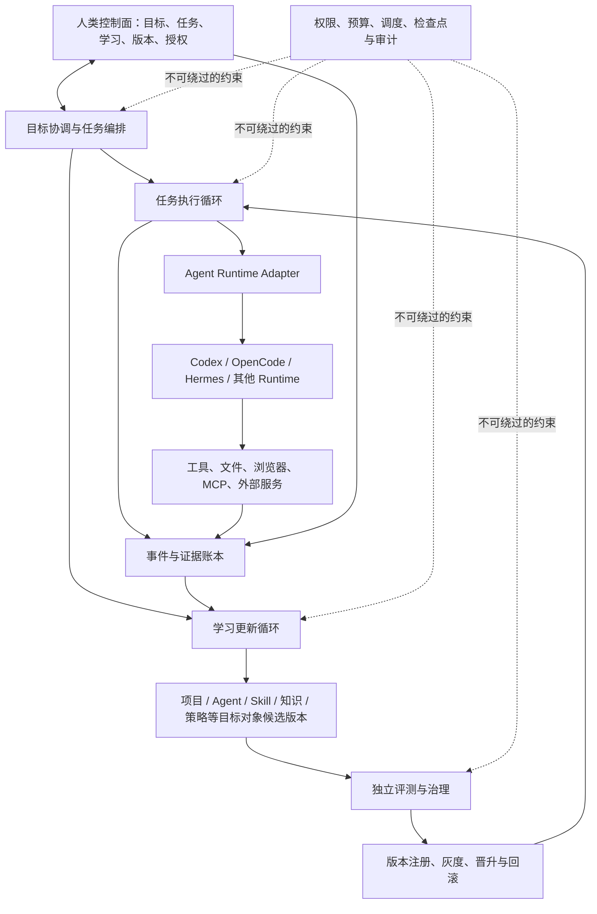
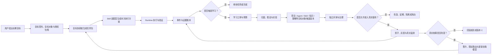

# 持续学习 Agent 研究笔记

> 状态：讨论中的活文档，不是最终产品设计或实施方案
> 创建日期：2026-08-11
> 最后更新：2026-08-11
> 项目目录：`D:\Guo\zuochong\AGi`

## 1. 文档目的

本文件用于保存关于“持续学习 Agent”的长期讨论成果，避免长会话发生上下文压缩后丢失重要推理。

维护原则：

- 保存结论，也保存得出结论的关键理由。
- 区分已形成的共识、暂定建议和仍待研究的问题。
- 每完成一个讨论章节，就同步更新本文件。
- 本文件是研究记录；未来确认产品范围后，再单独形成正式设计文档。

## 2. 讨论协作约定

后续讨论采用以下方式：

- 主要依赖逻辑分析和工程判断的问题，由主控 Agent 直接分析并给出建议。
- 不把阶段性结论机械地变成“请用户确认”的审批节点。
- 只有答案依赖用户的私人信息、价值选择、风险偏好或授权时，才向用户提问。
- 提问前先解释问题背景、不同答案的影响、利弊和主控 Agent 的推荐。
- 主控 Agent 应主动指出反例、风险和不确定性，不要求用户只做“同意/不同意”的 yes 机器。
- 每个讨论章节都应在会话中给出完整、可读的分析和推荐，文档只负责持久保存，不能代替向用户交付内容。
- 应先让用户在会话中看到结论及其理由，再将同一结论整理进研究文档并同步仓库。

## 3. 总体命题

当前 Agent 领域已经出现持续学习的若干部件：

- 长期目标与持续执行，例如 Goal 模式；
- 任务内迭代优化，例如 Loop；
- 将重复经验抽象为 Skill；
- 长期记忆、工具调用、MCP、上下文管理和评测体系。

但这些部件尚不等于完整的持续学习。完整系统还需要将它们连接为可验证、可治理、可回滚的学习协议。

### 3.1 项目定位补充

用户期待最终形成自己的通用持续学习 Agent，而不是复刻 Hermes，也不是把 Codex 简单改装或将两者机械拼接。它们更适合作为不同设计原则的参考：

| 参考对象 | 值得吸收的部分 |
| --- | --- |
| Hermes Agent | 通用工具执行、跨会话记忆、从实践中形成和改进 Skill、后台任务与多入口交互 |
| Codex | 持久目标、任务与进度的可见性、检查点、用户可暂停和恢复、较清楚的权限与工作区边界 |
| 本项目的原创重点 | 将“学、习、持续”连接成目标驱动、证据约束、版本化、可灰度、可回滚、可治理的持续学习协议 |

暂定产品公式：

> 通用行动能力 × 持续学习能力 × 用户可理解、可观察、可干预的控制面

这里的“用户控制面”不是最后附加的一层界面，而是自主 Agent 的核心架构：

- 目标层：当前在追求什么，为什么做，怎样算完成，什么不可改变；
- 任务层：正在做、等待做和已经完成什么，当前检查点、阻塞和产物在哪里；
- 学习层：发现了什么、证据是什么、准备修改什么、哪个版本正在生效；
- 控制层：用户可以暂停、恢复、调整预算、限制权限、否决变更和回滚版本；
- 解释层：重要决策、风险判断和失败归因可以追溯。

自主性与用户友好不是互相对立的：

- 只有自主性而没有可见性，用户感受到的是失控；
- 只有可见性而没有自主性，系统只是一个需要不断催促的任务管理器；
- 理想状态是 Agent 能独立推进，但用户不必猜测它正在做什么，也不必通过频繁对话才能控制它。

因此，Codex 的 Goal 模式和任务组织方式对本项目的价值，不只是提供若干可借鉴的功能，而是证明了“长期自主工作也可以保持清楚、可控和符合用户习惯”。本项目还要在此基础上增加学习过程与版本变化的可见性。

“通用”是长期产品定位，不代表第一个实现阶段必须同时覆盖所有任务。早期可以选择可评测的有限环境验证学习闭环，但核心概念和数据边界不应被设计成只能服务于编程。

暂定总体表达：

> 持续学习 = 目标驱动的认知建模（学） × 证据约束的能力更新（习） × 可长期运行的反馈控制（持续）

这里使用乘法，是因为任何一项缺失都会让系统退化：

- 只有“学”：会研究和写报告，但行为不改变。
- 只有“习”：会无方向地试错。
- 没有“持续”：只能进行一次性优化。

### 3.2 开源优先与灵活复用

本项目采用“开源优先、差异化自研”的工程原则：

> 已有成熟实现能够满足需求时，优先复用；接口不完全匹配时优先适配；只有核心差异化能力或现有实现确实不合适时，才自行开发。

截至 2026-08-11，相关项目的公开边界并不相同：

- Codex 的 CLI、SDK、App Server、Skills、Plugins 和部分环境组件属于公开源码部分；IDE 扩展和 Codex Cloud 不开源；
- Claude Code 有公开 GitHub 仓库，但核心许可证注明版权所有并受 Anthropic 商业条款约束，不能把整个项目视为传统开源代码自由改造；
- Anthropic 的部分 Agent SDK、API SDK 和示例项目另有独立许可证，需要逐个仓库、逐个组件确认；
- OpenCode 和 Hermes Agent 的官方仓库采用 MIT 许可证，可以作为重点源码研究与复用候选；
- “仓库公开可读”不等于“代码可以复制、修改和分发”，任何复用决定都必须检查具体许可证。

#### 三种利用上游代码的方式

方式 A：直接 Fork 一个完整 Agent。

优点是起步快，可以立即获得成熟执行能力和界面。

问题是容易继承上游的任务定位、语言栈、架构限制和升级负担；持续学习核心也可能被迫嵌入不合适的位置。

方式 B：从多个项目拆取组件。

优点是灵活，可以分别选择工具系统、沙箱、会话、MCP、UI 和评测组件。

问题是集成成本高，容易形成依赖拼盘，并且需要自行处理不同状态模型和接口。

方式 C：建立可替换的 Agent Runtime 适配层。

持续学习核心只依赖一组稳定接口，例如：

- 创建和恢复任务；
- 调用模型与工具；
- 读取执行轨迹；
- 取得产物和验证结果；
- 暂停、恢复和取消；
- 查询权限、预算和运行状态；
- 加载稳定 Skill 或候选版本。

底层可以先接入一个成熟 Agent Runtime，将来再替换或并存多个宿主。

当前推荐以方式 C 为主，选择性结合方式 B：

> 保持持续学习核心独立，通过适配器复用一个成熟执行宿主；只有无法通过扩展接口实现的必要能力，才维护小范围分叉。

#### 优先复用的通用能力

- 模型提供商适配；
- 工具调用循环；
- 终端、文件和浏览器工具；
- 沙箱与权限隔离；
- MCP 客户端和服务发现；
- 会话持久化与上下文压缩；
- 任务调度、后台运行和通知；
- 插件与 Skill 加载机制；
- Git、工作区与产物管理；
- 流式输出、任务面板和交互基础设施；
- 测试执行器和通用评测框架。

#### 需要保持为本项目核心的差异化能力

- “学、习、持续”的统一状态和数据模型；
- 目标主权与保留意图的目标重协商；
- 经历、证据、假设、知识、Skill、策略和版本之间的生命周期；
- 失败归因与学习触发；
- 条件化知识、冲突、遗忘和重新验证；
- 自我模型与动态自主边界；
- Champion/Challenger、灰度、晋升和回滚；
- 任务进度与学习进度的双轨控制面；
- 学习预算、停止条件和可恢复检查点；
- 学习者、评测者、治理者和执行者之间的职责与权限分离。

#### 每个上游组件的审计要求

在正式引入前，应记录：

- 官方仓库和具体版本或提交；
- 许可证、版权声明和再分发义务；
- 核心代码是否真正公开；
- 维护活跃度和社区情况；
- 与本项目架构的匹配程度；
- 安全边界和凭证处理方式；
- 测试覆盖和可验证性；
- 升级上游时的冲突成本；
- 是否绑定特定模型、服务或平台；
- 选择“直接依赖、适配、维护小分叉、只参考设计或不采用”的理由。

项目应维护一份上游来源与改动记录，确保以后知道每段复用代码来自哪里、采用什么许可证、修改过什么。

#### 避免两种极端

- 不重复造轮子：不要重新实现已经成熟、非差异化的基础能力；
- 不盲目堆依赖：一个依赖只有在减少的复杂度明显大于引入的维护成本时才值得采用。

阅读上游源码的目标也不只是复制代码，还包括发现成熟项目已经踩过的坑、理解状态边界、比较实现取舍，并用真实实现校正我们的概念设计。

## 4. “学、习、持续”三层理解

### 4.1 学：目标、探索、规划

“学”不是漫无目的地吸收信息，而是围绕明确目标建立认知。

基本过程：

`目标 → 识别知识缺口 → 探索 → 形成假设和概念地图 → 规划下一步`

主要组成：

- 目标：学习为哪个现实问题服务。
- 探索：寻找概念、证据、方法和反例。
- 知识建模：区分事实、主张、推测、冲突和未知。
- 规划：安排依赖顺序，并选择最可能降低关键不确定性的下一步。

例如“改善记忆系统”不能直接变成“研究所有记忆技术”。应先判断问题属于：

- 没有保存；
- 无法检索；
- 检索错误；
- 检索到了但不会使用；
- 知识互相冲突；
- 经验没有转化为未来行为。

不同问题对应完全不同的学习路线。

### 4.2 习：验证、记录、进化

知识不是无条件真理。它通常只在特定前提下成立，并伴随收益、代价和失效范围。

验证要确定：

- 结论是真是假；
- 在什么条件下成立；
- 在什么条件下失效；
- 收益和副作用；
- 证据强度和可信度；
- 是否存在反例或竞争解释。

“记录”不只是保存文本，而是知识固化与整合。成熟知识至少应携带：

- 结论；
- 来源和证据；
- 适用条件；
- 反例；
- 收益与代价；
- 可信度；
- 时间有效性；
- 与其他知识的关系和冲突。

“进化”是把知识转换成未来行为变化：

`知识 + 自我状态 + 目标 + 约束 → 候选 Skill、策略、工具或系统改造`

### 4.3 持续：包围“学”和“习”的控制层

“持续”不是排在学和习之后的第三个一次性阶段，而是控制二者反复运行的外层机制：

`持续 { 学 ↔ 习 }`

完整循环：

`目标 → 知识缺口 → 探索 → 假设 → 验证 → 条件化知识 → 能力改造 → 效果监测 → 新知识缺口`

持续不等于全天候不停运行。健康系统还必须知道：

- 什么时候启动学习；
- 什么时候停止研究并开始行动；
- 一轮学习可以消耗多少资源；
- 什么情况必须交给人类；
- 什么时候遗忘、废弃或重新验证旧知识。

## 5. 目标主权与目标重协商

### 5.1 顶层目标由人类掌握

原则：

> Agent 对顶层目标拥有异议权、解释权和提案权，但没有擅自修宪权。

Agent 可以自主修改方法、计划和局部策略，但不能悄悄改变人类最终想实现的事情。

### 5.2 目标层级

- 价值与核心意图：为什么做，由人决定。
- 项目目标：最终得到什么，原则上由人修改。
- 成功标准与约束：人和 Agent 可以协商，但修改必须透明。
- 策略路线：采用什么方法，Agent 可以自主调整。
- 战术步骤：下一步搜什么、试什么和运行什么，Agent 可以自由迭代。

### 5.3 致命阻塞的分类

Agent 不能把“我暂时不会”误判成“不可能”。阻塞至少分为：

- 原理上不可能；
- 当前技术或资源条件下不可行；
- 代价不可接受；
- 目标内部矛盾；
- 暂时缺少输入、权限或服务；
- 证据不足，既不能证明可行也不能证明不可行。

宣布目标不可行本身也需要证据和反向验证。

### 5.4 保留意图的目标修复

例如“研发永动机”在字面物理定义下不可实现，但其底层意图可能是“长时间、低维护、自主运行的能源系统”。

Agent 应：

1. 说明对原目标的理解；
2. 区分字面目标和底层意图；
3. 提供阻塞证据和可信度；
4. 提出最小幅度的替代目标；
5. 等待人类决定。

目标修改应保留版本谱系：

`原目标 G0 → 阻塞报告 → 人类批准 → 修订目标 G1`

## 6. 自主性、暂停与动态信任

### 6.1 暂停不是二元开关

不能让 Agent 一有疑虑就暂停整个任务。风险处理应分级：

1. 记录并继续；
2. 自主缓解风险；
3. 隔离实验或准备回滚；
4. 非阻塞通知；
5. 局部暂停高风险动作；
6. 仅在目标级重大风险时整体暂停。

原则：

> 能自行降低风险就继续；能隔离或回滚就先实验；只有必须由人做价值取舍时才暂停。

### 6.2 动态自主边界

暂定原则：

> 底线固定，权限动态；自主性可以增长，但不能无限外溢。

信任不是单一等级，而应按以下维度分别增长：

- 任务领域；
- 动作类型；
- 影响范围；
- 资源预算；
- 可逆性；
- 数据敏感度。

Agent 可以获得“自主修改本地代码”的权限，但不因此自动获得付款、生产部署或公开发布权限。

### 6.3 自主性可以降低

权限不是永久勋章，而是与当前已证明能力匹配的许可证。

以下情况应触发重新验证或降级：

- 模型、工具或环境变化；
- 新 Skill 改变行为；
- 连续发生误判；
- 知识过期；
- 风险识别明显退化。

## 7. 底线约束不能只依赖提示词

提示词可以作为“宪法文本”，但不能作为真正的门锁。

推荐采用多层约束：

### 7.1 提示词层

负责表达难以完全编码的语义原则，并使用正例和反例提高理解概率。

### 7.2 工作流协议层

把正向义务变成完成任务的必要条件，例如：

- 必须提交验证证据；
- 必须列出未验证部分；
- 必须记录已知风险和回滚方法；
- 缺少必要字段时，系统不接受“已完成”状态。

原则：

> 不只要求 Agent 拥有某种美德，而要把美德转换成可观察、可检查的行为。

### 7.3 Guardrail 与策略检查层

- 输入检查；
- 输出检查；
- 工具参数和结果检查；
- 高风险动作审批。

### 7.4 权限与执行器层

Agent 不直接掌握所有凭证和执行能力：

`Agent 提议动作 → 策略系统检查 → 执行器执行 → 自动记录`

即使 Agent 判断错误，权限系统也能阻止越界动作。

### 7.5 两阶段执行

高风险动作拆成：

1. 自主准备、模拟和影响分析；
2. 满足策略或取得批准后正式提交。

### 7.6 审计、评测和回滚

- 日志由外部运行框架产生，Agent 不能自行删除；
- 证据引用真实工具结果，而不是任意文本；
- 新 Skill 先进入隔离区；
- 通过安全评测和回归评测后才能启用；
- 出现退化时自动回滚。

## 8. 自主不等于自我批准

授权不一定意味着人类逐次点击同意。授权可以分为：

- 逐次授权；
- 人类预先划定的长期授权范围；
- 满足规则后由系统自动放行。

持续学习 Agent 应主要依赖后两种。

推荐职责分离：

`学习者提出变化 → 评测系统验证 → 治理规则决定晋升 → 执行器应用变化`

整个过程可以自动运行，但 Agent 不能同时修改提案、评测标准、权限边界和放行结果。

自我修改的自动晋升链：

`草稿 → 隔离 → 已验证 → 小范围试用 → 正式启用 → 观察 → 保留或回滚`

只能由人类修改或最终批准的内容包括：

- 顶层目标；
- 底线；
- 权限上限；
- 核心评测规则；
- 审计系统；
- 外部凭证。

## 9. 评测、真实实践与版本进化

### 9.1 证据原则

> 评测是对真实效果的小样本预测，实践效果才是最终证据。

但实践与评测互相改进：

- 评测决定新版本是否值得进入实践；
- 实践暴露的新问题进入知识库和评测库；
- 新版本必须避免旧问题复发。

### 9.2 稳定版与挑战版

- Champion：当前证据最充分、正式执行任务的稳定版。
- Challenger：用于挑战稳定版的候选版本。

不需要让所有历史版本长期并行运行。历史版本保留配置和数据，但通常归档。

### 9.3 验证阶段

`离线评测 → 真实影子运行 → 隔离并行运行 → 小范围灰度 → 晋升稳定版 → 长期监测`

- 影子运行：两个版本收到相同输入，但只有稳定版产生外部副作用。
- 隔离并行：两个版本在不同沙箱中完成相同任务。
- 灰度运行：挑战版处理少量低风险真实任务。

### 9.4 版本 C 的意义

A/B 比较不一定选出永久赢家。新问题可能产生 C。

但持续进化不等于持续改动：

> 应持续积累证据，离散地发布版本。

如果不同版本擅长不同任务，最终结果可能是学习“何时路由到 A、何时路由到 B”，而不是统一成一个万能 C。

### 9.5 多维评测

不能只看单一总分。至少考虑：

- 任务成功；
- 输出质量；
- 安全；
- 成本；
- 延迟；
- 人类介入次数；
- 泛化和迁移能力；
- 可回滚性。

## 10. 记忆的分层与版本关系

### 10.1 共享与独立记忆的矛盾

完全共享可写记忆会导致 A、B 相互污染，难以归因。

完全独立会造成重复存储、经历分叉和用户信息不一致。

### 10.2 推荐：共享基础 + 独立分支

- 共享知识库：用户明确偏好、项目事实、正式确认的领域知识。
- 版本内程序记忆：习惯、Skill、策略、自我认知和实验经验。
- 外部实践记录：所有输入、动作、工具调用、结果和反馈。
- 单次工作记忆：当前任务临时上下文。

版本定义应包含：

`模型 + 提示词 + Skill + 工具 + 策略 + 记忆快照`

A/B 测试时从同一正式记忆快照分支；实验结束后只合并经过验证的记忆。

## 11. 第一章：Agent 究竟学习什么

一次实践可能产生不同学习对象：

| 学习对象 | 回答的问题 |
|---|---|
| 原始经历 | 实际发生了什么 |
| 观察与证据 | 从经历中直接看到了什么 |
| 假设 | 可能是什么原因 |
| 条件化知识 | 在什么条件下什么结论成立 |
| Skill | 应该怎样操作 |
| 策略 | 什么时候使用或不使用 Skill |
| 自我模型 | Agent 对自身能力有什么认识 |
| 评测案例 | 如何防止同类问题复发 |

学习生命周期：

`原始记录 → 候选 → 验证中 → 已确认 → 已启用 → 被替代或过期`

附加状态：

- 已拒绝；
- 存在冲突；
- 需要复验；
- 已废弃。

关键原则：

- 原始经历不等于知识；
- 知识不等于 Skill；
- 失败通常应先形成评测，再形成改造；
- 未经验证的用户偏好推断不能自动升级为底线；
- 不修改系统也可以是有效学习结果。

逻辑上应区分：

- 实践记录库；
- 知识库；
- Skill 库；
- 策略库；
- 评测库；
- 自我模型；
- 治理规则。

## 12. 第二章：什么时候触发学习，以及下一步学什么

持续学习 Agent 不应一直处于学习模式，而应在执行与学习之间切换。

主要触发信号：

- 明确失败；
- 结果明显低于预期；
- 重复问题；
- 高不确定性；
- 预测与结果不一致；
- 意外成功；
- 用户纠正；
- 环境变化；
- 新目标产生能力缺口；
- 定期审计。

触发信号首先形成“学习任务”，不是直接形成 Skill。

学习任务应包含：

- 关联目标；
- 已观察事实；
- 当前假设；
- 潜在影响；
- 复用概率；
- 学习成本；
- 前置知识；
- 完成条件。

优先级的直观原则：

> 学习价值 = 潜在收益 × 复用概率 × 目标重要性，减去学习成本与风险。

Agent 应维护知识前沿：

- 已确认；
- 仍不确定；
- 暂时不重要；
- 阻塞决策的关键未知；
- 需要外部实验；
- 当前无法回答。

一次学习必须有时间、成本、证据和停止条件。

## 13. 第三章：归因——为什么成功或失败

归因目标不是追求绝对科学证明，而是获得与改造风险相匹配的“决策级证据”。

原因层次：

1. 现象；
2. 直接原因；
3. 根本原因；
4. 系统性原因。

只有系统性原因通常值得修改 Agent。

归因核心问题：

> 如果没有这项改造，结果会怎样？

主要方法：

- 相同输入和环境快照下的 A/B；
- 消融实验；
- 每次尽量验证一个核心变化；
- 多次重复；
- 搜索竞争解释和反例；
- 比较成功与失败轨迹的最早分歧；
- 记录行动前预测和行动后结果；
- 将用于改造的数据与最终验证数据分开。

证据与行动匹配：

- 很弱：保存候选假设；
- 较弱：建立待验证知识；
- 中等：小范围试用；
- 较强：形成正式 Skill；
- 很强：扩大使用范围。

条件化结论优于绝对结论：

> 在条件 C 下，变化 X 对任务 T 稳定地产生结果 Y，并伴随代价 Z。

## 14. 第四章：自我模型——Agent 如何认识自己

自我模型不是一段“我是谁”的人格描述，而是一份由系统事实和实践证据共同维护的能力账本。

它需要回答：

- 当前运行的是哪个 Agent 版本；
- 拥有哪些模型、工具、Skill、知识和权限；
- 在哪些任务上已经被证明可靠；
- 在哪些条件下容易失败；
- 当前哪些知识过期、冲突或不确定；
- 完成某类任务通常需要多少成本和时间；
- 什么情况可以自主执行，什么情况需要降级、委托或暂停。

### 14.1 为什么需要自我模型

Agent 即使学到大量外部知识，如果不了解自身当前状态，仍然无法正确改造自己。

例如它知道“向量检索可以改善长期记忆”，但必须先知道自己的真实问题属于：

- 没有保存；
- 检索不到；
- 排序错误；
- 检索结果没有进入上下文；
- 检索到了但策略没有使用；
- 记忆内容本身不可信。

只有准确识别自身缺口，外部知识才能转化为正确改造。

### 14.2 自我模型的组成

1. **版本清单**
   - 模型；
   - 提示词；
   - Skill；
   - 工具；
   - 策略；
   - 记忆快照；
   - 评测规则；
   - 运行环境。

2. **能力清单**
   - 能处理哪些任务；
   - 需要哪些前置条件；
   - 有哪些工具和权限；
   - 能否隔离、验证和回滚。

3. **实践能力画像**
   - 按任务类型统计成功率、质量、成本和延迟；
   - 人类介入次数；
   - 常见失败模式；
   - 最近验证时间；
   - 适用范围和环境。

4. **知识边界**
   - 已确认知识；
   - 候选假设；
   - 已知未知；
   - 过期知识；
   - 冲突知识；
   - 当前无法访问的信息。

5. **失败画像**
   - 经常在哪个阶段失败；
   - 哪些输入或环境容易触发；
   - 直接原因与系统性原因；
   - 已知缓解方法；
   - 是否已经存在回归评测。

6. **自主与权限画像**
   - 可以自主完成的动作；
   - 只能在沙箱中执行的动作；
   - 需要策略放行的动作；
   - 必须由人类决定的动作；
   - 当前权限为什么被授予或降级。

7. **当前运行状态**
   - 活跃目标；
   - 当前上下文和依赖；
   - 剩余预算；
   - 正在进行的实验；
   - 等待中的外部事件。

### 14.3 自我模型不能主要依赖模型自述

模型说“我很擅长研究”不是可靠证据。自我模型应优先来自：

- 外部工具和权限清单；
- 真实执行轨迹；
- 客观测试结果；
- Champion/Challenger 比较；
- 用户纠正；
- 版本和环境元数据；
- 长期表现统计。

模型的自我反思可以提出假设，但不能直接成为正式能力结论。

### 14.4 使用预测误差更新自我模型

每次任务开始前记录：

- 预计成功概率；
- 预计成本和时间；
- 预计最可能的失败点；
- 认为需要哪些能力和前置条件。

结束后比较实际结果：

- 高信心失败：说明自我模型过度自信；
- 低信心成功：可能低估了能力；
- 成功但成本远超预期：效率画像不准确；
- 反复在同一阶段失败：形成系统性能力缺口；
- 环境变化后突然退化：触发相关能力重新认证。

自我模型的质量可以用“预测是否校准”衡量，而不是用 Agent 对自己的文字评价衡量。

### 14.5 能力必须条件化

不应记录宽泛结论：

> 我擅长写代码。

而应记录：

> 在 Python 项目、测试可运行、依赖可安装且修改范围清楚时，本版本能可靠完成中小型缺陷修复；涉及分布式并发和生产数据迁移时证据不足。

通用 Agent 的能力不是一个总分，而是一张按任务类型、环境、工具、权限和风险划分的地图。

### 14.6 自我模型与版本

每个版本应拥有自己的能力画像。

- B 可以继承 A 的历史数据作为先验；
- 但 B 修改了相关 Skill、工具或策略后，受影响能力的可信度应暂时降低；
- 未受影响能力不必全部重新测试；
- 新版本通过离线、影子和灰度验证后，再逐步恢复或扩大可信度；
- 原始实践数据由外部记录库共享，正式能力结论按版本维护。

### 14.7 防止自我模型成为权限升级工具

Agent 可以更新描述性事实，也可以提出“我已经具备更高能力”的申请，但不能仅凭自我评价扩大权限。

影响自主边界的能力结论，需要：

- 外部评测证据；
- 足够真实任务记录；
- 风险和回滚条件；
- 治理规则自动放行或人类批准。

否则 Agent 可能为了扩大行动空间而逐渐高估自己。

### 14.8 自我模型不应全部塞进上下文

完整能力账本可能很大，不应每次都注入提示词。

运行时只检索与当前任务有关的部分，例如：

- 本任务需要哪些能力；
- 当前版本在这些能力上的可信度；
- 常见失败和缓解方法；
- 可用工具和权限；
- 相关知识是否过期。

这使自我模型成为结构化运行数据，而不是不断膨胀的人格提示词。

本章核心结论：

> 自我模型是一份可验证、按版本维护、能够预测能力边界的运行账本；它连接外部知识、学习触发、自主授权和具体改造。

## 15. 第五章：人机协作与控制面

持续学习 Agent 不能只考虑“Agent 如何行动”，还必须考虑“人如何理解和控制一个长期自主行动、并且会改变自身行为的系统”。

这里的控制面不是单纯的界面，而是由持久状态、治理规则、状态展示、通知和干预能力共同组成的系统。它类似一个驾驶舱：正常情况下不替代驾驶者完成每个动作，但必须持续显示真实状态，并允许在必要时改变方向或紧急制动。

### 15.1 三种控制方式

#### 方式 A：逐步审批

Agent 每完成一步就请求人类确认。

优点：

- 表面上最可控；
- 容易理解；
- 适合少量不可逆的高风险操作。

问题：

- 用户成为执行循环的一部分；
- 容易产生审批疲劳；
- Agent 无法真正长期自主运行；
- 用户往往没有足够信息判断每个技术细节，审批可能只剩形式。

#### 方式 B：黑箱自主

人类只给目标，Agent 自主完成全部工作，最后报告结果。

优点：

- 打扰少；
- 执行效率高；
- 容易展示较强的自主性。

问题：

- 过程中发生偏离时发现太晚；
- 用户不知道 Agent 是否真的在推进；
- 学习和自我修改可能暗中改变系统行为；
- 发生错误后难以定位、阻断和回滚。

#### 方式 C：监督式控制

人类设定目标、边界、资源和不可变底线；Agent 在授权范围内自主规划和执行。真实状态持续可见，只有遇到无法自行消解的价值冲突、越权需求或重大不可逆风险时，才要求人类裁决。

这是当前推荐方向，因为它同时满足：

- 默认自主推进；
- 异常才升级；
- 用户不必持续盯住系统；
- 状态可观察；
- 干预可局部化；
- 重要改变可追溯和回滚。

核心原则：

> 用户控制不是逐步审批，而是对一段持续委托关系进行监督。

### 15.2 会话不能成为系统状态本身

如果目标、计划、进度、权限和学习结论只存在于聊天上下文中，那么上下文压缩、会话切换、后台运行或多入口访问都会导致状态模糊甚至丢失。

因此应将以下对象持久化在会话之外：

- 目标契约：目标、核心意图、完成条件、约束和停止条件；
- 任务账本：任务分解、依赖、当前状态、检查点和产物；
- 事件与证据账本：实际执行、工具结果、评测、错误和用户纠正；
- 学习变更账本：候选知识、Skill、策略、验证状态和影响范围；
- 版本与权限账本：当前版本、实验版本、回滚点和授权边界。

聊天只是其中一个交互入口，而不是唯一的记忆容器或事实来源。

这意味着用户即使更换会话、从其他入口访问，或者系统发生上下文压缩，仍能准确知道项目正在做什么。

### 15.3 自主执行需要明确的授权包络

每个长期目标都应带有一个“授权包络”，也就是 Agent 可以自主行动的明确范围。

至少包括：

- 目标：最终要实现什么；
- 范围：哪些项目、文件、账户、数据和环境属于本次任务；
- 能力：可以调用哪些工具和子 Agent；
- 动作：可以读取、修改、发布、付款或删除到什么程度；
- 资源：时间、算力、费用和并发预算；
- 风险：哪些操作必须隔离、灰度或人工裁决；
- 时效：授权何时过期，哪些环境变化会触发重新确认；
- 停止条件：完成、失败、预算耗尽或重大阻塞时如何处理。

授权包络应由执行器和权限系统实际约束，而不能只写在提示词中。

在包络内，Agent 默认自主执行；超出包络时，优先寻找可逆、隔离或降级方案，确实需要扩大权限时才提交申请。

### 15.4 控制面应呈现什么

控制面不应简单堆放原始日志。默认视图应回答用户最关心的几个问题。

#### 目标视图

- 当前在追求什么；
- 为什么做；
- 怎样算完成；
- 哪些内容不能被 Agent 自行改变；
- 当前总体状态和剩余预算。

#### 任务视图

- 正在做什么；
- 已经验证了什么；
- 下一步是什么；
- 哪些任务在等待、重试或阻塞；
- 产生了哪些文件、结果和外部影响。

#### 学习视图

- Agent 发现了什么；
- 这是一次经历、假设、知识还是 Skill；
- 有哪些支持和反对证据；
- 是否已进入验证、灰度或正式生效；
- 会影响哪些能力和任务。

#### 版本与信任视图

- 当前稳定版本和挑战版本；
- 最近改变了什么；
- 真实运行效果如何；
- 哪些能力的可信度上升或下降；
- 可以回滚到哪里。

#### 注意事项视图

- 哪些只是背景信息；
- 哪些建议用户稍后查看；
- 哪些需要用户做决定；
- 哪些局部工作已被暂停；
- 是否存在需要立即处理的重大风险。

默认界面应保持简单，证据、原始轨迹和版本差异按需展开。这是“渐进展示”：普通用户先看到结论和影响，需要追查时再进入细节。

### 15.5 任务进度与学习进度必须分开

持续学习 Agent 同时在推进两类过程。

任务进度回答：

- 目标产物完成了多少；
- 当前执行到哪个任务和检查点；
- 哪些结果已经通过验证；
- 还剩哪些依赖和阻塞。

学习进度回答：

- 当前发现了什么知识缺口或能力缺陷；
- 正在验证哪个假设；
- 已获得哪些支持和反对证据；
- 还有哪些关键不确定性；
- 是否准备形成知识、Skill 或策略变更；
- 候选变更处于实验、评测、灰度还是正式生效阶段。

两者不能互相替代：

- 任务完成，不代表 Agent 从中学到了可复用能力；
- 学习取得进展，也可能暂时没有增加目标产物；
- 同一任务可能已经完成，但新的 Skill 仍在验证；
- Agent 可能因为发现错误归因而主动退回学习阶段。

开放式探索不应显示没有依据的百分比。与其声称“学习完成 73%”，不如展示当前阶段、已经排除的可能性、证据强度和下一次能够降低不确定性的实验。

这里的“训练”是广义的学习循环，包括探索、实践、评测、Skill 更新、策略调整和灰度运行，不必等同于修改基础模型参数。

### 15.6 展示结构化思路，而不是原始思维流

用户需要了解 Agent 的思路，才能判断此时应该参与调整，还是让 Agent 继续自主学习。但“思路展示”不应理解为持续输出模型内部未经整理的思维文本。

原始思维流通常存在以下问题：

- 冗长、反复并且包含大量无效探索；
- 不稳定，同一问题可能产生不同叙述；
- 未必忠实对应真正影响行动的依据；
- 容易让用户被技术细节淹没；
- 会消耗大量上下文和注意力。

更合适的是形成结构化的决策记录：

- 当前理解：Agent 认为问题是什么；
- 前提与假设：哪些已知，哪些只是暂时假设；
- 当前方案：准备做什么，以及为什么选择它；
- 备选方案：考虑过什么，为什么暂不采用；
- 证据与反证：哪些事实支持或削弱当前判断；
- 不确定性：最可能出错的地方是什么；
- 行动前预测：预期看到什么结果；
- 实际结果：发生了什么，与预测有何偏差；
- 下一步：哪个动作最可能减少关键不确定性；
- 介入价值：人类现在参与能改变什么，不参与时 Agent 会怎样继续。

展示可以分三层：

1. 默认摘要：目标、当前阶段、最近进展、下一步和是否需要用户；
2. 决策展开：假设、方案、取舍、不确定性和介入点；
3. 审计详情：原始事件、工具结果、评测数据和版本差异。

控制面应明确标记人类参与的价值：

- 无需介入：Agent 有明确、低风险且可逆的下一步；
- 可选参与：用户偏好或领域经验可以缩短探索，但 Agent 仍能继续；
- 建议参与：存在重要方向分叉，用户意见可能显著影响结果；
- 必须参与：涉及核心目标、价值取舍、权限扩大或重大不可逆风险。

这样，用户不是被迫跟随每一步，而是根据可见的进度、依据和不确定性，自主选择何时成为学习循环的一部分。

### 15.7 通知和暂停应分级

控制面的核心目标之一，是保护用户的注意力。用户注意力与算力、时间和费用一样，也是一种有限资源。

建议使用以下层级：

1. 后台记录：无需通知，保留审计信息；
2. 定期摘要：将低优先级变化批量汇报；
3. 非阻塞提醒：用户值得知道，但 Agent 可以继续安全工作；
4. 等待裁决：受影响分支暂停，其他安全任务继续；
5. 目标级暂停：只有重大风险、核心目标冲突或无法继续时使用；
6. 紧急制动：立即停止外部行动并保存可恢复状态。

Agent 在请求人类介入前，应先判断：

- 能否自行降低风险；
- 能否在隔离环境验证；
- 能否选择可逆方案；
- 能否推迟并与其他问题合并汇报；
- 等待人类是否真的比继续安全工作更好。

目标不是让通知更丰富，而是让每次打扰都有足够价值。

### 15.8 用户消息不应自动打断目标

长期任务运行时，用户的新消息可能有不同含义：

- 查询：询问状态或原因，不改变执行；
- 补充：增加事实、偏好或材料，Agent 吸收后继续；
- 调整：改变优先级或局部约束，触发重新规划；
- 目标变更：修改核心目标，需要明确记录为新版本目标；
- 紧急控制：暂停、撤销、冻结权限或回滚；
- 无关话题：进入独立任务，不污染当前目标。

系统应根据语义处理消息，而不是把所有新消息都视为“停止当前工作并执行最新一句话”。核心目标的修改尤其需要明确识别，避免日常交流无意间改变长期方向。

### 15.9 状态不能只依赖 Agent 自述

Agent 可以生成易懂的进度说明，但客观状态应尽量来自外部事实：

- 工具调用和返回结果；
- 文件、提交和产物；
- 测试与评测记录；
- 预算消耗；
- 权限变更；
- 版本发布和回滚事件；
- 用户实际做出的决定。

控制面应区分：

- 事实层：系统实际发生了什么；
- 解释层：Agent 如何理解这些事实，以及准备怎么做。

这样可以避免 Agent 仅凭语言声称“已经完成”“已经学会”或“风险很低”。

### 15.10 不同学习变更需要不同治理强度

持续学习不能把每一次记录都变成人工审批，但也不能允许所有自我修改静默生效。

| 变更类型 | 默认处理 |
| --- | --- |
| 临时工作记忆与待验证假设 | 自动产生，随任务结束清理或转入候选区 |
| 带来源的事实和经验记录 | 自动保存，允许冲突并等待后续验证 |
| Skill 或程序性方法 | 自动提出和测试；低风险时可灰度，高影响时需更强验证 |
| 执行策略与判断规则 | 版本化、对照评测、限制影响范围并保留回滚 |
| 权限、自主边界和底线 | Agent 只能提出，不得自行扩大或删除 |
| 顶层目标与核心意图 | 只由人类修改；Agent 可以报告阻塞并提出替代方案 |

这套分级使 Agent 能够持续学习，又不会因为每条记忆都要批准而失去自主性。

本章核心结论：

> 理想控制面应实现低打扰、高可见和强恢复：Agent 可以自主运行，但不能神秘运行；可以持续学习，但不能暗中改变关键行为；用户不必一直盯着，却能随时理解、接管和回退。

## 16. 第六章：知识冲突、遗忘、过期与重新验证

持续学习系统并不是记得越多越好。随着经历增加，错误信息、条件不同的结论、已经过时的事实和彼此竞争的方法也会不断增加。

真正的目标不是最大化记忆数量，而是提高未来决策质量：

> Agent 不仅要知道什么可能成立，还要知道它在什么条件下成立、依据是什么、何时验证过、可能与什么冲突，以及什么时候不应再使用。

### 16.1 三种知识更新方式

#### 方式 A：最新记录覆盖旧记录

优点是实现简单，读取时只看到一个答案。

问题是：

- 最新信息不一定更正确；
- 无法区分环境变化和偶然失败；
- 会丢失历史证据；
- 容易被一条错误输入污染；
- 无法解释知识为什么发生变化。

#### 方式 B：为每条知识维护单一置信度

它比直接覆盖更好，可以根据证据调整分数。

但单一分数仍然会隐藏很多关键区别：

- 两个结论可能分别在不同条件下成立；
- 高置信度旧知识可能已经过期；
- 不同来源的权威性取决于知识类型；
- 一个精确数字容易制造并不存在的确定性。

#### 方式 C：证据账本与条件化知识视图

系统保留多个知识主张及其条件、来源、时间和证据。执行具体任务时，再根据当前环境生成一份“当前可用知识视图”。

这是推荐方向：

- 原始证据不会被悄悄覆盖；
- 冲突可以被明确保存；
- 不同条件下可以采用不同结论；
- 当前选择可以解释和重新验证；
- 新证据可以改变活跃结论，而不必删除历史。

它比单值记忆复杂，但早期并不需要建设庞大的知识图谱。使用结构化记录和明确的依赖关系，就可以验证核心机制。

### 16.2 知识应记录为有条件的主张

一条可用于决策的知识至少应包含：

- 内容：具体主张是什么；
- 类型：事实、用户偏好、约束、程序方法、策略或能力结论；
- 适用范围：任务、环境、工具、版本和前提条件；
- 来源：用户、官方资料、工具结果、实验、模型推测或其他来源；
- 时间：何时观察、何时生效、最后何时验证；
- 支持证据：哪些事实支持它；
- 反对证据：哪些事实与它不一致；
- 状态：候选、验证中、活跃、冲突、过期、被替代或隔离；
- 依赖：哪些知识、Skill、策略和版本依赖它；
- 失效触发器：哪些变化出现时需要重新验证；
- 影响范围：如果它是错的，会影响哪些行动。

因此，不应只记录：

> 方法 A 更好。

而应记录：

> 在 Python 项目、测试可运行、改动范围较小且主要目标是降低回归风险时，方法 A 在 18 次任务中优于方法 B；当执行时间受到严格限制时证据不足。

这使知识能够被验证、复用和反驳。

### 16.3 冲突不一定是真正的矛盾

常见冲突包括：

1. 直接事实冲突：相同条件和时间下，两个主张互相否定；
2. 条件冲突：结论分别在不同环境、工具或任务中成立；
3. 时间冲突：旧结论曾经正确，但环境后来发生变化；
4. 来源冲突：用户、文档、工具结果或实验给出不同信息；
5. 偏好冲突：用户当前偏好与过去记录不同；
6. 策略冲突：局部效率规则与更高层目标或底线不一致；
7. 方法冲突：多个 Skill 都能解决问题，但收益、成本和风险不同；
8. 结果冲突：同一方法在重复实践中表现不稳定。

很多表面矛盾，在补充时间和适用条件后会变成两个都成立的条件化结论。因此冲突处理的第一步不是选赢家，而是检查双方是否真的在谈同一件事。

### 16.4 来源权威必须按知识类型判断

不存在一个在所有问题上都最可信的来源。

- 用户对自己的目标、偏好和授权拥有最高权威；
- 用户对外部事实的判断仍可能需要证据验证；
- 官方文档通常对接口和规则更权威，但不决定用户意图；
- 当前环境中的实际工具结果可以证明本地行为，但不必然代表所有环境；
- 多次真实实践可以证明经验有效，但仍需要记录适用范围；
- 模型自身回忆适合作为探索线索，不适合直接成为高影响决策依据。

因此，来源优先级应与主张类型绑定，而不能使用一个全局排序。

### 16.5 推荐的冲突处理流程

当发现冲突时：

1. 将双方改写为清楚、可比较的主张；
2. 对齐时间、环境、对象、版本和前提；
3. 检查来源及支持、反对证据；
4. 判断是真冲突、条件不同还是环境已经变化；
5. 评估错误选择的影响；
6. 选择处理方式；
7. 记录选择理由和仍未解决的不确定性；
8. 必要时创建学习任务或实验。

可选处理方式包括：

- 条件拆分：双方在不同条件下继续有效；
- 并存：证据不足，保留多个候选；
- 暂定优先：当前任务先使用证据更强的一方；
- 隔离：高风险或疑似污染的知识暂时不可用于行动；
- 替代：新知识正式取代旧知识，但保留历史关系；
- 重新验证：通过实验、检索或真实运行补充证据；
- 人类裁决：目标、偏好或价值冲突无法由事实实验决定。

系统不应默认采用“最后写入者胜出”。

### 16.6 遗忘不等于删除

对 Agent 来说，遗忘主要是减少某条信息对未来行为的影响，而不是立即销毁全部历史。

可以分为：

1. 工作记忆清理：任务结束后丢弃无复用价值的临时细节；
2. 检索降权：保留记录，但降低默认召回优先级；
3. 退出活跃知识：不再用于普通决策，只在审计或冲突分析时读取；
4. 标记被替代：指向新的结论，保留演化关系；
5. 隔离：疑似错误、污染或高风险内容不可直接影响执行；
6. 硬删除：根据用户要求、隐私、安全或数据治理规则真正删除内容。

不能只根据“多久没用”决定遗忘。某些低频知识可能极其重要，例如灾难恢复方法或不可违反的底线。

更合理的判断因素包括：

- 未来使用概率；
- 决策价值；
- 错误使用的风险；
- 是否可以从可靠来源低成本重新获取；
- 是否已被更好的知识替代；
- 是否仍承担审计和归因作用；
- 用户是否要求保留或删除。

原则是：

> 默认先移出活跃决策，再决定是否删除证据。

### 16.7 过期不等于错误

时间过去并不会自动让所有知识变假。

- 物理规律通常较稳定；
- 软件接口、价格、法规和在线服务状态变化较快；
- 用户偏好只有在用户改变想法时才真正更新；
- Skill 可能因为模型、工具或环境改变而失效；
- 某个版本的能力结论不能直接代表新版本。

因此不应给所有知识应用同一种时间衰减。更合适的是同时维护：

- 最后验证时间；
- 建议复查时间；
- 适用的环境和版本；
- 预期变化速度；
- 明确的失效触发器；
- 当前新鲜度状态。

“需要复查”表示证据已经变旧，不等于结论已经被证明错误。

### 16.8 重新验证的触发方式

重新验证可以由以下情况触发：

- 使用触发：高影响任务准备依赖旧知识；
- 定时触发：对变化较快的重要知识周期复查；
- 环境触发：模型、工具、接口、数据或权限变化；
- 冲突触发：出现新的反例或相反主张；
- 性能触发：依赖该知识的 Skill 连续表现下降；
- 用户触发：用户纠正、质疑或要求重新检查；
- 版本触发：相关能力被修改，需要重新认证。

验证优先级应综合：

- 对当前目标的影响；
- 当前不确定性；
- 环境发生变化的可能性；
- 近期使用概率；
- 错误知识可能造成的损失；
- 验证所需成本。

高风险行动依赖过期知识时，应先验证或使用安全替代方案。低风险、可逆任务可以在明确标注不确定性的前提下继续，并把真实结果作为新证据。

### 16.9 知识变化需要传播到依赖对象

如果一条知识被证明错误，只修改知识记录还不够。

系统还应检查：

- 哪些 Skill 使用了它；
- 哪些策略以它为前提；
- 哪些评测答案依赖它；
- 哪些版本的能力画像因此失真；
- 哪些正在运行的任务需要重新规划；
- 相关自主权限是否应该暂时降低。

传播不应导致整个系统无差别失效，而应依据依赖关系确定影响范围。只有真正受影响的能力需要重新测试或降级。

这也是知识库需要保存依赖关系的原因：不是为了建立漂亮的知识图谱，而是为了在结论变化时知道应该检查哪里。

### 16.10 冲突如何进入人机协作界面

控制面不需要向用户展示所有细小冲突。Agent 应先自行区分：

- 可以通过补充事实或低成本实验解决的冲突；
- 可以根据明确条件自动分流的冲突；
- 暂时并存也不影响当前目标的冲突；
- 会显著改变目标方向、风险或资源投入的冲突；
- 本质上属于用户偏好、价值或授权的冲突。

前面三类通常由 Agent 自主处理并记录。后面两类才值得进入用户的注意事项视图。

展示时应说明：

- 冲突双方是什么；
- 为什么不能同时用于当前任务；
- 已有哪些证据；
- Agent 准备怎样验证；
- 用户不参与时会采用什么安全方案；
- 用户介入能够改变什么。

这延续上一章的原则：让用户根据进度、依据和介入价值选择是否参与，而不是把未经整理的矛盾直接抛给用户。

本章核心结论：

> 持续学习 Agent 的知识库不应是一份不断覆盖的“标准答案”，而应是一套保存主张、条件、证据、时间和依赖的动态账本。学习不仅是获得新知识，也包括限制旧知识的影响、识别环境漂移，并在恰当时机重新验证。

## 17. 第七章：多目标评测

持续学习 Agent 的“进化”不是一个单一分数。

一个新版本可能：

- 完成率提高，但成本翻倍；
- 输出质量提高，但速度明显下降；
- 更少打扰用户，但也漏掉了应该上报的风险；
- 更安全，但通过拒绝大量正常任务来实现；
- 在当前评测集进步，却损害了其他任务的泛化能力；
- 离线评测很好，真实运行却没有改善。

因此，版本更新不能简单问“B 是否比 A 更强”，而应问：

> B 在哪些任务和条件下改善了哪些指标，付出了什么代价，是否违反底线，证据是否足够，以及这些权衡是否符合当前目标。

### 17.1 三种多目标决策方式

#### 方式 A：压缩成一个总分

将质量、安全、成本、自主性等指标乘以权重，再相加得到一个分数。

优点：

- 容易排序；
- 容易自动化；
- 适合做粗略趋势展示。

问题：

- 严重安全问题可能被其他高分平均掉；
- 权重很难长期固定；
- 不同量纲的分数容易制造伪精确；
- Agent 可能针对总分投机，而不是真正改善；
- 用户无法看出提升的真实代价。

#### 方式 B：要求所有指标同时改善

只有新版本在每个维度都不差于旧版本时才允许晋升。

优点：

- 比较保守；
- 不容易隐藏退步。

问题：

- 现实改进通常存在取舍；
- 很多有价值的新能力会被阻止；
- 指标噪声可能导致版本长期无法更新；
- 不同任务需要不同侧重。

#### 方式 C：分层约束与条件化权衡

推荐采用四层判断：

1. 不可违反的硬门槛；
2. 关键能力的最低保障；
3. 可权衡指标的多维比较；
4. 针对任务类型和用户偏好的条件化选择。

这意味着先排除不能接受的版本，再在合格版本之间讨论取舍，而不是把所有问题一次性塞进总分。

### 17.2 需要评测的主要维度

#### 结果质量

- 是否真正完成用户目标；
- 正确性、完整性和可复现性；
- 对模糊输入和环境变化的稳健性；
- 是否产生新的返工；
- 用户实际是否接受结果。

#### 安全与治理

- 是否违反权限、底线或数据边界；
- 是否出现风险漏报和不必要的风险报警；
- 是否正确使用隔离、灰度和人工升级；
- 出错后能否及时停止、控制影响和回滚；
- 是否留下完整审计记录。

#### 成本与性能

- 模型、工具、算力和外部服务成本；
- 完成一次成功任务的平均成本；
- 响应和完成时间；
- 重试、无效探索和重复工作的消耗；
- 为获得额外质量所付出的边际成本。

#### 自主性与用户负担

- 无需用户介入完成任务的比例；
- 不必要询问和暂停的次数；
- 应当询问却没有询问的漏报率；
- 等待用户时能否继续推进其他安全工作；
- 是否能够自行恢复常见失败；
- 用户为监督 Agent 实际花费的注意力和时间。

#### 学习质量

- 从多少次经历中形成了稳定改进；
- 是否能迁移到未见过但相关的任务；
- 一段时间后是否仍然保持；
- 是否造成旧能力退化；
- 是否产生错误泛化或负迁移；
- 版本是否过于频繁变动，却没有实际收益。

#### 可理解与可恢复

- 进度和决策依据是否可以被用户理解；
- 评测结论是否能追溯到真实证据；
- 失败能否定位到知识、Skill、策略或版本；
- 是否存在可用回滚点；
- 回滚后能否恢复稳定工作。

### 17.3 指标必须成对约束

任何单独指标都可能被错误优化。

例如：

- 只优化“减少询问”，Agent 可能在应该求助时保持沉默；
- 只优化“安全”，Agent 可能拒绝所有任务；
- 只优化“成本”，Agent 可能减少必要探索和验证；
- 只优化“速度”，Agent 可能增加错误与返工；
- 只优化“成功率”，Agent 可能无限消耗资源；
- 只优化“学习速度”，Agent 可能过度拟合少量经历。

因此关键指标应配对观察：

| 想要改善的指标 | 必须同时观察 |
| --- | --- |
| 减少用户介入 | 风险漏报、结果质量和自恢复能力 |
| 提高安全性 | 正常任务完成率和过度拒绝率 |
| 降低成本 | 质量、失败率和返工成本 |
| 提高速度 | 正确性、稳定性和后续修复成本 |
| 加快学习 | 保持时间、迁移能力和旧能力退化 |
| 提高自信 | 置信度与实际正确率是否匹配 |

这可以防止 Agent 通过牺牲真正目标来改善表面数字。

### 17.4 推荐的版本晋升阶梯

#### 第一步：硬门槛

以下问题不能被其他指标补偿：

- 违反不可变底线；
- 未经授权扩大权限；
- 破坏数据完整性；
- 无法审计关键外部行动；
- 无法在要求的条件下停止或回滚；
- 对重大风险的处理低于最低标准。

任何硬门槛失败都应阻止晋升。

#### 第二步：关键能力下限

根据 Agent 当前承担的任务，设定不能明显退化的核心能力，例如：

- 基础指令遵循；
- 关键工具调用；
- 用户数据处理；
- 目标保持；
- 重要回归案例。

这里不要求每个数字完全不下降，而是设定可以接受的退化预算，并考虑评测噪声。

#### 第三步：多维收益比较

通过前两层后，再比较：

- 哪些维度明显改善；
- 哪些维度付出代价；
- 代价是否在预算内；
- 改善是否只发生在特定任务；
- 当前证据有多大不确定性。

如果一个版本至少改善一项重要能力，同时其他维度没有超出允许的退化范围，可以认为它具有晋升价值。

如果两个版本各有优劣，不必强行选出全局赢家。

#### 第四步：真实运行验证

离线结果只决定挑战版本是否值得进入下一阶段。之后仍需经过：

`离线评测 → 影子运行 → 隔离并行 → 低风险灰度 → 扩大使用 → 稳定版`

最终决定依据是真实任务中的长期效果。

### 17.5 版本决策不只有通过和失败

评测结果可以产生：

- 晋升：新版本成为稳定版；
- 继续取证：结果有潜力，但样本不足；
- 限定使用：只在已证明有效的任务类型中启用；
- 保持双版本路由：不同条件选择不同版本；
- 退回改造：根据新问题形成版本 C；
- 回滚：真实运行效果低于稳定版；
- 淘汰：没有继续投入验证的价值。

“证据不足”不等于“版本失败”。它表示系统还没有权利作出强结论。

### 17.6 不同评测集承担不同职责

建议至少区分：

1. 核心回归集：长期冻结的重要能力和历史严重问题；
2. 动态问题集：近期真实失败、用户纠正和新环境问题；
3. 迁移集：与已学任务相关但没有直接见过的案例；
4. 高风险集：权限、数据、不可逆行动和异常输入；
5. 真实运行样本：灰度阶段的实际任务结果。

只使用动态问题集容易让 Agent 忘记旧能力；只使用固定回归集又容易对测试题过拟合。

学习者不应能够随意修改所有保护性评测。核心回归集、隐藏迁移集和评测规则应由独立治理机制维护，避免 Agent 通过改题来证明自己进步。

### 17.7 真实版本比较不应重复产生外部副作用

Champion 和 Challenger 接收相同真实输入，不代表两个版本都要真正付款、发消息、删除文件或发布内容。

更安全的方式是：

- 稳定版执行真实动作，挑战版只生成计划或在影子环境运行；
- 在沙箱中进行完整并行测试；
- 只把少量低风险、可回滚任务交给挑战版；
- 使用历史轨迹重放，比较新旧版本决策；
- 对高风险任务继续使用稳定版。

这样可以控制性能成本，也避免为了评测而把一次现实任务执行两遍。

### 17.8 最优结果可能是路由，而不是统一版本

假设：

- A 成本低、速度快，适合简单任务；
- B 质量更高，但耗时更长，适合复杂任务。

系统不一定要让 B 完全取代 A。它可以学习“什么条件下选择 A，什么条件下选择 B”。

但路由规则本身也必须评测，否则只是把版本选择问题转移成了错误分类问题。

默认稳定策略可以是：

- 高风险任务使用证据最充分的版本；
- 已证明优势明确的任务交给专门版本；
- 不确定任务回到稳定版；
- 路由错误进入新的评测和学习循环。

### 17.9 用户应该看到什么

控制面不应只显示“新版本总分提高 12%”，而应显示类似：

- 复杂任务质量提高；
- 简单任务成本增加；
- 用户介入次数减少；
- 风险漏报没有增加；
- 发现一个新的边界条件；
- 当前证据来自多少离线案例和真实任务；
- 建议在哪类任务中灰度；
- 出现什么情况会自动回滚。

用户负责决定高层取舍，例如：

- 质量优先；
- 均衡模式；
- 成本和速度优先。

但这些偏好不能覆盖安全底线。Agent 可以在已经授权的取舍范围内自行选择，不必每次询问用户。

本章核心结论：

> Agent 的进化应被表示为一组带条件和不确定性的变化，而不是一个“更聪明”的总分。版本晋升必须先满足底线和关键能力下限，再讨论质量、成本、速度、自主性和学习能力之间的权衡，并最终接受真实实践检验。

## 18. 第八章：内部组织——单 Agent、多角色还是多 Agent

持续学习 Agent 内部至少需要承担规划、执行、记录、学习、评测和治理等职责，但这不代表每一种职责都要变成一个独立 Agent。

首先应区分：

- 产品身份：用户认为自己在与谁协作；
- 逻辑角色：系统内部的一组职责和权限；
- 运行实例：一次独立的模型调用、会话或后台任务；
- 模型：提供推理能力的具体基础模型；
- 确定性服务：权限、日志、调度、版本和评测执行等普通程序。

多角色不等于多 Agent，多 Agent 也不等于真正独立。

### 18.1 三种内部组织方式

#### 方式 A：单体 Agent

一个 Agent 在同一上下文中完成规划、执行、学习、自我评测和版本更新。

优点：

- 实现最简单；
- 沟通成本低；
- 上下文共享自然；
- 适合验证非常早期的概念。

问题：

- 容易同时当选手、裁判和放行者；
- 不同角色目标互相干扰；
- 上下文持续膨胀；
- 很难判断失败来自哪个环节；
- 权限边界主要依赖提示词；
- 自我评价容易受到原方案的影响。

#### 方式 B：单一协调者与隔离角色

对用户表现为一个 Agent，由一个协调者维护目标和任务；学习、评测等职责在独立上下文或独立运行中完成，关键状态由确定性服务维护。

优点：

- 保持统一、友好的用户体验；
- 角色之间可以有明确的读写边界；
- 成本和协调复杂度仍然可控；
- 可以逐步替换模型或拆分服务；
- 适合早期验证完整持续学习闭环。

问题：

- 协调者可能成为瓶颈；
- 使用同一基础模型时仍会存在相关偏差；
- 需要清楚设计状态和产物接口。

#### 方式 C：分布式多 Agent 组织

多个长期存在的 Agent 分别负责研究、执行、评测、记忆、风险和领域任务。

优点：

- 可以并行处理独立工作；
- 容易引入不同模型和专业能力；
- 高负载时更容易扩展；
- 某些高风险职责可以物理隔离。

问题：

- 沟通、同步和调度成本高；
- 多个 Agent 可能重复工作或互相污染状态；
- 调试和失败归因更困难；
- 多 Agent 共识可能制造虚假的可靠感；
- 很容易在核心闭环尚未验证前过度工程化。

当前推荐方式 B：

> 对外是一个 Agent，对内按角色分离；先实现逻辑隔离，只有证据表明存在并行、专业化或安全隔离需求时，再进行物理拆分。

### 18.2 推荐的核心角色

| 角色或服务 | 主要职责 | 不能自行做什么 |
| --- | --- | --- |
| 目标协调者 | 维护目标契约、任务图、预算、优先级和检查点 | 修改人类核心意图或越过授权包络 |
| 执行者 | 使用当前稳定版本规划、调用工具、产生产物和验证任务结果 | 将自己的临时经验直接晋升为正式能力 |
| 事件记录器 | 记录工具调用、结果、文件、评测、用户反馈和版本事件 | 解释或改写已经发生的事实 |
| 学习者 | 发现知识缺口、归因、提出知识、Skill 和策略候选 | 激活自己的候选变更或修改晋升门槛 |
| 评测者 | 按受保护标准测试候选版本、检查回归和边界 | 修改候选来让它通过，或自行降低评测标准 |
| 治理与发布器 | 执行硬门槛、权限规则、灰度、晋升和回滚 | 修改顶层目标、底线或自行扩大授权 |
| 知识与记忆服务 | 保存主张、证据、冲突、依赖、状态和检索视图 | 根据语言直觉静默覆盖历史证据 |
| 控制面报告器 | 从真实状态生成用户可读的进度、思路和介入提示 | 把自己的总结当作系统事实 |

这些角色不都需要使用大模型。

### 18.3 哪些职责应交给程序，哪些需要模型

更适合确定性程序的职责：

- 权限检查；
- 预算计数；
- 事件日志；
- 任务和版本状态机；
- 文件哈希和产物校验；
- 测试命令执行；
- 固定规则评测；
- 灰度比例和回滚触发；
- 凭证隔离。

更适合模型推理的职责：

- 理解目标；
- 任务规划；
- 开放式探索；
- 假设形成；
- 失败归因；
- Skill 抽象；
- 复杂结果解释；
- 面向用户的进度总结。

原则是：

> 需要开放判断的地方使用 Agent，需要确定约束的地方使用普通程序。

不能为了强调“多 Agent”而把计数器、数据库、权限门和状态机也包装成会说话的 Agent。

### 18.4 任务执行循环与学习更新循环

系统内部应有两个时间尺度不同的循环。

任务执行循环：

`读取目标 → 规划任务 → 执行动作 → 验证结果 → 更新任务状态`

它围绕当前学习目标进行行动、构建和实验，产生目标对象的新状态、候选产物和真实证据。

学习更新循环：

`汇总经历 → 识别模式 → 形成假设 → 提出候选变更 → 独立评测 → 灰度 → 晋升或回滚`

它根据证据决定当前学习目标所指向的对象应怎样更新。目标对象可以是项目、Agent、Skill、知识、策略或用户适配，而不只限于天问自身能力。

两个循环共享外部事件和证据，但不应在每一个动作后立即改变执行策略。否则 Agent 在完成同一目标的过程中可能不断改变自己，导致难以归因和复现。

默认情况下，一个任务检查点应使用固定的稳定版本。只有严重错误修复、紧急回滚或明确的版本切换事件才改变行为。

### 18.5 持久状态需要明确写入者

共享状态不能允许所有角色随意修改。

推荐采用“广泛可读、有限可写”：

- 顶层目标和核心意图：只有人类可以正式修改；
- 任务状态：由目标协调者维护；
- 原始事件：由记录器追加，其他角色不能改写；
- 学习候选：由学习者创建和修订；
- 评测结果：由评测系统写入；
- 正式版本状态：由治理与发布器维护；
- 权限边界：由外部权限系统执行；
- 用户可读摘要：可以重新生成，但不能覆盖事实层。

每类关键对象尽量只有一个正式写入者，可以减少状态冲突和责任不清。

### 18.6 评测独立性不能只靠角色名称

让同一个模型先提出方案，再换一句提示词说“现在你是严格评测者”，只能提供有限独立性。

更可靠的办法包括：

- 使用独立上下文，避免评测者继承学习者的说服性叙述；
- 先盲测产物，再按需查看设计理由；
- 使用确定性测试和外部工具结果；
- 保留学习者不能修改的回归集和隐藏案例；
- 高影响变更可使用不同模型交叉检查；
- 价值与授权问题继续由人类负责。

多个 Agent 得出一致意见也不等于结论正确。它们可能共享相同模型、资料和偏见。共识只能成为弱证据，真实结果和独立验证才是强证据。

### 18.7 什么时候值得使用真正的子 Agent

适合委派给子 Agent 的情况：

- 多个任务真正独立，可以并行推进；
- 需要不同领域知识或工具环境；
- 需要隔离实验；
- 需要独立审查同一产物；
- 主协调者上下文不应承载大量局部细节。

不适合的情况：

- 工作强依赖前一步结果；
- 多个角色会同时修改同一状态；
- 子任务很小，沟通成本高于执行成本；
- 只是为了制造“多 Agent 很高级”的外观；
- 希望通过投票替代真实验证。

子 Agent 的输入应包含明确目标、范围、预算、可用工具、返回格式和停止条件。结果必须由协调者或外部验证系统检查，不能因为子 Agent 声称完成就直接信任。

### 18.8 需要防止的组织故障

#### 角色泄漏

学习者绕过评测直接修改活跃 Skill，或评测者为了通过测试帮助修改候选。

处理方式：权限隔离和不可跳过的版本状态机。

#### 状态分叉

不同角色持有不同版本的目标、任务或知识。

处理方式：持久状态作为事实来源，上下文只保存相关快照。

#### 无限讨论

多个 Agent 互相审查、反驳和再审查，却没有新证据。

处理方式：每轮必须产生新证据、执行决定或明确停止；设置轮次和资源预算。

#### 重复或冲突执行

多个执行者对同一外部对象产生重复副作用。

处理方式：单一任务所有权、幂等操作、执行锁和外部副作用登记。

#### 虚假独立

多个同模型 Agent 给出类似结论，被误认为多方验证。

处理方式：记录模型、上下文、数据和评测方法的独立程度，不用 Agent 数量冒充证据强度。

### 18.9 对用户仍应表现为一个完整 Agent

用户不应该负责判断该找学习者、评测者还是执行者，也不应该看到大量内部 Agent 对话。

用户面对的是一个统一主体：

- 给它目标；
- 查看任务和学习进度；
- 补充信息或调整方向；
- 在必要时处理决策和授权；
- 查看版本变化和真实效果。

内部角色可以显示为阶段：

- 执行中；
- 验证中；
- 学习候选已形成；
- 评测中；
- 灰度运行；
- 已晋升或已回滚。

需要深入调查时，用户可以展开查看是哪个角色、模型、工具和证据产生了结论，但默认体验不应像管理一家公司。

### 18.10 推荐的演进顺序

第一阶段：

- 一个目标协调者；
- 执行、学习和评测使用隔离运行；
- 权限、日志、版本和预算由普通程序维护；
- 对用户保持单一 Agent 体验。

第二阶段：

- 将后台学习者和评测环境独立运行；
- 支持受控的并行子任务；
- 根据实际瓶颈拆分专业角色。

第三阶段：

- 只有当任务规模、专业化或安全隔离需求被真实证明后，再建设长期存在的多 Agent 组织。

本章核心结论：

> 推荐“对外单一主体、对内职责分离、物理部署渐进拆分”。先分清谁能写什么、谁不能批准自己、哪些事实由外部系统维护，再决定需要多少 Agent。多 Agent 是扩展手段，不是持续学习成立的前提。

## 19. 第九章：学习预算、停止条件和资源控制

“持续学习”描述的是系统能够长期反复进入学习循环，不代表某一次学习必须无限持续。

如果缺少资源控制，Agent 很容易出现：

- 为了找到更优方案不断追加研究；
- 在没有新证据时重复尝试；
- 通过新建子任务或子 Agent 延长循环；
- 把大量资源用于改善自身，而不是完成用户目标；
- 预算耗尽后突然中断，无法恢复；
- 因为已经投入很多而继续投入更多。

因此，每次学习都应是一段有明确问题、预算、停止条件和输出的有限过程。

### 19.1 三种资源控制方式

#### 方式 A：只设置固定硬上限

例如最多运行 30 分钟、调用工具 50 次或花费 10 元。

优点：

- 简单；
- 容易执行；
- 可以避免无限运行。

问题：

- 不能根据进展调整；
- 可能在即将得到关键证据时突然停止；
- 不区分高价值探索和重复消耗；
- 停止后经常只留下不完整结果。

#### 方式 B：让 Agent 自行判断是否继续

优点：

- 灵活；
- 可以根据任务变化调整；
- 不需要预先精确估算。

问题：

- 模型不擅长准确统计自身资源；
- 容易因为“再试一次可能成功”不断延长；
- 学习者可能高估自身改造的价值；
- 子任务和重试可能绕过原有预算；
- 缺少外部强制停止能力。

#### 方式 C：外部预算包络内的自适应分配

推荐方案：

- 人类或上级目标设定总包络；
- 外部程序准确计量和强制执行；
- Agent 在包络内自主调整方法与局部分配；
- 软上限触发复盘、降级或检查点；
- 硬上限阻止继续消耗；
- 有价值但未完成的工作保存为可恢复状态；
- 扩大总预算需要治理规则或人类授权。

它兼顾了自主性和可控性。

### 19.2 预算应分层继承

预算至少存在以下层级：

1. 用户或账户总预算；
2. 项目预算；
3. 长期目标预算；
4. 任务预算；
5. 学习工单预算；
6. 实验或工具动作预算；
7. 子 Agent 预算。

下级预算必须计入上级消耗。

例如一个学习工单剩余 20 次工具调用，不能通过创建三个子 Agent 分别获得 20 次。子 Agent、重试、后台任务和版本 C 的实验都应继续消耗同一个上级额度，除非发生明确的新授权。

这可以防止“预算洗白”：通过换名字或生成子任务，把一次有限探索变成无限循环。

### 19.3 预算不是只有钱和 Token

应根据任务维护多个资源维度：

- 墙上时间：现实中经过多久；
- 计算成本：Token、模型调用、算力；
- 外部费用：付费 API、云资源、购买和交易；
- 工具调用：搜索、浏览器、终端、MCP 等次数或速率；
- 迭代次数：实验、重试、版本候选数量；
- 并发：同时运行多少子任务和 Agent；
- 外部影响：写文件、发消息、发布、删除或部署的次数与范围；
- 风险暴露：允许进入多少低置信度或高影响实验；
- 用户注意力：通知、询问和人工评审次数；
- 上下文与存储：日志、轨迹、数据集和版本占用。

不同目标可以使用不同重点，但关键资源必须由外部计量器统计，不能依赖 Agent 自报。

### 19.4 每个学习工单都需要学习契约

学习开始前应记录：

- 要回答的具体问题；
- 这个问题将影响哪个现实决策；
- 当前已有证据和关键未知；
- 允许探索的范围；
- 可用工具和权限；
- 时间、成本、实验和注意力预算；
- 什么证据算取得进展；
- 什么条件算足够完成；
- 什么情况应停止、降级或请求扩展；
- 最终要交付知识、实验报告、Skill、评测案例还是版本候选。

例如不应只创建：

> 研究怎样改进记忆系统。

而应创建：

> 在 90 分钟和 30 次检索实验内，判断当前失败主要来自未保存、检索错误还是错误应用；至少形成一个有证据支持的主因判断和一个可验证改造候选。若连续三轮实验没有减少关键不确定性，则停止并保存现状。

学习契约防止探索范围不断扩张。

### 19.5 软限制与硬限制

#### 软限制

达到后不一定立即停止，但必须触发：

- 检查是否仍有新进展；
- 重新估计剩余价值；
- 缩小问题范围；
- 选择更便宜的实验；
- 形成检查点；
- 决定继续、延期或提交预算扩展。

软限制可以包括建议时间、建议迭代数和最低学习收益。

#### 硬限制

达到后执行器必须阻止继续消耗，例如：

- 费用上限；
- 最晚结束时间；
- 最大外部副作用；
- 最大并发；
- 不可越过的风险阈值；
- 权限和数据边界。

硬限制不能由 Agent 用自然语言说服系统绕过。

预算中还应预留少量“收尾额度”，用于保存状态、取消任务、整理证据、回滚和生成报告，避免探索消耗掉全部资源后无法安全停止。

### 19.6 进展不能用“运行了多久”衡量

一次学习循环应至少产生一种变化：

- 新证据；
- 关键不确定性下降；
- 排除一个重要假设；
- 发现一个新的可验证解释；
- 评测结果改善；
- 对适用边界有更清楚认识；
- 形成可执行决策。

以下情况表示可能陷入停滞：

- 多次重复相同工具调用；
- 相同失败原因反复出现；
- 计划来回切换但没有新证据；
- 不断创建同义子问题；
- 评测长期没有变化；
- 只产生更多文字，没有改变判断；
- 每轮都以“还可以再研究一下”为理由继续。

停滞不应仅按固定次数判断。复杂任务可能需要很多轮，而简单任务两三轮就足够。更重要的是最近一段预算是否真正降低了不确定性或改善了结果。

### 19.7 停止不只有成功和失败

学习工单可以以不同状态结束：

- 已完成：达到证据和输出条件；
- 已足够行动：没有获得完整真相，但已经足以做当前决策；
- 延期：价值存在，但当前优先级不高；
- 预算暂停：额度耗尽，保存后等待恢复；
- 外部阻塞：缺少数据、工具、权限或环境；
- 证据不足：已完成合理探索，无法可靠下结论；
- 路线无效：当前方法持续不产生新信息；
- 风险停止：继续探索的风险超过授权；
- 目标重协商：发现顶层目标不可行或核心前提错误；
- 已被替代：目标、环境或其他方案已经使该工单失去价值。

“足够行动”尤其重要。持续学习系统不需要在采取任何行动前获得完整知识，只需要证据与行动风险相匹配。

### 19.8 停止必须产生可恢复检查点

安全停止至少应保存：

- 当前问题和目标；
- 已消耗与剩余预算；
- 已验证事实和证据；
- 被否定与仍待验证的假设；
- 最近一次有效进展；
- 当前产物和实验状态；
- 未完成外部动作；
- 回滚或清理结果；
- 推荐的下一步；
- 恢复学习需要的条件。

这样暂停不是丢弃工作，而是把运行状态转换为未来可以继续的资产。

### 19.9 预算扩展需要证据

Agent 可以在授权范围内重新分配预算，例如减少低价值搜索，把资源转给更有区分度的实验。

但扩大总预算时，应说明：

- 已经消耗了什么；
- 获得了哪些新证据；
- 为什么原估计不足；
- 剩余关键问题是什么；
- 再增加多少资源；
- 预期能获得什么决策价值；
- 不扩展时可以采用什么安全方案；
- 新预算耗尽后如何停止。

“再试一次可能会成功”不是充分理由。

可以为 Agent 提供一小部分预授权弹性额度。当进展明确且风险低时自动使用；超过总上限仍需治理规则或人类决定。

### 19.10 学习不能吞噬用户目标

持续学习 Agent 可能产生“自我改进成瘾”：不断研究怎样让自己更强，却迟迟不交付用户真正需要的结果。

学习活动应分成：

- 内联学习：当前任务必须解决的知识缺口；
- 后台学习：不阻塞当前交付，但未来价值较高；
- 延期学习：记录进学习队列，等待重复信号或更高优先级；
- 放弃学习：预期价值低于成本。

当前用户目标拥有优先权。除非学习是完成目标的必要条件，Agent 不应把大部分执行预算自动转为自我改进预算。

### 19.11 用户控制面应展示资源状态

用户不需要阅读每次 Token 消耗，但应能够看到：

- 总预算、已使用和剩余；
- 当前消耗速度；
- 预计还能运行多久；
- 资源主要花在执行、验证还是学习；
- 最近预算产生了什么证据或能力改善；
- 是否接近软限制或硬限制；
- 不增加预算时 Agent 会怎样收尾；
- 增加预算预计能换来什么。

可以提供“快速完成、均衡、深度研究”等默认资源偏好，但仍应展开为明确的实际额度和停止规则，不能只作为模糊提示词。

自主边界扩大可以带来更大的自动预算和更灵活的内部调配，但不能变成无限资源。能力越强，获得的是更大的受控额度，而不是取消账户边界。

本章核心结论：

> 持续学习应由一系列有限、可计量、可恢复的学习工单组成。Agent 在外部预算包络内自主探索，以证据增量而不是运行时长衡量进展；当收益递减、预算耗尽、风险上升或已经足够行动时，应形成检查点并停止，而不是依靠“再试一次”无限延长。

## 20. 第十章：完整概念架构与数据流

本章把前面的目标、自主性、记忆、学习、评测、版本、控制面和开源复用原则连接为一套完整概念架构。

它仍然是一份等待真实使用验证的架构假设，而不是不可修改的最终蓝图。架构的目的不是提前确定所有实现细节，而是保护几条关键边界，使系统以后可以调整内部实现，而不破坏目标主权、证据链和回滚能力。

### 20.1 三种总体架构方式

#### 方式 A：直接修改一个现有 Agent

例如 Fork Codex、OpenCode 或 Hermes，将持续学习能力直接写进其内部循环。

优点：

- 可以最快获得成熟执行能力；
- 初始集成路径短；
- UI、工具和会话能力可以直接使用。

问题：

- 持续学习核心会绑定上游架构和语言栈；
- 上游更新难以合并；
- 很难同时支持其他 Runtime；
- 学习证据和版本历史可能与宿主状态耦合；
- 为编程 Agent 设计的边界可能限制长期通用化。

#### 方式 B：独立持续学习核心与 Runtime 适配层

持续学习、证据、版本和治理由天问核心管理，底层通过统一适配器调用一个或多个 Agent Runtime。

优点：

- 可以复用成熟轮子；
- 学习历史不依赖某个宿主；
- 可以替换、比较或并存多个 Runtime；
- 差异化能力保持清楚；
- 上游更新更容易吸收。

问题：

- 需要设计稳定接口；
- 某些宿主内部状态可能难以完整取得；
- 跨 Runtime 行为一致性需要额外验证。

#### 方式 C：完全自研 Agent Runtime

从模型调用、工具循环、会话、沙箱到学习系统全部自行建设。

优点：

- 控制力最大；
- 状态模型可以完全围绕持续学习设计；
- 不受上游接口限制。

问题：

- 会重复建设大量成熟基础能力；
- 实现周期和维护成本最高；
- 容易把精力花在非差异化基础设施；
- 早期很难同时验证通用 Agent 和持续学习两个巨大命题。

当前推荐方式 B：

> 以独立持续学习核心为主，通过 Agent Runtime Adapter 复用成熟执行宿主；初期只接入一个 Runtime，接口和数据边界保留替换能力。

### 20.2 哪些边界应稳定，哪些细节应允许变化

#### 应长期稳定的架构原则

- 顶层目标和核心意图由人类掌握；
- 会话只是交互入口，不是系统唯一状态；
- 原始事实与 Agent 解释分离；
- 学习候选与正式生效版本分离；
- 学习者不能自我评测、自我放行或自行扩大权限；
- 任务执行与学习更新使用不同状态和发布节奏；
- 权限、预算、版本与回滚由外部程序执行；
- 所有长期改变必须有来源、证据、版本和影响范围；
- 持续学习核心与底层 Runtime 保持清楚接口；
- 真实实践持续反哺评测和知识。

#### 预计会根据使用调整的部分

- 具体使用哪个 Agent Runtime；
- 模型和模型路由策略；
- 内部角色数量和是否物理拆分；
- 数据库、检索和消息实现；
- 学习触发阈值；
- 评测指标和样本量；
- Skill 适配参数；
- 预算默认值和自动扩展额度；
- 控制面布局和通知方式；
- 知识字段的具体细节；
- 哪些学习活动在线执行、哪些后台批处理。

原则是：

> 稳定责任边界和数据契约，允许算法、组件与阈值持续演化。

### 20.3 总体分层



总体可以理解为八层：

1. 人类控制面；
2. 目标与任务协调；
3. 任务上下文和 Skill 适配；
4. 任务执行循环；
5. 事件、证据与持久状态；
6. 学习更新循环；
7. 评测、治理与版本发布；
8. Runtime 适配与外部工具。

权限、预算、审计和恢复作为横跨所有层的确定性护栏。

### 20.4 人类控制面

控制面是用户与整个系统协作的唯一必要入口。

它不直接承担内部执行，而是展示并控制：

- 目标：核心意图、完成条件、范围和底线；
- 任务：当前工作、检查点、阻塞、产物和下一步；
- 学习：触发原因、假设、证据、不确定性和介入价值；
- 版本：稳定版、挑战版、灰度状态、能力变化和回滚点；
- 资源：预算、消耗速度、预计停止时间；
- 权限：当前授权包络和扩大权限申请；
- 决策：需要人类处理的价值、偏好和高影响取舍。

控制面中的事实应来自持久状态和真实事件；模型生成的说明只是解释层。

### 20.5 目标协调与任务编排

目标协调者维护：

- 目标契约；
- 任务图和依赖；
- 当前优先级；
- 检查点；
- 任务与学习预算；
- 暂停、恢复和停止状态；
- 任务执行循环与学习更新循环的调度关系。

它可以调整计划和方法，但不能自行改变核心意图。

目标协调者也不必是一个始终运行的大模型 Agent。目标状态、任务状态和调度可以主要由普通程序维护，只在需要理解、规划和解释时调用模型。

### 20.6 学习目标与目标对象

持续学习不是一个固定功能，而是一套围绕目标推进状态变化的通用过程。

每次持续学习至少需要明确：

- 学习目标：最终希望达到什么状态；
- 目标对象：具体要改善什么；
- 当前状态：目标对象现在是什么情况；
- 关键差距：当前状态与目标状态之间缺少什么；
- 允许操作：Agent 可以怎样研究、实验和修改；
- 评价证据：什么事实能够证明目标对象改善；
- 版本单位：哪种变化需要形成候选版本；
- 预算与停止条件：学到什么程度开始行动，何时暂停或结束。

目标对象可以是：

| 学习目标示例 | 目标对象 | 主要版本变化 |
| --- | --- | --- |
| 完成一个自动投递简历项目 | 项目 | 需求、方案、代码、配置、交互与部署版本 |
| 改良 Codex | Codex 或其扩展层 | 源码、配置、插件、Skill、交互和评测版本 |
| 完善天问 | 天问 Agent | Skill、策略、工具、路由、自我模型和 Agent 版本 |
| 适应某个用户 | 用户与项目适配 | 条件化偏好、工作方式和 Skill 执行配置 |
| 学习一个领域 | 知识与程序能力 | 条件化知识、来源、Skill 和评测 |
| 降低运行成本 | 执行策略 | 模型、工具、缓存、并发和任务路由版本 |

因此，生成项目和自动优化 Skill 都不是持续学习本身，而是同一过程作用于不同目标对象后的结果。

通用过程是：

```text
确定目标
→ 识别差距
→ 探索与规划
→ 实践或实验
→ 获取结果
→ 验证与归因
→ 更新目标对象候选版本
→ 继续观察和循环
```

“完善天问”可以作为长期默认元目标，但当前用户指定的目标拥有优先权。用户要求完成项目时，主要学习预算应服务于项目；过程中发现的天问自身问题可以进入学习队列，除非它直接阻塞当前目标，否则不能自动吞噬主要资源。

### 20.7 任务上下文编译

每次执行任务前，系统不应把全部历史、知识和 Skill 塞入上下文，而应生成一个与当前任务有关的“任务包”：

- 当前目标及不可变边界；
- 当前学习目标对象、目标版本和关键差距；
- 当前任务、依赖和完成条件；
- 授权、预算和风险等级；
- 当前稳定 Agent 版本；
- 相关用户和项目偏好；
- 当前适用的条件化知识；
- 相关 Skill、策略和常见失败；
- 需要记录的评测和证据；
- 本次停止与检查点条件。

这个过程类似把分散状态编译成一次可执行任务上下文。

任务完成后，上下文可以释放，但重要事件、证据、产物和状态变化必须写回持久账本。

### 20.8 Skill 适配层

天问不应直接把上游 Skill 复制一份后随意修改，而应优先采用：

```text
上游原始 Skill
+ 用户与项目适配层
+ 当前任务和风险上下文
+ 当前稳定策略版本
= 本次有效执行方案
```

#### 上游原始 Skill

- 保持来源和版本；
- 尽量只读；
- 可以继续接收上游更新；
- 记录不可弱化的核心约束。

#### 用户与项目适配层

- 用户对不同任务的严谨程度偏好；
- 项目质量标准；
- 汇报方式；
- 已证明可以省略或必须保留的步骤；
- 常用工具和环境；
- 历史真实效果。

#### 当前任务与风险上下文

- 任务类型；
- 影响范围；
- 可逆性；
- 数据敏感程度；
- 成本和时间要求；
- 当前不确定性。

#### 本次有效执行方案

明确本次：

- 是否触发该 Skill；
- 执行哪些步骤；
- 使用什么工具；
- 验证到什么程度；
- 怎样汇报；
- 什么时候停止；
- 哪些步骤不可省略。

适配应先使用参数和策略覆盖。只有结构性差异无法表达时，才创建 Skill 分支。

适配本身也是学习候选，必须根据后续质量、成本、用户负担和风险进行验证。上游 Skill 更新后，受影响的本地适配需要重新验证。

上层系统和安全规则明确要求的步骤不能被个性化适配绕过。

### 20.9 任务执行循环

任务执行循环服务于完成当前目标：

```text
读取任务包
→ 规划下一步
→ 调用 Runtime 和工具
→ 获取真实结果
→ 验证产物
→ 更新任务状态
→ 继续、完成、局部重试或形成检查点
```

执行过程中可以修改当前计划、工作记忆和工具选择，但默认不直接修改正式长期知识、Skill、策略或权限。

如果当前目标对象是项目或其他外部产物，执行循环可以持续产生代码、设计和配置的候选版本，但不能在没有验证和治理记录的情况下把候选直接标记为正式版本。

一个任务检查点通常使用固定的稳定 Agent、Skill 和策略版本，同时允许被改善的目标对象形成新候选版本，以保证：

- 行为可复现；
- 失败可以归因；
- 当前结果不会被未经验证的自我修改污染；
- 发生问题时可以恢复。

严重错误可以触发紧急回滚或受控修复，但仍然要形成明确版本事件。

### 20.10 事件与证据账本

执行循环产生的真实经历进入事件与证据账本：

- 用户输入和纠正；
- 当前目标和任务版本；
- 任务上下文摘要；
- 使用的模型、Runtime、Skill 和策略版本；
- 工具调用与结果；
- 产物、测试和评测；
- 时间、成本和预算；
- 异常、重试和回滚；
- 用户是否接受结果；
- 后续真实效果。

账本应尽量追加记录，避免模型事后改写历史。

并非所有原始内容都要永久保存。隐私、敏感数据和低价值轨迹应按数据治理规则进行最小化、脱敏、归档或删除。

### 20.11 学习更新循环

学习更新循环读取执行证据，判断当前学习目标所指向的对象应怎样改变：

```text
学习触发
→ 创建学习工单
→ 归因
→ 形成假设
→ 补充探索或实验
→ 产生目标对象候选版本
→ 独立评测
→ 挑战版本
→ 影子与灰度
→ 晋升、限定路由、改造或回滚
```

学习触发可能来自：

- 重复失败；
- 用户纠正；
- 意外成功；
- 重复工作；
- 预测与实际结果偏差；
- 环境和工具变化；
- 目标对象当前状态与预期不一致；
- 目标长期停滞。

学习更新循环并不只是总结。它还可能启动新的隔离实验，取得足够证据后才改变项目、Agent、Skill、知识或其他目标对象的正式版本。

### 20.12 学习更新可以作用的目标对象

一次学习工单可能产生：

| 目标对象 | 候选更新 | 改善证据 |
| --- | --- | --- |
| 项目或外部产物 | 需求、设计、代码、配置、部署和交互版本 | 测试、用户评估和真实运行效果 |
| Agent 或 Runtime | 源码、Prompt、工具、插件、配置和路由版本 | 能力评测、任务表现和回归结果 |
| 记忆 | 用户、项目和事件事实 | 后续任务正确检索并减少重复说明 |
| 条件化知识 | 带范围、来源和时效的主张 | 新证据、反例和真实决策质量 |
| Skill | 程序性方法及其用户、项目适配 | 相似任务质量、成本、速度和稳定性 |
| 策略 | 工具、模型、Runtime、Skill 和介入选择 | 多任务对照与真实路由效果 |
| 评测案例 | 失败、边界和迁移案例 | 是否能预测真实退化并防止复发 |
| 自我模型 | 能力、失败、成本和可信边界 | 预测与实际表现是否校准 |
| 用户适配 | 条件化偏好和工作方式 | 用户接受度、返工和介入负担 |
| 自主权申请 | 某领域权限或预算调整建议 | 足够真实证据与可控风险 |

学习完成的判据不是“已经生成文件”，而是：

> 目标对象的新版本在后续实践中带来可测量改善，并且没有产生不可接受的退化。

### 20.13 评测、治理与版本发布

候选变化进入独立验证：

1. 确认变更范围；
2. 检查安全和权限硬门槛；
3. 运行核心回归和相关动态案例；
4. 检查质量、成本、速度、自主性和可恢复性；
5. 生成 Challenger 版本；
6. 进行影子、隔离或低风险灰度；
7. 比较真实效果；
8. 晋升、限定路由、继续取证、改造或回滚。

所有可持续改善的目标对象都需要版本清单。通用字段至少包括：

- 目标对象类型和标识；
- 当前版本与父版本；
- 变更内容和原因；
- 相关证据和评测；
- 状态、适用范围和发布条件；
- 回滚位置。

如果目标对象是 Agent，版本清单还应能够确定：

- 模型和关键参数；
- Runtime 和工具能力；
- Skill 与策略版本；
- 相关知识视图；
- 权限和预算配置；
- 自我模型。

如果目标对象是项目，版本清单还应能够确定需求、设计、代码、配置、数据迁移、部署状态、验收结果和用户反馈。不同目标对象可以使用不同评测器，但必须遵守同一候选、验证、发布和回滚协议。

### 20.14 Agent Runtime Adapter

适配层为天问核心提供统一能力：

- 查询 Runtime 支持的模型、工具和权限；
- 创建、恢复、暂停、取消任务；
- 提交任务包和有效 Skill 方案；
- 接收流式状态和结构化事件；
- 获取工具调用、产物和验证结果；
- 创建检查点；
- 加载稳定版本或隔离候选版本；
- 在允许时切换 Runtime；
- 报告无法支持的能力。

适配器不应隐藏重要事实。如果某个 Runtime 无法提供完整工具轨迹、暂停或版本隔离能力，天问需要明确降低可验证性和自主权限，而不是假装能力相同。

### 20.15 持久状态与写入所有权

| 状态 | 主要内容 | 正式写入者 |
| --- | --- | --- |
| 目标账本 | 核心意图、完成条件、约束、目标版本 | 人类；协调者记录 |
| 学习目标对象 | 对象类型、当前版本、关键差距、可修改范围和评价证据 | 目标协调者记录；对应发布器更新版本 |
| 任务账本 | 任务、依赖、检查点、状态、产物 | 目标协调者 |
| 事件与证据账本 | 动作、工具结果、用户反馈、真实效果 | 事件记录器 |
| 知识账本 | 主张、条件、来源、冲突、过期、依赖 | 知识服务按治理流程写入 |
| Skill 与策略库 | 上游版本、本地适配、候选和活跃状态 | 学习者提案；发布器激活 |
| 评测库 | 核心回归、动态案例、结果和标准 | 评测与治理系统 |
| 版本注册表 | Champion、Challenger、发布、路由、回滚 | 治理与发布器 |
| 自我模型 | 能力、失败、成本、可信度和授权建议 | 证据驱动更新；权限另行决定 |
| 用户与项目画像 | 明确偏好、条件化习惯和项目标准 | 用户事实优先；推断需有证据 |

每类对象应至少具有：

- 唯一标识；
- 类型；
- 作用范围；
- 状态；
- 版本；
- 来源；
- 证据引用；
- 时间；
- 适用条件；
- 依赖关系；
- 失效和重新验证条件。

### 20.16 端到端数据流



这一闭环可能跨越多个任务和多个会话，不要求在一次对话中完成。

### 20.17 主要失败和恢复路径

#### 当前动作失败

执行者在预算内尝试可逆替代方案；重复失败形成学习触发。

#### Runtime 或工具变化

相关知识和 Skill 标记需要复查，使用备用 Runtime、降级方案或重新验证。

#### 用户纠正

当前任务立即调整；目标对象的长期改变作为证据进入学习更新循环，避免一次纠正被过度泛化。

#### 候选评测失败

候选保持隔离，可以改造、延期或淘汰，不影响稳定版本。

#### 灰度版本退化

自动停止扩大范围，回滚到 Champion，保存失败为新评测和学习证据。

#### 预算耗尽

形成可恢复检查点，保存证据、候选和下一步，而不是无限重试或突然丢失。

#### 状态不一致

使用正式账本和原始事件重建状态，不以模型最近一次总结为唯一事实。

#### 顶层目标不可行

停止相关分支，形成阻塞报告和保留意图的替代目标，由人类决定是否修改。

### 20.18 初版部署形态

虽然逻辑上有多个角色和服务，初版不建议直接建设微服务和长期多 Agent 集群。

推荐“模块化单体”：

- 一个目标协调入口；
- 一个持久状态存储；
- 一个事件与证据记录层；
- 一个 Runtime Adapter；
- 执行、学习和评测以隔离任务或独立上下文运行；
- 权限、预算、状态机和版本由普通程序维护；
- 控制面展示任务和学习双进度；
- 后台工作由简单调度器驱动。

模块边界和数据契约先建立，物理拆分等到真实负载、隔离需求或维护瓶颈出现后再进行。

具体语言、数据库和上游 Runtime 应在开源源码对照与小型验证后决定。

### 20.19 架构如何根据真实使用演化

架构调整应由证据驱动：

- 哪些步骤经常成为瓶颈；
- 哪类状态难以追踪；
- 哪些 Runtime 信息无法取得；
- 哪些学习候选从未带来真实改善；
- 用户实际在哪些位置介入；
- 哪些通知造成负担；
- 哪些评测不能预测真实结果；
- 哪些模块需要独立扩展或隔离。

为支持调整，初版需要：

- 版本化接口；
- 数据迁移能力；
- 功能开关；
- 可回放的事件记录；
- Runtime 契约测试；
- 模块级指标；
- 清楚的上游来源和改动记录。

不能因为架构未来会变化，就取消当前边界；也不能因为画出了完整架构，就提前实现所有组件。

本章核心结论：

> 天问应以人类目标为顶层输入，以目标对象明确需要改善什么，以任务执行循环创造真实经历，以事件与证据账本保存事实，以学习更新循环产生目标对象的受控候选版本，再通过独立评测、灰度和版本治理改变其后续状态。持续学习核心与底层 Runtime 分离，对外保持一个 Agent，初版采用模块化单体，并允许内部实现根据真实使用持续演化。

## 21. 当前共识、暂定建议与未决问题

### 21.1 已形成的共识

- 顶层目标由人类掌握。
- Agent 应具有较高自主性。
- 自主边界可以动态扩大和缩小。
- 底线不能只依赖提示词。
- 自我修改应版本化、评测、灰度和回滚。
- 真实实践是最终证据，评测是预测。
- 记忆应分层，不应全部塞入一个万能记忆库。
- 学习必须区分经历、假设、知识、Skill、策略和评测。
- 长期产品定位是具有持续学习能力的通用 Agent，而不是编程专用 Agent。
- 控制面应采用监督式控制，而不是逐步审批或黑箱自主。
- 会话只是交互入口，目标、任务、证据、学习变更和版本状态必须外部持久化。
- 用户注意力应被视为有限资源，通知和暂停必须分级。
- 任务进度和学习进度必须分开呈现。
- 应展示结构化的决策依据和不确定性，而不是堆放原始思维流。
- 知识冲突不能通过简单覆盖隐藏，应保留双方证据和适用条件。
- 遗忘主要是降低知识对行为的影响，删除历史只用于明确需要的情况。
- 过期表示需要复查，不自动等于错误。
- 来源权威取决于知识类型，不能使用一个全局来源排序。
- Agent 的进化是多维变化，不能压缩为唯一总分。
- 安全底线和关键能力下限应先于其他收益权衡。
- 自主性不能只用“少问用户”衡量，必须同时检查风险漏报、结果质量和自恢复能力。
- 证据不足应与版本失败区分。
- 对用户应表现为一个完整 Agent，内部角色分离不应增加用户的协调负担。
- 学习者、评测者、治理者和执行者必须有不同职责与写权限，但不必都成为独立 Agent。
- 多 Agent 共识不能代替外部证据和真实验证。
- 执行循环和学习循环应使用不同时间尺度，避免任务进行中持续改变行为。
- 持续学习不等于单次学习无限运行；每次学习都应有预算、停止条件和输出。
- 子任务、重试、后台任务和子 Agent 必须继承上级预算，不能通过拆分工作绕过限制。
- 预算耗尽不自动等于失败，停止应形成可恢复检查点。
- 学习进展应以证据和不确定性变化衡量，而不是以运行时长或输出文字数量衡量。
- 自我改进必须服务于用户目标，不能吞噬主要执行预算。
- 工程实现应优先复用成熟开源组件，只有持续学习差异化能力或现有实现确实不合适时才自研。
- 公开仓库不自动等于可自由复用，许可证和组件边界必须逐项核实。
- 任务执行循环负责行动、构建和实验，学习更新循环负责依据证据更新当前学习目标所指向的对象。
- 生成项目、改良 Codex、优化 Skill 和适应用户都是持续学习作用于不同目标对象后的结果，而不是持续学习本身。
- 每个学习目标都应明确目标对象、当前差距、可修改范围、评价证据、版本单位、预算和停止条件。
- Skill 应通过上游原始版本、用户与项目适配、任务风险上下文生成本次有效方案。
- 持续学习成立的最终证据是后续任务中的可测量改善，而不是生成了记忆或 Skill 文件。
- 架构应稳定责任边界和数据契约，同时允许 Runtime、模型、存储、UI、算法和阈值根据真实使用调整。
- 持续学习核心应独立于底层 Agent Runtime。

### 21.2 暂定技术方向

- 使用 Champion/Challenger 版本体系。
- 使用共享基础知识与版本化程序记忆。
- 逻辑上分离学习者、评测者、治理规则和执行器。
- 初期更适合在现有通用 Agent 或 Codex 等执行框架外部构建学习层，而不是直接修改基础模型。
- 第一个验证环境可以有限，但架构和数据模型不应被限定为只能处理代码任务。
- 使用持久化目标契约、任务账本、事件与证据账本、学习变更账本以及版本与权限账本。
- 状态事实尽量来自实际事件和产物，Agent 生成的说明属于解释层。
- 将知识表示为带类型、条件、来源、时间、证据、状态和失效触发器的主张。
- 由当前任务上下文生成活跃知识视图，不把知识库压缩为唯一全局答案。
- 记录知识与 Skill、策略、评测和版本能力之间的必要依赖，以支持局部失效和重新验证。
- 使用“硬门槛 → 关键能力下限 → 多维收益比较 → 真实灰度”的版本晋升流程。
- 组合核心回归集、动态问题集、迁移集、高风险集和真实运行证据。
- 当不同版本在不同任务上各有优势时，允许条件化路由，而不是强制选出全局赢家。
- 每个版本结论同时记录样本范围、证据阶段和不确定性。
- 初期使用一个目标协调者、隔离的角色运行和确定性基础服务，而不是直接建设分布式多 Agent 组织。
- 对关键持久状态实行“广泛可读、有限可写”和单一正式写入者。
- 让权限、日志、预算、版本状态和固定评测由程序执行，让模型承担开放式判断。
- 只有在并行、专业化或安全隔离需求得到证明后，才物理拆分更多 Agent。
- 为项目、目标、任务、学习工单、实验和子 Agent 建立分层继承预算。
- 使用外部计量器和执行器强制硬限制，使用软限制触发复盘和检查点。
- 每个学习工单记录问题、决策价值、预算、进展定义、停止条件和交付物。
- 预留安全收尾额度，并将暂停状态持久化为可恢复检查点。
- 将低优先级学习机会放入学习队列，而不是立即占用当前目标预算。
- 在持续学习核心与底层 Agent Runtime 之间定义稳定适配接口，避免绑定单一上游项目。
- 设计和实现每个子系统前，针对相关主流开源 Agent 做源码与架构对照，形成复用决策记录。
- 优先使用直接依赖或扩展接口；只有必要时才维护范围受控、便于同步上游的小分叉。
- 为引入的代码和组件记录仓库、提交、许可证、修改和验证结果。
- 初版采用模块化单体，以逻辑隔离代替过早的微服务和长期多 Agent 组织。
- 增加任务上下文编译与 Skill 适配层，为每次任务生成受范围和风险约束的有效执行方案。
- 使用 Runtime Adapter 统一任务、工具、轨迹、检查点、暂停恢复和版本加载接口。
- 以事件与证据账本连接任务执行和能力进化，但不要求整个系统一开始采用复杂事件溯源架构。
- 为目标、任务、知识、Skill、评测、版本和自我模型建立明确的正式写入者。
- 通过接口版本、契约测试、数据迁移、功能开关和可回放事件支持后续架构调整。

### 21.3 后续章节

1. 开源生态对照与复用矩阵：Codex、Hermes、OpenCode、Claude Agent SDK、Goal、Skill、MCP 和其他执行框架。
2. 最后再选择第一个可验证的项目范围。

## 22. 官方参考

- [OpenAI Docs：Follow a goal](https://learn.chatgpt.com/use-cases/follow-goals)
- [OpenAI Docs：Guardrails and human review](https://developers.openai.com/api/docs/guides/agents/guardrails-approvals)
- [OpenAI Docs：Model guidance](https://developers.openai.com/api/docs/guides/latest-model)
- [OpenAI Docs：Evaluate agent workflows](https://developers.openai.com/api/docs/guides/agent-evals)
- [OpenAI Docs：Compaction](https://developers.openai.com/api/docs/guides/compaction)
- [OpenAI Docs：Codex open-source components](https://learn.chatgpt.com/docs/open-source)
- [Claude Code 官方仓库与许可证](https://github.com/anthropics/claude-code/blob/main/LICENSE.md)
- [Claude Agent SDK for Python 官方仓库](https://github.com/anthropics/claude-agent-sdk-python)
- [OpenCode 官方仓库](https://github.com/anomalyco/opencode)
- [Hermes Agent 官方仓库](https://github.com/NousResearch/hermes-agent)
- [Hermes Agent 官方 Skills 文档](https://hermes-agent.nousresearch.com/docs/user-guide/features/skills)
