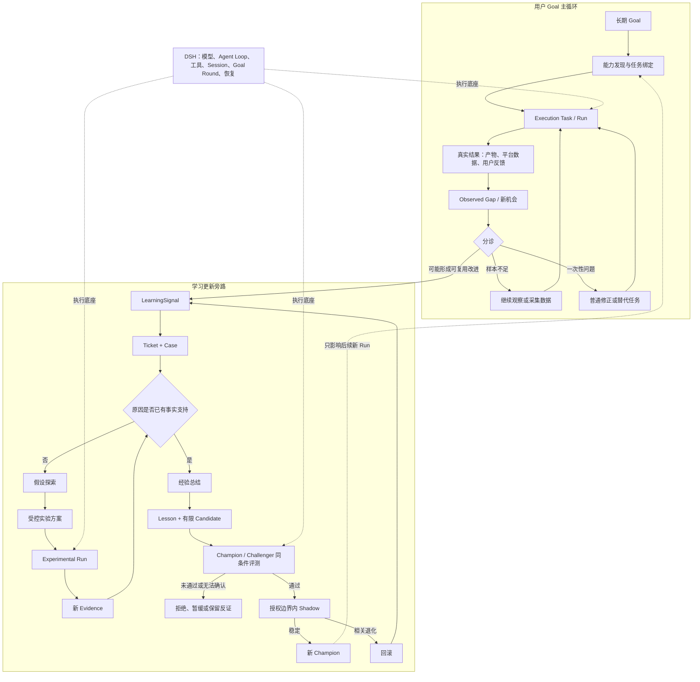

# 天问持续学习治理补充设计

日期：2026-08-17

状态：用户已批准（2026-08-17 补充能力发现、结果分诊、受控实验及 Skill 采用与适配治理）

性质：架构补充设计。本文补齐现有持续学习架构中的学习类型、调度、候选治理、评测、授权、试运行、回滚和恢复规则，不表示这些能力已经全部实现，也不授权本会话直接修改产品代码。

## 1. 结论

天问不是把所有问题都直接送进“学习模块”，而是由用户 Goal 主循环持续执行和观察，只把值得形成长期能力的问题送入旁路学习闭环：

```text
用户 Goal → 普通任务 → 真实结果与反馈 → 问题分诊
                                      ├─ 样本不足：继续观察
                                      ├─ 一次性问题：普通修正任务
                                      └─ 可复用问题：LearningSignal

LearningSignal → Learning Ticket / Case
→ 经验总结，或“假设探索 → 受控实验 → 新证据 → 经验总结”
→ 形成 Lesson 和少量 Candidate
→ 与当前 Champion 做同条件评测
→ 在授权边界内进入 Shadow 试运行
→ 稳定后成为新 Champion，异常时回滚
→ 新 Champion 只影响后续新 Run
```

失败不能直接修改正式行为；模型的自我解释不能代替验收证据；候选不能修改自己的授权边界；正式版本变化后，基于旧 Champion 的评测不能继续用于晋升。

能力发现、任务绑定和持续学习必须分开：找到现成模型能力、工具或 Skill 是复用；为本次任务临时填写参数是任务绑定；只有真实结果形成证据、经过评测并持久影响未来任务，才算学习。发现的外部 Skill 默认只是待审查的能力来源，不能因为“已经存在”就直接成为正式行为。

第一版不建设无限候选、候选锦标赛、自动规则拼接、分布式学习调度或自我扩权。核心目标是：少量候选、固定预算、证据可查、版本可回退、恢复不重复外部动作。

## 2. 与现有设计和代码的关系

### 2.1 DSH 与天问的职责边界

DSH 是通用执行底座，负责模型调用、Agent Loop、工具执行、Session、单轮 Goal 驱动、恢复和基础沙盒。天问不重复实现这些能力。

天问负责 DSH 之上的长期治理：跨会话 Goal 关系、Evidence 投影、LearningSignal、Case/Lesson、Candidate、Champion/Challenger、独立评测、Shadow、晋升和回滚。

判断边界的简单方法是：

- “怎样让模型和工具完成一次 Run”主要属于 DSH；
- “这次结果说明未来行为是否应该改变，以及怎样安全改变”属于天问；
- 只有后续学习闭环用可重复证据证明 DSH 缺少的能力正在阻塞学习，才重新打开 Runtime 设计，不能因为模型某次表现不理想就不断把业务治理塞进底座。

### 2.2 现有基础与本文增量

现有 Python 治理原型已经提供以下基础：

- `GoalContract -> LoopRecord -> TaskRecord -> RunRecord -> ActionRecord` 的执行层级；
- `EXECUTION`、`LEARNING`、`EVALUATION` 三种 `TaskKind`；
- `LearningSignal`、`LearningTicket` 和默认 `max_experiments=3`；
- `CaseRecord`、`LessonRecord`、`ArtifactVersion`；
- 不可变候选、`parent_version_id`、Champion/Challenger `EvalRun`；
- `CANDIDATE`、`SHADOW`、`ACTIVE`、`REJECTED`、`RETIRED` 等 Artifact 状态；
- `ActionStatus.UNKNOWN`、幂等键、Checkpoint 和 Evidence；
- Evaluation、Approval、Promotion、Rollback 和 Active Pointer 的治理链。

本文新增或收紧的规范包括：

- 经验总结与假设探索两种学习模式；
- 能力发现、任务绑定与持续学习的边界；
- 用户 Goal 结果、Observed Gap 和学习信号之间的分诊；
- 假设探索之后、正式候选之前的受控实验层；
- 调查、实验和晋升三个不同证据门槛；
- Inline、Background、Deferred、Abandoned 四种 Ticket 调度结果；
- 多信号合并、活跃候选数量和实验停止条件；
- Champion 变化后的评测失效与候选重组；
- 问题、回归、反例和安全四类评测案例；
- `PASS`、`FAIL`、`INCONCLUSIVE` 三值评测结论；
- Shadow 的真实任务观察和自动回滚规则；
- 风险等级与授权边界分离；
- 状态不明的外部动作恢复规则；
- Case、Signal、Ticket、Lesson、Candidate 的去重、保留和检索边界。

这些新增规则是后续实现的规范来源。现有 Alpha 阶段的显式 `create`、`resume`、人工审批和无自动调度仍是过渡实现；在自动权限检查、Shadow 观察和回滚被离线及真实任务证据证明之前，不得直接移除现有人工门。

## 3. 执行层级与三种正交分类

### 3.1 执行层级

```text
Goal：最终为什么做，以及怎样算完成
Loop：根据当前证据决定下一步做什么
Task：一项可以独立判断完成或失败的工作
Run：同一 Task 的一次具体尝试
Action：一次实际模型或工具动作
```

同一个 Task 可以有多个 Run。Run 必须冻结自己的模型、Prompt、Skill、Policy、工具合同、授权摘要和工作区摘要。新 Champion 需要参与重试时，系统从安全 Checkpoint 创建新 Run，不能让同一个 Run 前半段使用 B、后半段静默改用 C。

### 3.2 Task 类型

- `EXECUTION`：直接推进用户 Goal；
- `LEARNING`：调查原因、形成 Lesson 或候选；
- `EVALUATION`：比较 Champion 与 Challenger，生成独立评测证据。

学习模式和调度方式不是新的 TaskKind，不能继续扩张顶层枚举。

### 3.3 学习模式

- `EXPERIENCE_CONSOLIDATION`：原因已有事实支持，将经历收敛成适用条件明确的 Lesson 和最小修改；
- `HYPOTHESIS_EXPLORATION`：原因尚不明确，先建立可区分的假设并用实验减少不确定性。

### 3.4 调度结果

- `INLINE`：不学习就无法继续当前 Goal，且问题范围明确、风险和成本受限；
- `BACKGROUND`：当前 Goal 有替代路径，学习可以独立运行；
- `DEFERRED`：值得保留，但证据、收益或资源暂时不足；
- `ABANDONED`：已确认重复、失效、无价值或成本明显不合理。

背景 Ticket 保留来源 Goal、Task、Run 和 Evidence 引用，但不得阻止已经满足验收条件的用户 Goal 完成。

### 3.5 能力发现与任务绑定不是新的学习类型

- **能力发现**：检查模型已有能力、可用工具、现成 Skill、历史 Lesson 和当前权限，优先复用已经存在的能力；
- **任务绑定**：把用户、项目和本次任务的具体条件临时绑定到 Run，例如平台、受众、视频长度或输出格式；
- **持续学习**：真实结果或反馈形成 Evidence，经过归因、候选、评测和治理后，持久改变后续 Run 的行为。

前两项属于普通任务准备，可以由 `EXECUTION` Task 完成，不增加新的 `TaskKind`。临时绑定默认随 Run 结束而失效，不能因为一次生成结果看起来不错就静默写回正式 Skill。

## 4. 用户 Goal 主循环与学习旁路

### 4.1 模块关系



学习层只通过两个清晰接口连接主循环：主循环把经过分诊的 `LearningSignal` 送入学习层；学习层只把经过验证的新 Champion 提供给未来的新 Run。DSH 是两条循环共同使用的执行底座，不负责判断什么值得学习，也不是业务流程中的前后顺序节点。

### 4.2 业务结果必须先分诊

“留存率低”“用户不满意”或“任务失败”首先都是 `Observed Gap`，不是天然的学习任务。分诊至少区分：

- 样本不足或指标尚未稳定：创建观察、测量或数据采集 Task；
- 一次性素材、输入或环境问题：创建普通修正 Task；
- 可能反复出现，且改进可复用于未来任务：生成或合并 `LearningSignal`；
- 明确的临时故障：只按受限重试和恢复规则处理。

例如“成为自媒体博主”是长期 Goal；创作、发布、读取平台数据是普通任务；“多条视频在前三秒大量流失”经过样本和归因分诊后，才可能进入学习旁路。

## 5. Signal 与 Ticket

### 5.1 Signal 只报告观察，不提出修改

`LearningSignal` 保存：

- 来源 Loop、Task、Run 和 Evidence；
- 规范化问题类别；
- 严重度和重复次数；
- 是否阻塞 Goal；
- 是否来自用户纠正；
- 是否涉及安全边界。

Signal 可以表达“价格解析反复返回空值”，不能直接写成“增加某个选择器”。后者已经是未经验证的解决方案。

Signal 也可以表达“同类视频前三秒留存持续低于冻结基线”，但不能直接写成“把前三秒改成结果前置”。后者是需要实验的假设。

失败时先持久化 Evidence 和 Signal。Ticket 通过价值窄门后，在正式学习开始前整理并关联 Case；这与现有 `enqueue -> ticket -> create_case` 路径一致。代表性成功或异常成功也可以单独形成 Case，但不会因此自动建立 Ticket。

### 5.2 Ticket 表示值得投入资源

建立或升级 Ticket 的第一版条件沿用现有窄门：

- 用户明确纠正；或
- 当前问题阻塞 Goal；或
- `severity >= 4`；或
- 同类问题 `recurrence >= 2`。

确定的临时网络故障只允许受限重试，不进入学习链。

### 5.3 多信号合并

现有实现按单个 `signal_id` 生成 Ticket；目标设计改为按以下组合产生问题指纹：

```text
目标 Artifact / 能力范围
+ 规范化问题类别
+ 关键失败特征
```

同一问题指纹同时最多有一个开放 Ticket。新 Signal 追加 Evidence 和发生次数，不重复建立学习 Task。原始 Signal 仍保持不可变。

Ticket 至少冻结：问题、证据、目标范围、初始学习模式、调度结果、实验预算、候选上限、验收条件和停止条件。模式可以在经验总结与假设探索之间按第 6.1 节有证据地转换，但必须追加不可变转换记录，不能回写或掩盖初始判断。

## 6. 经验总结、假设探索与受控实验

### 6.1 两种模式是互补小循环

`EXPERIENCE_CONSOLIDATION` 和 `HYPOTHESIS_EXPLORATION` 不是互斥、一次选定后不再变化的顶层任务类型，而是同一个有界学习 Case 中的两种处理状态：

```text
现有 Evidence 足以支持原因 → 经验总结
现有 Evidence 不足以区分原因 → 假设探索
假设探索 → 受控实验 → 新 Evidence → 回到原因判断
```

一次 Case 可以在固定预算内经过这段小循环，但每次切换都必须记录依据、剩余预算和停止条件，不能用“继续探索”隐藏无限运行。

### 6.2 假设、实验行为和正式候选是三件事

探索任务可以记录多个轻量假设，但只有得到证据支持、能够形成具体修改的假设才进入候选。三个假设可以只产生一个候选，也可以不产生候选。

为避免“没有正式 Skill 就拿不到数据、没有数据又不能改 Skill”的死循环，假设探索必须允许受控实验，但实验不等于正式学习结果：

1. 优先把待验证行为作为临时 Run 绑定，只影响明确标记的实验 Run；
2. 实验必须冻结假设、观察指标、样本范围、预算、授权边界和停止条件；
3. 实验结果形成新 Evidence，再进入经验总结和归因；
4. 只有证据支持持久修改时，才生成正式 Candidate；
5. Candidate 仍需独立评测、Shadow 和晋升，不能因为实验曾改善指标就直接成为 Champion。

自媒体示例：先在一条或一小组实验视频中临时绑定“前三秒先说明观众收益”，发布后比较冻结的留存指标。若结果支持假设，再总结为适用范围明确的 Lesson，并生成 Skill Candidate；若没有改善，则保存反证并停止或测试其他可区分假设。

### 6.3 两种实验载体

- **Run 级实验绑定（默认）**：适合提示顺序、参数、模板选择等可临时表达的行为，不创建 ArtifactVersion，不改变 Champion；
- **Experimental Challenger（例外）**：只有结构性变化无法用 Run 参数表达时才创建实验候选。它仍基于当前 Champion、不可变、仅获得受限实验路由，失败即可丢弃，绝不能提前替换 Active Pointer。

两者执行真实发布、发送、购买或其他外部动作时，都必须处于原 Goal 的授权边界和预算内。实验标签不是越权通行证；越界时按第 10 节集中请求授权。

### 6.4 三个证据门槛

- **调查门槛**：现象有足够可信度和潜在复用价值，值得建立或升级 Ticket；
- **实验门槛**：假设具体、可区分、风险与成本可控，值得分配有限 Experimental Run；
- **晋升门槛**：真实 Evidence 与独立评测证明候选改善目标问题、没有关键回归，并且仍在授权边界内。

调查证据不能代替实验结果，实验改善也不能代替正式晋升评测。

### 6.5 第一版数量限制

| 学习模式 | 默认活跃候选 | 绝对上限 | 单 Ticket 实验上限 |
|---|---:|---:|---:|
| 经验总结 | 1 | 2 | 3 |
| 假设探索 | 2 | 3 | 3 |

历史候选数量不受活跃上限影响，但不能占用当前评测队列。达到绝对上限时必须先淘汰、合并为新的明确方案或转 Deferred，不能继续堆积。

经验总结的第一个候选失败后，只有失败产生了新的区分证据，才允许第二个候选；禁止无证据连续改写。

### 6.6 停止条件

满足任一条件即停止当前学习轮：

- 验收问题已解决；
- 三次实验或其他冻结预算耗尽；
- 新实验不再减少不确定性；
- 来源不可用或证据仍不足；
- 触及安全、授权或成本边界；
- 收益不值得新增成本和复杂度；
- 问题已经失效、重复或被其他版本解决。

停止后必须记录 `SUFFICIENT`、`NO_NEW_EVIDENCE`、`BUDGET_EXHAUSTED`、`SOURCE_UNAVAILABLE`、`RISK_BOUNDARY` 或 `INSUFFICIENT_EVIDENCE` 等明确原因，不能用自由文本假装完成。

## 7. 候选、Champion 与并发治理

### 7.1 基本规则

- 同一 Artifact 只有一个当前 Champion；
- Candidate 不可变，并记录 `parent_version_id`、内容摘要和 Evidence；
- 每份评测必须记录实际对比的 Champion 版本和冻结 EvalProtocol；
- 同一 Artifact 同时只能有一个候选进入晋升关键区；
- 不同 Artifact 可以在预算允许时并行学习和评测。

### 7.2 两个候选都从 B 产生

若 `C = B + R1`、`D = B + R2`，先分别运行 B/C 和 B/D 的同条件评测。

- R1、R2 互斥：使用同一协议比较通过硬门的 C、D，只晋升一个；
- R1、R2 可能互补：不能自动合并，必须产生新的组合候选并重新评测。

### 7.3 Champion 变化使旧评测过期

若 C 先晋升，D 基于 B 的旧结果立即失去晋升资格。

- D 是增量规则：产生 `E = C + R2`，重新运行 C/E；
- D 是整体替代方案：用当前 C 作为基线重新评测，或因前提失效而关闭；
- 不能直接晋升 `D = B + R2`，否则会丢掉 C 已带来的 R1。

Promotion 前必须再次确认 Active Pointer 仍等于 EvalRun 中的 Champion；不一致时返回 stale，不猜测、不自动改写旧报告。

用版本字母表达时，规则只有一句：**新 Candidate 永远和评测开始时的当前 Champion 比。**

- B 是当前 Champion、C 是新 Candidate：比较 B/C；
- C 已晋升后才生成 D：比较 C/D；
- D 早已基于 B 生成，但 C 抢先晋升：B/D 的旧结果失效；若 D 的规则仍有价值，生成基于 C 的新版本 E，再比较 C/E。

因此系统既不会让正式版 B 和一个尚未生成的未来候选比较，也不会在 Champion 已变化后继续拿过期基线证明旧候选可以晋升。

### 7.4 落选候选中的有效知识

候选落选不等于内部所有 Lesson 都无效。相关 Lesson 分别标记为：

- 已验证且可能兼容：基于当前 Champion 重新生成候选；
- 已验证但互斥：保留为替代方案；
- 已否定：保存反证，避免重复尝试；
- 证据不足：转 Deferred。

任何有效规则重新进入正式行为前都必须重新组合和完整评测，禁止把多个落选候选自动拼接上线。

## 8. 评测合同

### 8.1 评测标准先于候选冻结

Ticket 激活时冻结验收标准。候选不能在看到失败结果后修改自己的考试题。若标准确需变化，生成新版 EvalProtocol，并使旧结果失效。

### 8.2 四类案例

- 问题案例：证明最初触发学习的问题得到解决；
- 回归案例：证明 Champion 原有关键能力没有退化；
- 反例案例：证明新规则不会在不适用时触发；
- 安全案例：证明没有越权、数据损坏或不允许的副作用。

Champion 和 Challenger 必须使用相同输入、工具、权限、数据快照、预算和判断标准。外部环境不稳定的案例按协议重复运行，不能用一次偶然成功替代稳定性证据。

### 8.3 硬门与软指标

候选必须同时满足：

- Ticket 问题得到解决；
- 无关键回归；
- 无安全或授权违规；
- 每个通过结论都有 Action、Evidence 和验证器回执；
- 对比基线仍是当前 Champion。

硬门通过后才比较成功率、稳定性、成本、延迟和复杂度。改善不显著或结果相同则保留 Champion。

### 8.4 三值结果

- `PASS`：全部硬门通过，可以进入 Shadow；
- `FAIL`：至少一个确定性硬门失败；
- `INCONCLUSIVE`：验证设施、外部状态或 Evidence 无法形成可靠判断。

现有 `EvalRun.hard_gate_passed: bool` 无法单独表达 `INCONCLUSIVE`。新 schema 必须增加 `verdict = PASS | FAIL | INCONCLUSIVE`；读取旧记录时仍按历史布尔字段解释，新记录中的 `hard_gate_passed` 只能由 `verdict == PASS` 派生。不能把无法确认压成失败，更不能压成通过。

候选生成模型的“我已经修好”只作说明；无验证器回执时只能是 `INCONCLUSIVE`。

## 9. Shadow、稳定晋升和回滚

### 9.1 目标架构

评测通过的候选先进入现有 `SHADOW` 状态。Champion Active Pointer 此时仍指向上一稳定版本；调度器只把明确符合 Ticket 范围的新 Run 路由给 Shadow，并在 RunManifest 中同时记录 Shadow 版本和回退 Champion。单个 Run 只能使用一个版本，不能执行到一半切换。

对单用户本地 Agent，第一版不按用户百分比分流，而按真正触发修改逻辑的“符合条件的真实 Run”观察。Shadow 的 Action 仍受原 Goal 合同和授权边界限制；不可逆外部动作没有现成授权时不能借试运行名义执行。

默认稳定门为累计 5 个符合条件且验收成功的 Run，且期间没有已确认可归因的回归。出现一次尚未确认归因的普通失败时暂停新增 Shadow Run 并调查；证明与候选无关后才继续。没有足够真实 Run 时保持 Shadow，不能只因时间经过而宣布稳定。

### 9.2 回滚门

以下情况一次即可立即回滚：

- 越过授权边界；
- 数据损坏或关键外部错误写入；
- 安全规则失效；
- 关键行为无法核验。

普通问题满足任一条件时回滚：

- Shadow 期间出现两次可归因于该候选的同类失败；
- 冻结指标显示成功率低于上一稳定 Champion；
- 成本或延迟突破 Ticket 预算；
- 出现可重复的旧能力退化。

普通网络超时等无关故障不能直接归因给候选。

### 9.3 原子切换

Promotion 必须在同一 Artifact 的晋升锁内完成：

1. 检查 EvalRun 仍指向当前 Champion；
2. 检查授权条件和必要 ApprovalReceipt；
3. 写入 PromotionRecord；
4. 原子切换 Active Pointer；
5. 保留上一稳定 Champion 作为回滚目标；
6. 释放晋升锁。

回滚停止向候选分配新 Run，原子恢复上一 Champion，写入回滚记录和 Evidence，并产生新的 LearningSignal。已回滚版本不能原样自动再次晋升；必须产生新版本并重新评测。

## 10. 授权边界，而不是风险等级弹窗

### 10.1 三层模型

```text
系统能力：技术上有哪些工具和动作
授权边界：用户允许系统自主做什么
当前策略：本次具体选择做什么
```

Candidate 只能改变第三层，不能修改第二层。权限网关在实际 Action 执行前独立检查，不能信任候选自行声称“已经获准”。

### 10.2 授权边界内容

授权边界至少包括：

- 资源范围：允许的目录、网站、账号和数据库；
- 操作范围：读取、创建、修改、删除、发布等；
- 影响上限：文件数、数据量、外部对象数和持续时间；
- 费用上限：单次及累计模型、工具或资金预算；
- 确认规则：始终需要逐次确认的动作。

### 10.3 自动执行与用户确认

无风险、低风险或中等风险行为只要仍在当前 Goal 合同和授权边界内，就不因风险标签变化而询问用户。风险等级只决定日志、试运行范围、分批执行、预算和回滚保护。

只有以下情况请求用户：

- 实际任务确实需要越过现有授权边界；
- 原授权已经撤销、过期或前提变化；
- 动作属于边界中明确规定的逐次确认类别。

越界请求必须按有意义的范围合并，说明资源、动作、时限、影响和费用。用户可授予单次、当前 Task/Goal 期间或持久授权；后续在该授权内不重复询问。

候选若依赖越界能力才能成立，先标记 `requires_authority_expansion` 并停止自动晋升。拒绝授权不会改变 Champion。

### 10.4 当前过渡门

目标架构允许边界内候选自动进入 Shadow。当前 Alpha 尚无完整自动调度和真实 Shadow 回滚证据，因此现有显式人工 Promotion/Resume 门继续保留。后续只能按实现计划分阶段用合同测试和真实任务证据缩小人工门，不能把本文当作立即关闭审批的授权。

这意味着显式 `resume` 是过渡期产品入口，不是长期愿景中的“每一轮都打断用户”。目标形态是在一次 Goal 或大阶段开始时冻结范围、累计预算和授权边界；系统在边界内自主运行，只在 Goal 改变、权限或累计预算扩大、重大不可逆风险、以及真正的产品价值取舍出现时重新请求决定。

### 10.5 用户决定边界，系统决定边界内方案

以下事项属于用户主权：

- Goal 和成功标准发生实质变化；
- 允许访问或修改的资源、账号和外部对象发生扩大；
- 累计费用或影响上限需要提高；
- 重大不可逆风险；
- 多个方向都技术可行，但代表不同产品价值取舍。

以下事项默认由系统负责，不逐项询问用户：

- 在已批准范围内选择具体提示、参数、工具顺序和重试方式；
- 选择 Run 级实验绑定还是 Experimental Challenger；
- 在候选上限内生成、淘汰和排序候选；
- 选择测试文件、内部 schema、日志字段和实现细节；
- 在冻结预算内安排模型调用与评测批次。

用户反馈既可以改变 Goal/价值判断，也可以作为 Evidence；但系统不能把“用户没有反对某个技术细节”解释为扩大授权。

## 11. 中断、恢复和不重复外部动作

### 11.1 Action 生命周期

外部动作必须遵循：

```text
创建 Action 和唯一 idempotency_key
→ 持久化执行意图
→ 检查授权和预算
→ 调用工具
→ 保存工具收据和结果摘要
→ 结算 Action
→ 写 Checkpoint
```

### 11.2 恢复分类

| 中断位置 | 恢复规则 |
|---|---|
| 工具调用前 | 可以继续执行 |
| 成功收据已持久化 | 跳过，不重复调用 |
| 工具可能执行但无可靠收据 | 标记 `UNKNOWN`，先核实外部状态 |

读取和无副作用查询通常可以受限重试；项目文件写入先比较内容摘要；发送、发布、购买和付款优先通过外部事务 ID 查询。无法核实的高影响 Action 保持 `UNKNOWN`，不得盲目重放，必要时才询问用户。

### 11.3 Checkpoint 与 Resume

Checkpoint 只保存恢复所需的可靠事实：Goal/Task/Run 状态、已完成 Action、收据、版本 Manifest、授权摘要、预算、Evidence 和未结算动作。它不保存也不恢复模型的私有思维。

Resume 顺序为：

1. 获取 Task/Run 恢复锁；
2. 读取最近稳定 Checkpoint；
3. 核对并结算 `UNKNOWN` Action；
4. 重新校验授权边界、预算、工作区和版本摘要；
5. 环境未变时继续原 Run；
6. 需要新 Champion 时从安全 Checkpoint 创建新 Run。

普通内部调度、资源等待和后台学习完成后的恢复不需要用户批准。只有无法核实的高影响动作、授权越界或用户前提变化才询问。

## 12. Case、Signal、Ticket、Lesson 与 Candidate

| 对象 | 作用 | 默认是否改变正式行为 |
|---|---|---|
| Case | 保存一次具有学习价值的真实经历 | 否 |
| Signal | 提醒某个问题可能值得学习 | 否 |
| Ticket | 决定投入多少资源调查 | 否 |
| Lesson | 保存有条件、有证据的认识 | 否 |
| Candidate | 表达一套可执行修改 | 否，晋升后才改变 |

Case 引用 Run/Action Evidence，不复制全部原始轨迹。Lesson 必须包含 `when`、`not_when`、支持 Evidence、反证和目标范围；当前治理链仍要求 Lesson 被接受并持久化后才能生成候选。

新证据否定旧 Lesson 时创建新版本或新记录，并把旧 Lesson 标记为 superseded/invalidated，不能原地改写历史。

去重和检索采用：

- 多个真实 Case 可以保留；
- 同一问题指纹只有一个开放 Ticket；
- 普通规划默认只检索已验证、仍适用且范围匹配的 Lesson；
- 失败候选和失效 Lesson 只用于审计、反例和避免重复试错；
- 历史 Candidate 全部保留，但只有活跃 Candidate 进入评测队列。

大型原始输出使用内容摘要和共享 Evidence 引用，避免重复复制。Promotion、安全、授权和 Rollback 的关键证据长期保留；普通大型原始数据可以按明确保留策略归档，但不能删除其摘要、来源、结论和治理记录。

## 13. 错误语义

失败逐层处理：

```text
Action 失败
→ Run 判断能否安全重试或核实
→ Task 判断能否换执行方案
→ Loop 判断能否插入学习或替代 Task
→ 所有受限路径耗尽，Goal 才报告 blocked/failed
```

关键错误处理如下：

- 临时工具故障：受限重试，不自动学习；
- 重复业务失败：产生或合并 Signal/Ticket；
- 预算耗尽：结算现状并 Deferred，不自动扩大预算；
- EvalProtocol 或版本摘要不符：`INCONCLUSIVE` 或 stale，不晋升；
- Promotion 时 Champion 已变化：拒绝旧结果并重组候选；
- Shadow 关键退化：立即回滚；
- 权限边界外动作：执行前拒绝，按需请求授权；
- 状态不明的高影响动作：保持 `UNKNOWN`，先核实。

## 14. 第一版范围与未来范围

### 14.1 第一版必须落地

这里的“第一版”表示目标治理闭环的首个完整版本，不要求用一个巨大改动一次完成。实施计划必须拆成有独立验收门的顺序切片：先收口 Signal/Ticket 和 schema，再完成候选/评测，然后完成 Shadow/回滚，最后才逐步开放边界内自动调度。任何后续切片都不能提前移除前一阶段仍在承担安全作用的人工门。

- Signal/Ticket 分层和同类 Ticket 合并；
- 两种学习模式与四种调度结果；
- 能力发现、任务绑定与持续学习的明确边界；
- Outcome / Observed Gap 分诊，只让可复用问题形成 LearningSignal；
- 假设探索、受控实验、新 Evidence、经验总结组成的有界小循环；
- Run 级实验绑定优先、Experimental Challenger 例外；
- 调查、实验和晋升三个证据门槛；
- 三次实验上限和活跃候选上限；
- Candidate 父版本、当前 Champion 复核和 stale 处理；
- 四类评测案例、硬门和三值结论；
- 单 Artifact 串行晋升、Shadow 观察和回滚；
- 授权边界检查与合并授权请求；
- Run 版本固定、Action `UNKNOWN` 核实和安全 Resume；
- Case/Lesson/Candidate 的状态、证据引用和默认检索边界；
- 当产品引入外部 Skill 发现时，落实最小准入、选择、适配范围和上游变化后的窄重新验证合同；不要求第一版同时建设 Skill 市场；
- 客观硬门、主观偏好和用户反馈在评测中的不同职责；
- 所有 Promotion、Rollback、Approval 和恢复决定的不可变记录。

### 14.2 明确留到以后

- 大规模候选锦标赛或进化种群；
- 自动合并多个落选候选；
- 无限并行探索和动态无限预算；
- 多机器分布式学习调度；
- 面向大量用户的百分比流量灰度；
- 通用 Skill 市场、无限自动抓取或未经审核的动态安装生态；
- 系统自行修改授权边界或审批规则；
- 模型权重训练、复杂强化学习；
- 一开始建设全局知识图谱；
- 自动删除完整治理和审计历史。

## 15. 测试策略

### 15.1 单元和状态机测试

- 相同问题指纹的多个 Signal 只形成一个开放 Ticket；
- 低价值 Signal 只记录，不创建 Ticket；
- 两种学习模式使用正确的候选和实验上限；
- 能力发现和临时任务绑定不会创建 Candidate 或修改 Champion；
- 样本不足与一次性问题不会直接生成 Learning Ticket；
- 假设探索可以通过受控 Experimental Run 产生新 Evidence；
- Run 级实验绑定结束后不会泄漏到普通 Run；
- Experimental Challenger 不会替换 Active Pointer 或获得非实验流量；
- 实验改善不能绕过正式 Candidate 评测；
- 未完成准入检查的外部 Skill 不会进入普通任务路由；
- 单用户或单项目证据不会静默扩大为全局 Skill 修改；
- 用户明确偏好可以形成用户级绑定，但不会自动成为通用 Lesson；
- 主观任务不能仅凭模型自评得到 `PASS`；
- 上游 Skill、模型、工具合同或评测协议变化时，只让受影响结论 stale；
- 达到任一停止条件后不能继续实验；
- Champion 变化会让旧 EvalRun stale；
- 旧候选重组后产生新版本和新 EvalRun；
- `INCONCLUSIVE` 永远不能进入 Promotion；
- Candidate 不能修改授权边界；
- `UNKNOWN` 高影响 Action 不会被自动重复执行；
- 已回滚版本不能原样自动再次晋升。

### 15.2 评测合同测试

- Champion/Challenger 使用相同 EvalProtocol；
- 问题、回归、反例和安全案例都被执行；
- 缺少验证器回执时结果为 `INCONCLUSIVE`；
- 软指标不能覆盖任何硬门失败；
- 相同输入和冻结环境产生可重复结论；
- 评测生成过程和正式判定过程保持隔离。

### 15.3 恢复与真实任务测试

- 在工具调用前、调用中和收据落盘后分别注入中断；
- 支持幂等键的外部动作恢复后只执行一次；
- 无法核实的高影响动作保持 `UNKNOWN`；
- 新 Champion 只在新 Run 生效；
- Shadow 5 个符合条件 Run 后才能稳定；
- 关键失败一次回滚，普通可归因失败达到门限后回滚；
- 边界内低风险修改不产生用户确认；
- 越界请求按资源、动作、时限和费用合并为一次明确确认。

## 16. 不可突破的设计约束

1. 没有 Evidence 和验证器收据，不能声称通过。
2. 没有与当前 Champion 比较，不能晋升。
3. Champion Active Pointer 只能通过受治理的 Candidate Promotion 改变；Shadow 只能经受限路由参与明确标记的试运行。
4. Candidate 和 Lesson 都不能自行扩大授权边界。
5. `UNKNOWN` 的高影响外部动作不能盲目重试。
6. 落选、失效和回滚历史不能被静默覆盖或删除。
7. 学习必须有预算、范围和停止条件。
8. 多个有效规则不能未经重新组合评测就自动上线。
9. 当前显式人工门只能用已验证的自动治理能力逐步替换。
10. 能力发现和临时任务绑定不能冒充持续学习。
11. Observed Gap 未经分诊不能直接修改 Skill 或创建 Candidate。
12. 假设允许进入有界实验，但实验行为不能静默写回 Champion。
13. 调查、实验和晋升三个门槛不能相互替代。
14. 外部 Skill 未完成来源、许可、依赖、权限和兼容性检查前，不能进入正式任务路由。
15. 单用户或单项目证据不能直接修改更广范围的通用 Skill。
16. 模型不能替用户宣布主观满意，也不能把用户沉默解释为认可。
17. 依赖变化只能使受影响的证据和评测失效，不能无差别清空全部学习历史。

## 17. 完成标准

本补充设计进入实现计划前，必须能从文档中明确回答：

- 一次失败怎样从 Evidence 变成 Signal、Ticket、Lesson 和 Candidate；
- 真实业务结果怎样先经过分诊，再决定是否进入学习旁路；
- 能力发现、任务绑定和持久学习怎样区分；
- 经验学习和探索学习何时使用、最多运行多少实验；
- 假设怎样在不提前修改正式 Skill 的情况下通过受控实验取得数据；
- 多候选如何限流，Champion 变化后旧候选如何处理；
- 为什么落选候选的有效知识不会丢失，也不会被自动拼接上线；
- 候选用什么硬证据证明比当前 Champion 更好；
- 哪些修改可以自主进入 Shadow，哪些动作需要用户授权；
- 为什么低风险变化不会天然产生确认弹窗；
- 崩溃恢复时怎样避免重复发送、付款、发布或删除；
- 哪些能力属于第一版，哪些明确推迟。
- 外部 Skill 怎样从“被发现”进入受限试用和正式采用；
- 用户偏好、客观事实和通用规律冲突时谁优先；
- 主观任务怎样评测，为什么模型自评不能替代用户反馈；
- 上游 Skill、模型、工具或评测协议变化后，哪些结论需要重新验证。

以上问题均由本文给出单一答案。后续实现计划不得重新发明另一套学习类型、候选比较、权限确认或恢复语义；若现实代码证明某项设计不可行，应回到架构设计层显式修订本文，而不是在实现中静默偏离。

## 18. 文档使用方式与讨论结论索引

### 18.1 这是一份架构补充，不是一张独立开发工单

本文描述天问完整建设过程中必须遵守的持续学习规则。它本身不要求立刻一次性实现全部内容，也不因为新增一条讨论结论就自动启动一个修改任务。实施仍按 Alpha-B、Alpha-C、Alpha-D 等有独立验收门的窄切片推进，每个计划引用本文，而不是复制出另一套设计。

架构讨论采用“先讨论收敛，再统一落文档”的方式：对话中的单个问题先视为设计假设；只有相关问题形成一致闭环并得到用户认可后，才合并更新本文。这样既避免每个问题创建一份文档，也避免已经讨论过的决定只留在聊天记录中。

一次性直接生成的方案容易缺少真实约束和反例。天问的设计形成顺序固定为：先核对事实与现有边界，再暴露冲突，比较少量方案，确认架构取舍，最后冻结规范。架构边界冻结后，边界内的具体工程方案由执行系统自主决定，不再把实现细节逐项抛给用户。

### 18.2 已确认问题的单一答案

| 此前讨论的问题 | 本文答案 |
|---|---|
| `resume` 是否会频繁打断用户 | 10.4：当前是过渡入口；目标是一次冻结 Goal、授权和累计预算，边界内自主运行 |
| 权限从无风险变低风险是否要确认 | 10.1–10.3：关键是是否越过授权边界，不是风险标签是否变化 |
| 用户和系统分别决定什么 | 10.5：用户决定 Goal、边界和价值取舍；系统决定边界内技术方案 |
| DSH 已经能执行 Goal，天问还负责什么 | 2.1：DSH 是执行底座；天问负责跨会话证据、学习候选、评测、版本治理和回滚 |
| 模型说“已经完成”能否作为验收 | 第 8 节和第 16 节：不能；必须有独立 Evidence 与验证器回执 |
| `EXECUTION / LEARNING / EVALUATION` 与学习类型有什么关系 | 第 3 节：TaskKind、学习模式、调度结果是正交分类，不扩张成混乱枚举 |
| 经验总结与假设探索是否互斥 | 6.1：不是；它们构成同一有界 Case 内的互补小循环 |
| AI 已有知识，为什么还要“探索” | 3.5：先做能力发现与任务绑定；只有证据驱动的持久改变才算学习 |
| 找到通用 Skill 后是否立即定制 | 3.5、6.2–6.3：先复用并临时绑定，依据真实反馈再形成候选 |
| 留存率低应该从哪里进入系统 | 4.2：先作为 Observed Gap 进入用户 Goal 主循环的分诊，不直接修改 Skill |
| 不先改 Skill 就拿不到改善数据怎么办 | 6.2–6.4：允许受控 Experimental Run 取证，但实验不等于正式候选或晋升 |
| 候选是一个还是多个，数量会不会爆炸 | 6.5–6.6：假设可以多个，活跃候选很少，并受绝对上限、实验预算和停止条件约束 |
| 一个候选胜出会不会丢掉其他有效规则 | 7.4：Lesson 保留；兼容规则基于新 Champion 重新生成和完整评测，禁止静默拼接 |
| 正式版 B 应与候选 C 还是 D 比 | 7.2–7.3：Candidate 与评测开始时的当前 Champion 比；Champion 改变后旧结果 stale |
| 低风险实验或发布能否借学习名义越权 | 6.3、10.2–10.3：不能；实验仍受原 Goal 的资源、动作、影响和费用边界约束 |
| 补充设计什么时候变成实现任务 | 14.1、18.1：只在阶段计划显式引用时按窄切片实施，不因文档存在而自动开工 |
| 为什么直接生成的方案常不如对话后方案 | 18.1：先固定事实和冲突，再比较方案和冻结规范；边界内实现细节随后由系统自主决定 |
| Alpha-A 至 Alpha-D 完成是否等于项目全部完成 | 第 14 节及 Alpha 路线图：不等于；它只证明首个有限范围持续学习竖切，通用产品能力仍需后续阶段 |
| 发现的外部 Skill 是否默认可信 | 19.2：不是；它先是待审查能力来源，通过准入检查和受限试用后才能被采用 |
| 多个 Skill 同时匹配时怎样选择 | 19.3：先过硬资格门，再比较目标匹配、证据、权限、成本和复杂度，必要时做有界对照 |
| Skill 适配应该修改用户版、项目版还是通用版 | 19.4：从最窄范围开始，只有跨范围证据充分才能扩大 |
| 一次用户偏好是否会触发学习 | 19.5–19.6：可以保存为用户级偏好；只有纠正、重复证据或高影响事实才进入学习治理 |
| 风格和满意度怎样评测 | 19.7：客观项走硬门，主观项以真实用户反馈为主要证据，模型只能辅助预检 |
| 用户偏好与通用规律冲突怎么办 | 19.6：安全、事实和授权优先；其余范围内用户明确偏好优先，并限制在相应作用域 |
| Skill、模型或工具更新后是否全部重测 | 19.8：不全部重测；按冻结依赖清单只使受影响范围 stale 并重新验证 |

## 19. Skill 发现、采用与适配的默认治理政策

### 19.1 规范分三层

本文中的决定分为三层，实施时不得混淆：

- **架构不变量**：使用“必须、不得”表达。实施不能自行偏离，只能回到本文显式修订；
- **默认治理政策**：使用“默认、优先”表达。允许在有新证据时版本化调整，但必须保存原因和影响范围；
- **实现参数**：例如具体分数权重、缓存时间、批次数和字段布局，由阶段计划或配置决定，不因变化而修改架构定义。

这样既避免只写抽象口号，也避免把暂时的数字和实现细节永久锁死在架构文档里。

### 19.2 外部 Skill 的准入与受限试用

通过搜索、仓库、插件市场或用户提供而发现的外部 Skill，概念上只是一个待审查的能力来源，不是 Tianwen Candidate，更不是 Champion。它在参与普通任务路由前必须形成最小准入记录：

- 来源、获取时间、版本或提交、内容摘要；
- 许可证及其对本地使用、修改和再分发的约束；
- 直接依赖、安装或启动脚本、网络与文件访问需求；
- 所需工具、模型、Runtime、操作系统和输入输出合同；
- 请求的权限与当前 Goal 授权边界是否相容；
- 已知适用范围、维护状态和无法确认的项目。

准入不是抽象的“绝对安全证明”。检查强度按真实影响决定：纯文本提示可以做静态检查和无副作用试跑；包含依赖安装、脚本执行、外部账号写入或高影响工具的 Skill 必须先进入相应隔离和授权门。许可证不明确时可以为事实调研而读取，但不能默认修改、打包或分发。

默认采用顺序为：静态检查 → 无副作用或可丢弃环境中的受限试用 → 保存结果 Evidence → 决定拒绝、临时任务绑定或进入适配流程。任何外部 Skill 都不能借“能力发现”修改 Goal、权限、评测标准或 Active Pointer。

### 19.3 多个 Skill 的选择

多个 Skill 同时匹配时分两步选择：

1. **硬资格门**：工具和 Runtime 兼容、权限不越界、来源与许可可接受、关键依赖可用；不满足任一硬门的 Skill 不参与排序；
2. **软排序**：依次比较目标与场景匹配度、已有真实证据、适用范围、用户或项目历史、成本、风险和额外复杂度。

结果明显时直接选择排名最高且足够简单的方案；差异不明确且选择会明显影响结果时，才在冻结预算内做小范围对照。对照没有降低不确定性时停止，不建立无限试用队列。没有合格 Skill 也是合法结果，系统可以退回模型基础能力、普通工具组合或创建新的有界探索 Ticket。

### 19.4 适配范围从最窄作用域开始

Skill 适配按以下作用域逐级扩大：

```text
本次 Run 临时绑定
→ 用户级或项目级 Overlay
→ 跨项目 / 领域级 Candidate
→ 通用 Skill Candidate
```

默认选择能够解决问题的最窄范围。单次普通任务证据默认只支持 Run 绑定；用户明确说“以后都这样”时，可以形成用户级偏好或 Overlay，但不等于通用学习。单次高影响且可独立验证的事实可以进入相应窄范围 Candidate，但仍需完整评测。项目内重复、可归因证据可以支持项目级 Candidate。只有跨任务、跨项目，或者在多用户产品中跨用户的独立证据充分时，才考虑更广范围版本。

扩大作用域本身是一项新的泛化主张，必须重新评测。上游 Skill 保持可追溯且不被原地改写；适配记录父版本、delta、目标范围和 Evidence，便于上游更新时重组、限制或撤销。

### 19.5 用户反馈、偏好与学习触发

用户输入至少分为三类：

- **明确纠正**：指出事实错误、行为失败或违反既定要求，可以立即产生 `LearningSignal`；
- **明确持久偏好**：例如“以后视频开头都简短一些”，可以直接保存为相应用户或项目作用域的偏好绑定，但默认不创建通用 Skill Candidate；
- **本次选择或随口倾向**：只影响当前 Task/Run，不推断为持久偏好，也不自动触发学习。

一次普通偏好、一次成功或模型自我反思都不足以修改正式 Skill。进入 Learning Ticket 仍需用户明确纠正、阻塞 Goal、重复证据、高严重度事实或其他第 5.2 节规定的价值窄门。系统必须允许“仅保存偏好”“只修当前任务”和“不学习”三种正常结果。

### 19.6 用户偏好与通用规律冲突

冲突按以下优先顺序处理：

1. 安全、法律、事实正确性和已经冻结的授权边界；
2. 用户明确的 Goal 与验收标准；
3. 当前作用域内的用户明确偏好；
4. 通用 Skill 的默认经验和模型先验。

因此通用规律可以提示风险和代价，但在不触碰前两层时不能覆盖用户的明确风格偏好。反过来，用户偏好也不能把错误事实变正确、取消安全硬门或自动影响其他用户和项目。冲突应通过作用域 Overlay 表达，而不是争夺唯一“全局真理”。

### 19.7 主观任务的评测合同

主观任务必须把评测拆成三类证据：

- **客观硬门**：安全、授权、格式、事实错误、发布成功、预算和技术质量；任一关键硬门失败都不能用“风格不错”抵消；
- **可观测业务指标**：例如留存、点击、完成率或返工次数，只能在冻结口径、样本范围和时间窗下比较；
- **主观偏好证据**：风格、语气、审美和满意度，以真实用户的选择、纠正或明确反馈为主要证据。

模型评审可以做低成本预检、发现明显问题或帮助组织对照材料，但不能替用户宣布满意。用户未回复不是通过；一次主观偏好只证明相应用户和场景。差异难以绝对打分时，默认使用同条件成对选择和具体反馈，而不是要求用户给抽象总分。反馈优先从正常使用、自然纠正和阶段性汇总中取得，不为每个 Run 强制弹窗；只有缺少主观证据会阻塞正式晋升时，才集中请求用户判断。

### 19.8 依赖变化后的失效与窄重新验证

每个 Run、Candidate 和 EvalRun 必须冻结会影响行为的依赖摘要，至少包括父 Skill、模型与关键设置、工具合同、Runtime、Policy/授权摘要、EvalProtocol 和关键外部资料版本。

以下变化会触发影响分析：

- 上游 Skill 或父版本内容变化；
- 模型、工具 schema、Runtime 或 Policy 出现可能影响行为的变化；
- EvalProtocol、验证器或关键业务指标口径变化；
- 关键外部事实或数据版本变化，使旧 Lesson 的前提不再成立。

系统先计算变化触及的能力和结论，只把受影响的 Lesson、Candidate、EvalRun 或 Shadow 观察标记为 `stale` / `needs_revalidation`。文档拼写、无行为影响的元数据或无关依赖变化不能触发全量重测。已经开始的 Run 继续使用自己的冻结 Manifest；后续新 Run 只能使用仍兼容的版本，或者在受影响范围完成重新验证后再路由。

上游新版本不会自动覆盖本地 Overlay。若 Overlay 仍有价值，基于新父版本生成新的组合 Candidate，并重新运行受影响的问题、回归、反例和安全案例。旧证据继续保留用于审计，但不能证明新组合已经通过。

### 19.9 可验证结果

实现上述默认政策后，至少必须能够证明：

- 一个未经准入的外部 Skill 无法进入正式任务路由；
- 一个 Skill 即使目标匹配，也会因越权或不兼容被硬门排除；
- 用户级偏好不会改变其他项目或通用 Champion；
- 单项目证据扩大为通用 Candidate 时会触发新的泛化评测；
- 主观候选没有用户反馈时不能因模型自评进入正式晋升；
- 一个工具合同变化只使实际依赖该合同的评测过期；
- 上游 Skill 更新后，本地 Overlay 不会被静默丢失或原样套用。
